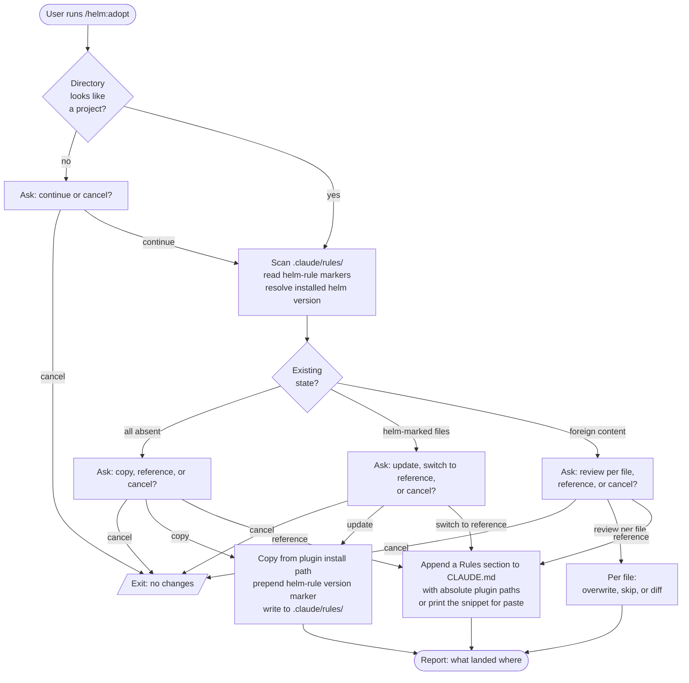

# /helm:adopt

Setup helper. Installs or updates the helm rule files into the current project, choosing between a copy-in or a reference-from-CLAUDE.md install. Detects whether existing rules came from helm (via a version marker) or were authored manually, and adapts the prompt accordingly.

Unlike the workflow commands, `/helm:adopt` configures how helm relates to a project. It does no product work, runs no tests, ships no release.

## Flow

## Steps

### 1. Sanity check

Looks for `.git/`, `CLAUDE.md`, or a recognised manifest (`package.json`, `composer.json`, `Cargo.toml`, `pyproject.toml`, `go.mod`). If the directory doesn't look like a project, prompts the user to confirm or cancel.

### 2. Scan existing rules

Reads `.claude/rules/git.md` and `.claude/rules/safety.md`. For each file, classifies as:

- **Absent**: the file does not exist.
- **Helm-marked**: file exists and starts with `<!-- helm-rule: claude-helm@v{X.Y.Z} -->`. The version is recorded.
- **Foreign**: file exists but does not carry the helm marker. Authored manually or by another tool.

Then reads the installed helm version from `~/.claude/plugins/claude-helm/.claude-plugin/plugin.json` so the prompt can show users which version they would adopt.

### 3. Show the scan summary

Prints a small status table so the user knows what is on disk before picking an install mode.

### 4. Choose install mode

Question and labels adapt to the detected state:

- **FRESH** (no existing files): Copy into `.claude/rules/` is the recommended option; Reference and Cancel are also available.
- **UPDATE** (helm-marked files present): Update is the recommended option; Switch to reference and Cancel are also available.
- **CONFLICT** (foreign files present): Review per file is the recommended option; Reference and Cancel are also available.

### 5. Execute

**Copy or Update**: ensures `.claude/rules/` exists, then writes `git.md` and `safety.md` from the installed plugin source. Each file gets a leading `<!-- helm-rule: claude-helm@v{X.Y.Z} -->` marker so a future `/helm:adopt` run can detect them as helm-managed.

**Conflict / Review per file**: for each foreign file, asks Overwrite, Skip, or Show diff. Showing the diff loops back to the same prompt so the user can pick after seeing the changes.

**Reference**: resolves the plugin's absolute install path and appends a `## Rules` section to `CLAUDE.md` pointing at the source files. If `CLAUDE.md` does not exist, prints the snippet to the chat so the user can place it manually.

### 6. Report

Final summary line per file describing what was written, updated, skipped, or referenced, and which helm version was recorded in the marker.

## Stop conditions

- **Directory does not look like a project and user cancels.**
- **User picks Cancel at any of the install-mode prompts.**
- **No `CLAUDE.md` and Reference mode chosen**: the snippet is printed but nothing is written; user takes over.

## Notes

- The version marker at the top of each copied file is required. Stripping it makes `/helm:adopt` treat the file as foreign on the next run.
- `/helm:adopt` never writes outside `.claude/rules/` or `CLAUDE.md` in the current project.
- `/helm:adopt` never touches anything in `~/.claude/`.

## See also

- [`git.md`](../rules/git.md) - one of the two rule files this command installs
- [`safety.md`](../rules/safety.md) - the other rule file
- [`/helm:log`](log.md) - the related command that updates `CLAUDE.md` content; if you add a `## Rules` section via Reference mode, `/helm:log` will respect it
