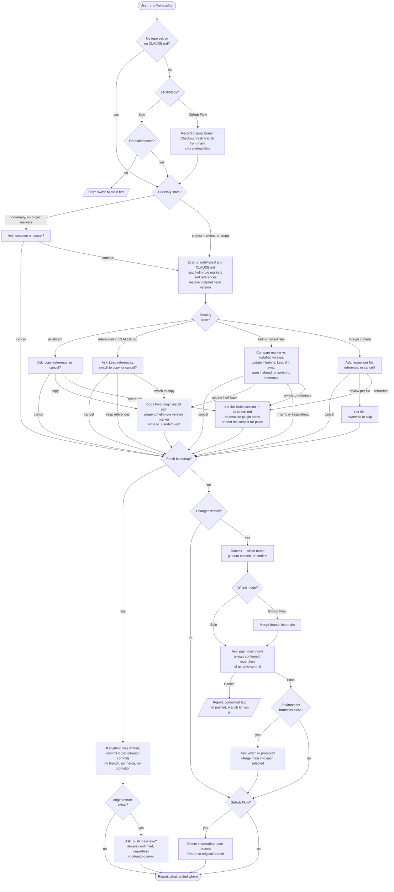

# /helm:adopt

Setup helper. Installs or updates the helm rule files into the current project, choosing between a copy-in or a reference-from-CLAUDE.md install. Detects whether existing rules came from helm (via a version marker) or were authored manually, and adapts the prompt accordingly.

Unlike the workflow commands, `/helm:adopt` configures how helm relates to a project. It does no product work, runs no tests, ships no release.

## Flow

```mermaid
flowchart TD
  Start([User runs /helm:adopt]) --> Bootstrap{No repo yet, or<br/>no CLAUDE.md?}
  Bootstrap -->|yes| Sanity
  Bootstrap -->|no| Strategy{git-strategy?}
  Strategy -->|Solo| SoloCheck{On main/master?}
  SoloCheck -->|no| StopSolo[/Stop: switch to main first/]
  SoloCheck -->|yes| Sanity
  Strategy -->|GitHub Flow| Fresh2[Record original branch<br/>Checkout fresh branch from main:<br/>chore/adopt-date]
  Fresh2 --> Sanity

  Sanity{Directory state?}
  Sanity -->|non-empty, no project markers| AskContinue[Ask: continue or cancel?]
  AskContinue -->|cancel| CommitWrite
  AskContinue -->|continue| Scan
  Sanity -->|project markers, or empty| Scan

  Scan[Scan .claude/rules/ and CLAUDE.md<br/>read helm-rule markers and references<br/>resolve installed helm version] --> State{Existing<br/>state?}

  State -->|all absent| Fresh[Ask: copy, reference, or cancel?]
  State -->|referenced in CLAUDE.md| Referenced[Ask: keep references,<br/>switch to copy, or cancel?]
  State -->|helm-marked files| Update[Compare marker vs installed version:<br/>update if behind, keep if in sync,<br/>warn if ahead; or switch to reference]
  State -->|foreign content| Conflict[Ask: review per file,<br/>reference, or cancel?]

  Fresh -->|cancel| CommitWrite
  Referenced -->|cancel| CommitWrite
  Update -->|cancel| CommitWrite
  Conflict -->|cancel| CommitWrite

  Fresh -->|copy| Copy
  Fresh -->|reference| Reference
  Referenced -->|keep references| CommitWrite
  Referenced -->|switch to copy| Copy
  Update -->|update / roll back| Copy
  Update -->|in sync or keep-ahead| CommitWrite
  Update -->|switch to reference| Reference
  Conflict -->|review per file| PerFile[Per file:<br/>overwrite or skip]
  Conflict -->|reference| Reference

  Copy[Copy from plugin install path<br/>prepend helm-rule version marker<br/>write to .claude/rules/] --> CommitWrite
  PerFile --> CommitWrite
  Reference[Set the Rules section in CLAUDE.md<br/>to absolute plugin paths<br/>or print the snippet for paste] --> CommitWrite

  CommitWrite{Fresh bootstrap?}
  CommitWrite -->|yes| BootstrapCommit["If anything was written,<br/>commit it (per git-auto-commit)<br/>no branch, no merge, no promotion"]
  BootstrapCommit --> BootstrapRemote{origin remote<br/>exists?}
  BootstrapRemote -->|no| Done
  BootstrapRemote -->|yes| BootstrapPushAsk[Ask: push main now?<br/>always confirmed, regardless<br/>of git-auto-commit] --> Done
  CommitWrite -->|no| ChangesCheck{Changes written?}

  ChangesCheck -->|no| Cleanup
  ChangesCheck -->|yes| Commit["Commit — silent under<br/>git-auto-commit, or confirm"]

  Commit --> SoloOrFlow{Which mode?}
  SoloOrFlow -->|Solo| PushAsk[Ask: push main now?<br/>always confirmed, regardless<br/>of git-auto-commit]
  SoloOrFlow -->|GitHub Flow| MergeMain[Merge branch into main] --> PushAsk
  PushAsk -->|Cancel| Done2[/Report: committed but<br/>not pushed, branch left as-is/]
  PushAsk -->|Push| Promote

  Promote{Environment<br/>branches exist?}
  Promote -->|yes| PromoteAsk[Ask: which to promote?<br/>Merge main into each selected]
  Promote -->|no| Cleanup
  PromoteAsk --> Cleanup

  Cleanup{GitHub Flow?}
  Cleanup -->|yes| DeleteBranch[Delete chore/adopt-date branch<br/>Return to original branch]
  Cleanup -->|no| Done
  DeleteBranch --> Done

  Done([Report: what landed where])
```

## Steps

### Before starting

Behavior depends on `git-strategy` in CLAUDE.md's Project Config (absence defaults to GitHub Flow, per git.html) — skipped entirely on a fresh bootstrap (no git repo yet, or no CLAUDE.md to read the flag from):

- **Solo Mode**: runs only on `main`/`master`. Halts on any other branch.
- **GitHub Flow**: records the current branch, then unconditionally checks out a fresh branch from main's current tip (`chore/adopt-{date}`) — regardless of what the starting branch was. Returns to the original branch at the end (see Step 5).

If the command exits at any point without writing anything — Cancel at any prompt, or the No-change path — this cleanup still runs: delete the temporary branch and return to the original branch. This applies everywhere in the command (not a fresh bootstrap, though — see Step 5).

### 1. Sanity check

Looks for `.git/`, `CLAUDE.md`, or a recognised manifest (`package.json`, `composer.json`, `Cargo.toml`, `pyproject.toml`, `go.mod`). Proceeds when markers are found, and also when the directory is empty (a plausible fresh-project setup with nothing to clobber). Only prompts to confirm or cancel when the directory is non-empty but has no project markers — the case that suggests a wrong directory. Cancelling here still proceeds to Step 5, which cleans up the GitHub Flow branch if one was created (or does nothing further on a fresh bootstrap).

### 2. Scan existing rules

Reads `.claude/rules/git.md` and `.claude/rules/safety.md`, and detects the `CLAUDE.md` reference type for each — a *marketplace ref* (`marketplaces/claude-helm/rules/{name}`), a *local ref* (`.claude/rules/{name}`, written by copy mode), or *no ref*. Classification is driven by the file first; the reference type only disambiguates the file-absent cases:

- **Helm-marked**: file exists and starts with `<!-- helm-rule: claude-helm@v{X.Y.Z} -->`. The version is recorded.
- **Foreign**: file exists but does not carry the helm marker. Authored manually or by another tool.
- **Referenced**: the file does not exist as a physical copy, but a marketplace ref is present in CLAUDE.md (reference-mode install).
- **Absent**: the file does not exist and no marketplace ref is present. A stray local ref (e.g. a copy-mode file that was later deleted) does not block this — the Execute step rewrites the reference.

Then reads the installed helm version from `~/.claude/plugins/marketplaces/claude-helm/.claude-plugin/plugin.json` so the prompt can show users which version they would adopt.

### 3. Choose install mode

First prints a small status table (per-file state plus the installed version) so the user sees what is on disk before deciding. Then the question and labels adapt to the detected state:

- **FRESH** (no existing files, no CLAUDE.md references): Copy into `.claude/rules/` is the recommended option; Reference and Cancel are also available.
- **REFERENCED** (rules referenced in CLAUDE.md, no physical files): Keep references is the recommended option; Switch to copy mode and Cancel are also available.
- **UPDATE** (helm-marked physical files present): branches on a semver comparison of each file's marker version against the installed plugin version. **Behind** → offers to update from `v{marker}` to `v{current}`. **In sync** (marker equals installed) → reports "already up to date" and offers no overwrite. **Ahead** (marker newer than installed, e.g. the plugin was downgraded) → warns and defaults to keeping the project's newer rules rather than rolling back. Switch to reference and Cancel remain available throughout.
- **CONFLICT** (foreign physical files present): Review per file is the recommended option; Reference and Cancel are also available.

### 4. Execute

Both the Copy or Update and Reference paths update CLAUDE.md's `## Rules` section the same way: they set only the helm entries (detected by path), preserve any user-authored entries, and never add a second `## Rules` heading. If CLAUDE.md exists the section is written silently (the mode was already chosen in the previous step); if it does not exist, a minimal CLAUDE.md is created silently — there is no prompt or manual-placement path, since the pointer is required for the rules to load and skipping it would leave the install non-functional. The two paths differ only in the snippet they write.

**Copy or Update**: ensures `.claude/rules/` exists, then writes `git.md` and `safety.md` from the installed plugin source — each with a leading `<!-- helm-rule: claude-helm@v{X.Y.Z} -->` marker so a future run detects them as helm-managed. The `## Rules` snippet lists the local `.claude/rules/` paths, so the rules load as context rather than relying on implicit auto-loading.

**Conflict / Review per file**: for each foreign file, asks Overwrite or Skip. Overwrite installs the file via the Copy or Update path; Skip leaves it untouched (the developer can diff against the plugin source manually if they want to compare first).

**Reference**: first clears any local `.claude/rules/git.md` / `safety.md` that would otherwise sit alongside — and conflict with — the referenced plugin rules. Helm-marked files are deleted without asking (the mode was already chosen), which also makes the next scan classify as REFERENCED rather than UPDATE. A Foreign, user-authored file at either of those two paths is never deleted silently — the command asks Delete or Skip, and a kept file is flagged in the report as a possible conflict. Any other file in `.claude/rules/` is left untouched. The `## Rules` snippet points at `~/.claude/plugins/marketplaces/claude-helm/rules/` — always the latest installed version, auto-updating after `/plugin update helm@claude-helm` — and includes a warning to install the plugin if those paths are missing.

**No change**: for the no-op choices — "Nothing" (already in sync), "Keep project rules" (project ahead of the installed plugin), or "Keep references" (already in reference mode) — writes nothing and just reports the status. Proceeds to Step 5 for cleanup, same as Cancel.

### 5. Commit and finalize

**Fresh bootstrap** (Before starting's branch-strategy setup was skipped — no repo, or no pre-existing CLAUDE.md): there's no branch to clean up, since none was created, and no merge or promotion applies. If Step 4 made no changes, there's nothing to do at all. If Step 4 wrote anything, commits it per [git.md's Auto-Commit rule](../rules/git.html#auto-commit), then checks whether an `origin` remote exists: if not, there's nothing to push to and the command stops; if one does, push gets its own confirmation ("Push main now?"), same as every other command — the fact that CLAUDE.md didn't exist yet doesn't mean this is a throwaway clone with no remote to push to.

**Normal flow**: if Step 4 made no changes (No-change or Cancel path), skips commit, merge, and environment promotion — nothing to act on. Still runs GitHub Flow cleanup (delete the temporary branch, return to the original branch) if one was created; this step is never skipped wholesale, since the cleanup logic lives here.

Otherwise, commits per that same rule: silent if `git-auto-commit: true`, otherwise confirms before committing, merging, and pushing together. Either way, push always requires its own separate confirmation regardless of `git-auto-commit` — git.md's Auto-Commit rule states this as an explicit exception, and rules/safety.md lists `git push` as always requiring confirmation with no exceptions.

If environment branches exist (same detection [`/helm:ship`](ship.html) uses), asks which should also receive the update — that branch-selection prompt is itself the confirmation for those pushes, capped at 4 options if more branches qualify (recognized tier names first, then alphabetical; the question notes any remainder needs a follow-up run). Under GitHub Flow, the branch is merged into main first, then `git push origin main` gets its own separate "Push main now?" confirmation before proceeding to promotion and cleanup.

**Solo Mode** commits directly to main, confirms the push, then runs environment promotion. **GitHub Flow** commits on the temporary branch, merges it into main, confirms the push, runs environment promotion, deletes the temporary branch (locally and remotely if pushed), and returns to whichever branch the command was originally run from. If push is cancelled at either point, the command stops there — no promotion, no branch cleanup — leaving the commit (or merge) in place locally for a manual push later.

### 6. Report

For Copy or Update installs, verifies the written files before reporting: reads `.claude/rules/git.md` and `.claude/rules/safety.md` and confirms each exists and contains the `<!-- helm-rule: claude-helm@v{X.Y.Z} -->` marker. If a file is missing or the marker is absent, reports the error instead of success.

Final summary line per file describing what was written, updated, skipped, or referenced, and which helm version was recorded in the marker, plus a `Pushed:` line (yes / no — push manually when ready / N/A if no remote exists) — present for Copy/Update and Reference outcomes, including the Fresh bootstrap path.

## Stop conditions

- **Solo Mode, not on main/master (and not a fresh bootstrap).** Switch to main or master and re-run.
- **Directory is non-empty without project markers and user cancels.**
- **User picks Cancel at any of the install-mode prompts.**
- **No `CLAUDE.md` and Reference mode chosen, user declines to create it**: the snippet is printed but nothing is written; user takes over.

Every exit above still runs GitHub Flow cleanup (delete the temporary branch, return to the original branch) if one was created — see Before starting. Not applicable to a fresh bootstrap, since no branch was ever created there.

## Notes

- The version marker at the top of each copied file is required. Stripping it makes `/helm:adopt` treat the file as foreign on the next run.
- `/helm:adopt` never writes outside `.claude/rules/` or `CLAUDE.md` in the current project.
- `/helm:adopt` never touches anything in `~/.claude/`.

## See also

- [`git.md`](../rules/git.html) - one of the two rule files this command installs
- [`safety.md`](../rules/safety.html) - the other rule file
- [`/helm:log`](log.html) - the related command that updates `CLAUDE.md` content; if you add a `## Rules` section via Reference mode, `/helm:log` will respect it
- [`/helm:ship`](ship.html) - environment-branch promotion in Step 5 uses the same detection and merge mechanics
