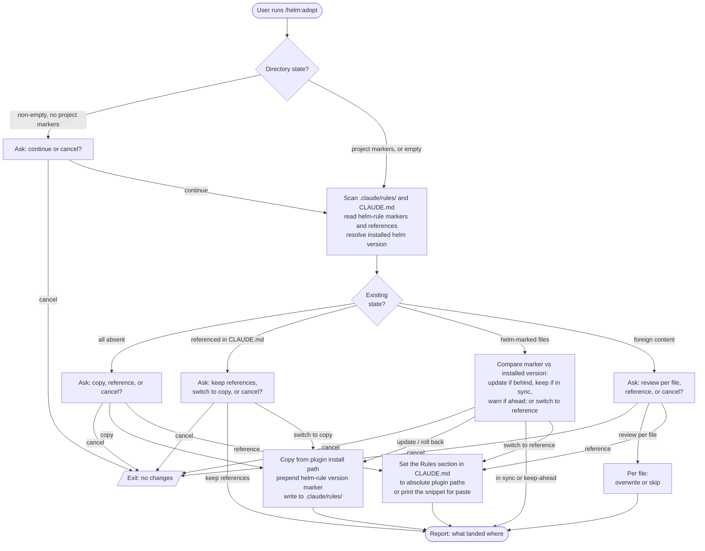

# /helm:adopt

Setup helper. Installs or updates the helm rule files into the current project, choosing between a copy-in or a reference-from-CLAUDE.md install. Detects whether existing rules came from helm (via a version marker) or were authored manually, and adapts the prompt accordingly.

Unlike the workflow commands, `/helm:adopt` configures how helm relates to a project. It does no product work, runs no tests, ships no release.

## Flow

```mermaid
flowchart TD
  Start([User runs /helm:adopt]) --> Sanity{Directory state?}
  Sanity -->|non-empty, no project markers| AskContinue[Ask: continue or cancel?]
  AskContinue -->|cancel| Cancel[/Exit: no changes/]
  AskContinue -->|continue| Scan
  Sanity -->|project markers, or empty| Scan

  Scan[Scan .claude/rules/ and CLAUDE.md<br/>read helm-rule markers and references<br/>resolve installed helm version] --> State{Existing<br/>state?}

  State -->|all absent| Fresh[Ask: copy, reference, or cancel?]
  State -->|referenced in CLAUDE.md| Referenced[Ask: keep references,<br/>switch to copy, or cancel?]
  State -->|helm-marked files| Update[Compare marker vs installed version:<br/>update if behind, keep if in sync,<br/>warn if ahead; or switch to reference]
  State -->|foreign content| Conflict[Ask: review per file,<br/>reference, or cancel?]

  Fresh -->|cancel| Cancel
  Referenced -->|cancel| Cancel
  Update -->|cancel| Cancel
  Conflict -->|cancel| Cancel

  Fresh -->|copy| Copy
  Fresh -->|reference| Reference
  Referenced -->|keep references| Done
  Referenced -->|switch to copy| Copy
  Update -->|update / roll back| Copy
  Update -->|in sync or keep-ahead| Done
  Update -->|switch to reference| Reference
  Conflict -->|review per file| PerFile[Per file:<br/>overwrite or skip]
  Conflict -->|reference| Reference

  Copy[Copy from plugin install path<br/>prepend helm-rule version marker<br/>write to .claude/rules/] --> Done
  PerFile --> Done
  Reference[Set the Rules section in CLAUDE.md<br/>to absolute plugin paths<br/>or print the snippet for paste] --> Done

  Done([Report: what landed where])
```

## Steps

No branch requirement — run from any branch. Unlike [`/helm:log`](log.md), [`/helm:legal`](legal.md), and [`/helm:manifest`](manifest.md), adopt's output (the rule files and the `## Rules` pointer) is static content templated from the plugin's own version, not a synthesis of the project's current state, so branch staleness can't corrupt it. Any merge conflict this creates is small and self-contained (a version marker, a short pointer section) — resolve it like any other conflict.

### 1. Sanity check

Looks for `.git/`, `CLAUDE.md`, or a recognised manifest (`package.json`, `composer.json`, `Cargo.toml`, `pyproject.toml`, `go.mod`). Proceeds when markers are found, and also when the directory is empty (a plausible fresh-project setup with nothing to clobber). Only prompts to confirm or cancel when the directory is non-empty but has no project markers — the case that suggests a wrong directory.

### 2. Scan existing rules

Reads `.claude/rules/git.md` and `.claude/rules/safety.md`, and detects the `CLAUDE.md` reference type for each — a *marketplace ref* (`marketplaces/claude-helm/rules/{name}`), a *local ref* (`.claude/rules/{name}`, written by copy mode), or *no ref*. Classification is driven by the file first; the reference type only disambiguates the file-absent cases:

- **Helm-marked**: file exists and starts with `<!-- helm-rule: claude-helm@v{X.Y.Z} -->`. The version is recorded.
- **Foreign**: file exists but does not carry the helm marker. Authored manually or by another tool.
- **Referenced**: the file does not exist as a physical copy, but a marketplace ref is present in CLAUDE.md (reference-mode install).
- **Absent**: the file does not exist and no marketplace ref is present. A stray local ref (e.g. a copy-mode file that was later deleted) does not block this — the Execute step rewrites the reference.

Then reads the installed helm version from `~/.claude/plugins/marketplaces/claude-helm/.claude-plugin/plugin.json` so the prompt can show users which version they would adopt.

### 3. Choose install mode

First prints a small status table (per-file state plus the installed version) so the user sees what is on disk before deciding. Then the question and labels adapt to the detected state:

- **FRESH** (no existing files, no CLAUDE.md references): Copy into `.claude/rules/` is the recommended option; Reference and Cancel are also available.
- **REFERENCED** (rules referenced in CLAUDE.md, no physical files): Keep references is the recommended option; Switch to copy mode and Cancel are also available.
- **UPDATE** (helm-marked physical files present): branches on a semver comparison of each file's marker version against the installed plugin version. **Behind** → offers to update from `v{marker}` to `v{current}`. **In sync** (marker equals installed) → reports "already up to date" and offers no overwrite. **Ahead** (marker newer than installed, e.g. the plugin was downgraded) → warns and defaults to keeping the project's newer rules rather than rolling back. Switch to reference and Cancel remain available throughout.
- **CONFLICT** (foreign physical files present): Review per file is the recommended option; Reference and Cancel are also available.

### 4. Execute

Both the Copy or Update and Reference paths update CLAUDE.md's `## Rules` section the same way: they set only the helm entries (detected by path), preserve any user-authored entries, and never add a second `## Rules` heading. If CLAUDE.md exists the section is written silently (the mode was already chosen in the previous step); if it does not exist, a minimal CLAUDE.md is created silently — there is no prompt or manual-placement path, since the pointer is required for the rules to load and skipping it would leave the install non-functional. The two paths differ only in the snippet they write.

**Copy or Update**: ensures `.claude/rules/` exists, then writes `git.md` and `safety.md` from the installed plugin source — each with a leading `<!-- helm-rule: claude-helm@v{X.Y.Z} -->` marker so a future run detects them as helm-managed. The `## Rules` snippet lists the local `.claude/rules/` paths, so the rules load as context rather than relying on implicit auto-loading.

**Conflict / Review per file**: for each foreign file, asks Overwrite or Skip. Overwrite installs the file via the Copy or Update path; Skip leaves it untouched (the developer can diff against the plugin source manually if they want to compare first).

**Reference**: first clears any local `.claude/rules/git.md` / `safety.md` that would otherwise sit alongside — and conflict with — the referenced plugin rules. Helm-marked files are deleted without asking (the mode was already chosen), which also makes the next scan classify as REFERENCED rather than UPDATE. A Foreign, user-authored file at either of those two paths is never deleted silently — the command asks Delete or Skip, and a kept file is flagged in the report as a possible conflict. Any other file in `.claude/rules/` is left untouched. The `## Rules` snippet points at `~/.claude/plugins/marketplaces/claude-helm/rules/` — always the latest installed version, auto-updating after `/plugin update helm@claude-helm` — and includes a warning to install the plugin if those paths are missing.

**No change**: for the no-op choices — "Nothing" (already in sync), "Keep project rules" (project ahead of the installed plugin), or "Keep references" (already in reference mode) — writes nothing and just reports the status.

### 5. Report

For Copy or Update installs, verifies the written files before reporting: reads `.claude/rules/git.md` and `.claude/rules/safety.md` and confirms each exists and contains the `<!-- helm-rule: claude-helm@v{X.Y.Z} -->` marker. If a file is missing or the marker is absent, reports the error instead of success.

Final summary line per file describing what was written, updated, skipped, or referenced, and which helm version was recorded in the marker.

## Stop conditions

- **Directory is non-empty without project markers and user cancels.**
- **User picks Cancel at any of the install-mode prompts.**
- **No `CLAUDE.md` and Reference mode chosen, user declines to create it**: the snippet is printed but nothing is written; user takes over.

## Notes

- The version marker at the top of each copied file is required. Stripping it makes `/helm:adopt` treat the file as foreign on the next run.
- `/helm:adopt` never writes outside `.claude/rules/` or `CLAUDE.md` in the current project.
- `/helm:adopt` never touches anything in `~/.claude/`.

## See also

- [`git.md`](../rules/git.md) - one of the two rule files this command installs
- [`safety.md`](../rules/safety.md) - the other rule file
- [`/helm:log`](log.md) - the related command that updates `CLAUDE.md` content; if you add a `## Rules` section via Reference mode, `/helm:log` will respect it
