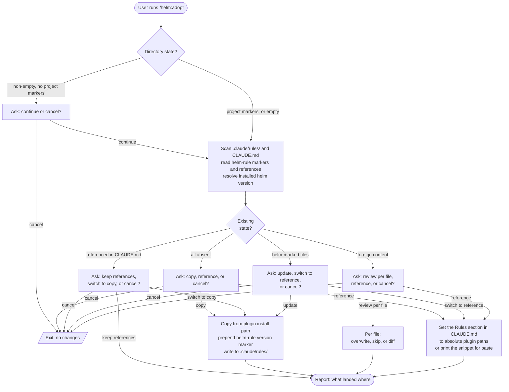

# /helm:adopt

Setup helper. Installs or updates the helm rule files into the current project, choosing between a copy-in or a reference-from-CLAUDE.md install. Detects whether existing rules came from helm (via a version marker) or were authored manually, and adapts the prompt accordingly.

Unlike the workflow commands, `/helm:adopt` configures how helm relates to a project. It does no product work, runs no tests, ships no release.

## Flow

```mermaid
flowchart TD
  Start([User runs /helm:adopt]) --> Sanity{Directory state?}
  Sanity -->|non-empty, no project markers| AskContinue[Ask: continue or cancel?]
  AskContinue -->|cancel| Cancel[/Exit: no changes/]
  AskContinue -->|continue| Scan
  Sanity -->|project markers, or empty| Scan

  Scan[Scan .claude/rules/ and CLAUDE.md<br/>read helm-rule markers and references<br/>resolve installed helm version] --> State{Existing<br/>state?}

  State -->|all absent| Fresh[Ask: copy, reference, or cancel?]
  State -->|referenced in CLAUDE.md| Referenced[Ask: keep references,<br/>switch to copy, or cancel?]
  State -->|helm-marked files| Update[Ask: update, switch to reference,<br/>or cancel?]
  State -->|foreign content| Conflict[Ask: review per file,<br/>reference, or cancel?]

  Fresh -->|cancel| Cancel
  Referenced -->|cancel| Cancel
  Update -->|cancel| Cancel
  Conflict -->|cancel| Cancel

  Fresh -->|copy| Copy
  Fresh -->|reference| Reference
  Referenced -->|keep references| Done
  Referenced -->|switch to copy| Copy
  Update -->|update| Copy
  Update -->|switch to reference| Reference
  Conflict -->|review per file| PerFile[Per file:<br/>overwrite, skip, or diff]
  Conflict -->|reference| Reference

  Copy[Copy from plugin install path<br/>prepend helm-rule version marker<br/>write to .claude/rules/] --> Done
  PerFile --> Done
  Reference[Set the Rules section in CLAUDE.md<br/>to absolute plugin paths<br/>or print the snippet for paste] --> Done

  Done([Report: what landed where])
```

## Steps

### 1. Sanity check

Looks for `.git/`, `CLAUDE.md`, or a recognised manifest (`package.json`, `composer.json`, `Cargo.toml`, `pyproject.toml`, `go.mod`). Proceeds when markers are found, and also when the directory is empty (a plausible fresh-project setup with nothing to clobber). Only prompts to confirm or cancel when the directory is non-empty but has no project markers — the case that suggests a wrong directory.

### 2. Scan existing rules

Reads `.claude/rules/git.md` and `.claude/rules/safety.md`, and detects the `CLAUDE.md` reference type for each — a *marketplace ref* (`marketplaces/claude-helm/rules/{name}`), a *local ref* (`.claude/rules/{name}`, written by copy mode), or *no ref*. Classification is driven by the file first; the reference type only disambiguates the file-absent cases:

- **Helm-marked**: file exists and starts with `<!-- helm-rule: claude-helm@v{X.Y.Z} -->`. The version is recorded.
- **Foreign**: file exists but does not carry the helm marker. Authored manually or by another tool.
- **Referenced**: the file does not exist as a physical copy, but a marketplace ref is present in CLAUDE.md (reference-mode install).
- **Absent**: the file does not exist and no marketplace ref is present. A stray local ref (e.g. a copy-mode file that was later deleted) does not block this — Step 5 rewrites the reference.

Then reads the installed helm version from `~/.claude/plugins/marketplaces/claude-helm/.claude-plugin/plugin.json` so the prompt can show users which version they would adopt.

### 3. Show the scan summary

Prints a small status table so the user knows what is on disk before picking an install mode.

### 4. Choose install mode

Question and labels adapt to the detected state:

- **FRESH** (no existing files, no CLAUDE.md references): Copy into `.claude/rules/` is the recommended option; Reference and Cancel are also available.
- **REFERENCED** (rules referenced in CLAUDE.md, no physical files): Keep references is the recommended option; Switch to copy mode and Cancel are also available.
- **UPDATE** (helm-marked physical files present): Update is the recommended option; Switch to reference and Cancel are also available.
- **CONFLICT** (foreign physical files present): Review per file is the recommended option; Reference and Cancel are also available.

### 5. Execute

**Copy or Update**: ensures `.claude/rules/` exists, then writes `git.md` and `safety.md` from the installed plugin source. Each file gets a leading `<!-- helm-rule: claude-helm@v{X.Y.Z} -->` marker so a future `/helm:adopt` run can detect them as helm-managed. It also points `CLAUDE.md` at the copied files — a `## Rules` section listing the local `.claude/rules/` paths with an instruction to read and follow them each session — so the rules load as context rather than relying on implicit auto-loading. This *sets* the section entries, replacing any existing helm entries (a marketplace ref from reference mode, or a stale one) rather than appending — so switching reference ↔ copy is idempotent and never leaves a doubled or dangling reference.

**Conflict / Review per file**: for each foreign file, asks Overwrite, Skip, or Show diff. Showing the diff loops back to the same prompt so the user can pick after seeing the changes.

**Reference**: when switching from copy or update, first deletes any Helm-marked local files in `.claude/rules/` so the next scan classifies as REFERENCED rather than UPDATE (Foreign, user-authored files are left untouched). Then sets the `## Rules` section in `CLAUDE.md` to point at `~/.claude/plugins/marketplaces/claude-helm/rules/` — replacing any local-path entries left by copy mode rather than appending alongside them. This path always reflects the latest installed version and updates automatically after `/plugin update helm@claude-helm`. The snippet instructs the agent to read and follow those rule files at the start of every session (and to warn if the plugin is not installed) — so cross-references between the rules resolve the same way they would in copy mode. If `CLAUDE.md` does not exist, the command offers to create it first (recommended); if the user declines, it prints the snippet to the chat for manual placement.

### 6. Report

For Copy or Update installs, verifies the written files before reporting: reads `.claude/rules/git.md` and `.claude/rules/safety.md` and confirms each exists and contains the `<!-- helm-rule: claude-helm@v{X.Y.Z} -->` marker. If a file is missing or the marker is absent, reports the error instead of success.

Final summary line per file describing what was written, updated, skipped, or referenced, and which helm version was recorded in the marker.

## Stop conditions

- **Directory is non-empty without project markers and user cancels.**
- **User picks Cancel at any of the install-mode prompts.**
- **No `CLAUDE.md` and Reference mode chosen, user declines to create it**: the snippet is printed but nothing is written; user takes over.

## Notes

- The version marker at the top of each copied file is required. Stripping it makes `/helm:adopt` treat the file as foreign on the next run.
- `/helm:adopt` never writes outside `.claude/rules/` or `CLAUDE.md` in the current project.
- `/helm:adopt` never touches anything in `~/.claude/`.

## See also

- [`git.md`](../rules/git.md) - one of the two rule files this command installs
- [`safety.md`](../rules/safety.md) - the other rule file
- [`/helm:log`](log.md) - the related command that updates `CLAUDE.md` content; if you add a `## Rules` section via Reference mode, `/helm:log` will respect it
