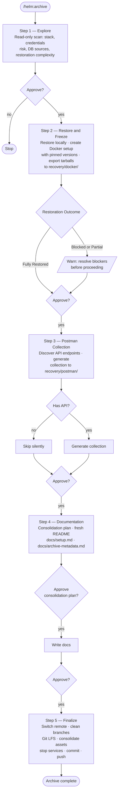

# /helm:archive

The archival command. Runs a five-step workflow to restore an old project, freeze its environment with Docker, generate a Postman collection, write recovery documentation, and push everything to a private archive remote — so the project can be recovered years later from a clean machine.

## Flow



## Steps

### 1. Explore

Read-only reconnaissance. Scans the project structure, stack, runtime versions, database sources, external integrations, existing documentation, and Git remotes. Flags any active credentials found in env files. Produces a structured report and assigns a restoration complexity rating (Easy / Medium / Complex / Blocked) so the developer can decide whether to proceed before anything is touched.

### 2. Restore and Freeze

Gets the project running locally and freezes its environment for long-term recovery. Creates a `Dockerfile` and `docker-compose.yml` if none exist, with all base image versions specifically pinned. Restores available data from the best source found (dumps → seeders → migrations). After successful verification, exports all Docker images as gzipped tarballs to `recovery/docker/` — stored locally alongside the repo, gitignored, never committed. Recovery then requires only Docker and the tarballs with no internet or registry dependency. For project types where Docker does not apply (mobile, browser extensions), documents exact SDK and toolchain versions in `docs/setup.md` as the freeze mechanism instead.

### 3. Postman Collection

Generates a Postman collection if the project exposes an API it owns. Discovers endpoints from route definitions, source code, or OpenAPI specs. Verifies safe requests (GET, health endpoints, auth flows) against the running local app. Saves the collection and environment files to `recovery/postman/` using the project name. Skips silently for projects with no API surface.

### 4. Documentation

Writes fresh, archive-focused documentation using verified information from all previous steps. Reads all existing documentation first and presents a consolidation plan (Keep / Update / Merge / Archive / Remove per file) for explicit approval before touching anything. Always writes a fresh `README.md` — extracts any historically valuable content from the old one into `docs/historical-notes.md` first. Writes `docs/setup.md` as the single recovery reference: environment, Docker restore commands, recovery priority, demo workflow, API notes, and restoration fixes. Writes `docs/archive-metadata.md` as a structured snapshot for quick inventory across archived projects.

### 5. Finalize

Prepares and seals the archive. Verifies and switches the Git remote to the private archive URL — stops if origin still points to a company or client repository. Deletes all branches except main or master locally and remotely after explicit approval. Sets up Git LFS for any files over 100 MB. Consolidates archive-worthy assets scattered across the project into `recovery/assets/`, checking for code references before moving anything. Stops all running project services (Docker containers, dev servers). Commits everything accumulated across the full workflow with a single `chore(archive): seal project archive` commit and pushes to the private remote.

## Output

After the workflow completes, the project contains:

```
recovery/
  docker/         ← gitignored Docker image tarballs (local only)
  postman/        ← Postman collection and environment files
  assets/         ← consolidated screenshots, exports, demo files
docs/
  setup.md        ← single recovery reference
  archive-metadata.md  ← structured snapshot
  historical-notes.md  ← historical content (if any)
README.md         ← fresh archive-focused index
```

## Approval gates

The command stops and waits for explicit approval at seven points:

1. After Step 1 — before anything is modified
2. After Step 2 — with a warning if restoration was not fully successful
3. After Step 3 — before proceeding to documentation
4. Before Step 4 executes — consolidation plan review
5. After Step 4 — before proceeding to finalize
6. Before branch deletion in Step 5
7. Before asset moves in Step 5 if referenced files are found

## See also

- [`/helm:log`](log.md) — sync `CLAUDE.md` to the current codebase
- [`/helm:manifest`](manifest.md) — sync `README.md` to the current codebase
