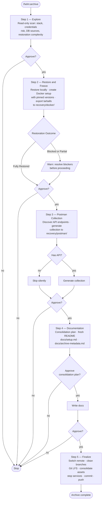

# /helm:archive

The archival command. Runs a five-step workflow to restore an old project, freeze its environment with Docker, generate a Postman collection, write recovery documentation, and push everything to a private archive remote — so the project can be recovered years later from a clean machine.

The workflow is **resumable**. Progress and each step's report are persisted under a gitignored `.archive/` directory: a `state.json` cursor tracks the last completed step, and each step writes its report to `.archive/step{N}-{name}.md`. Later steps read those reports by name rather than relying on conversation memory — so the workflow survives context compaction and can resume across the approval gates, even in a new session. On start it reads `state.json` and continues from the next step (or reports that the archive already completed). Step 1 stays read-only: nothing is written until after its approval.

`.archive/` is gitignored scratch, so it has no trace on a fresh clone of an already-archived project. If `state.json` is absent, the command falls back to checking for `docs/archive-metadata.md` — the committed, permanent record Step 4 writes — before assuming this is a genuine fresh run. If that file exists, it confirms with you before restarting the whole workflow, rather than silently re-running everything from Step 1.

**Before starting**, there is no branch-name requirement — run it from whatever branch you consider the real, complete state of the project. Archive candidates are often old or neglected, so `main` is not always the branch that was actually last worked on; Step 5 makes whichever branch you archived from the sole surviving branch, renamed to `main` if it isn't already. It also lists any unmerged local branches (`git branch --no-merged`) and warns that their work will not be captured, so you can merge what should be kept into the current branch before sealing. It never merges on your behalf.

## Flow


```mermaid
flowchart TD
  Start(["/helm:archive"]) --> S1

  S1["Step 1 — Explore\nRead-only scan: stack, credentials\nrisk, DB sources, restoration complexity"]
  S1 --> A1{Approve?}
  A1 -->|no| Exit([Stop])
  A1 -->|yes| S2

  S2["Step 2 — Restore and Freeze\nRestore locally · create Docker setup\nwith pinned versions · export tarballs\nto recovery/docker/"]
  S2 --> Outcome{Restoration Outcome}
  Outcome -->|Fully Restored| A2{Approve?}
  Outcome -->|Blocked or Partial| Warn[/"Warn: resolve blockers\nbefore proceeding"/]
  Warn --> A2
  A2 -->|no| Exit
  A2 -->|yes| S3

  S3["Step 3 — Postman Collection\nDiscover API endpoints · generate\ncollection to recovery/postman/"]
  S3 --> HasAPI{Has API?}
  HasAPI -->|no| SkipS3[Skip silently]
  HasAPI -->|yes| GenPost[Generate collection]
  SkipS3 --> A3{Approve?}
  GenPost --> A3
  A3 -->|no| Exit
  A3 -->|yes| S4

  S4["Step 4 — Documentation\nConsolidation plan · fresh README\ndocs/setup.md · docs/archive-metadata.md"]
  S4 --> Plan{Approve\nconsolidation plan?}
  Plan -->|no| Exit
  Plan -->|yes| WriteDocs[Write docs]
  WriteDocs --> A4{Approve?}
  A4 -->|no| Exit
  A4 -->|yes| S5

  S5["Step 5 — Finalize\nSwitch remote · clean branches\nGit LFS · consolidate assets\nstop services · commit · push"]
  S5 --> Done(["Archive complete"])
```

## Steps

### [1. Explore](archive/1-explore.md)

Read-only reconnaissance. Scans the project structure, stack, runtime versions, database sources, external integrations, existing documentation, and Git remotes. Compares the current branch against every other local and remote branch and flags it (informational only, never blocking) if another branch looks more recently active or complete — a heads-up in case the wrong branch was checked out. Flags any active credentials found in env files. Produces a structured report and assigns a restoration complexity rating (Easy / Medium / Complex / Blocked) so the developer can decide whether to proceed before anything is touched.

### [2. Restore and Freeze](archive/2-restore-and-freeze.md)

Gets the project running locally and freezes its environment for long-term recovery. Creates a `Dockerfile` and `docker-compose.yml` if none exist, with all base image versions specifically pinned. Determines the project's data layer first (database-backed, API-consuming frontend, local/file-based storage, or none) and restores accordingly — for database-backed projects, from the best source found (dumps → seeders → migrations), and for the others, the appropriate handling or a clean skip. After successful verification, exports all Docker images as gzipped tarballs to `recovery/docker/`. These are the freeze mechanism, so they are meant to travel with the archive (committed via Git LFS in Step 5) rather than being gitignored — otherwise a clean clone has no tarballs and would have to rebuild from registries that may no longer exist. Because a `docker save` captures the engine image but not the data (which lives in a volume), it also makes the restored data recoverable — either by wiring the recovery to re-init from the committed dump/seed on startup, or by exporting the data volume as its own tarball — so `docker-compose up` does not come back empty. Recovery then requires only Docker and the tarballs with no internet or registry dependency. For project types where Docker does not apply (mobile, browser extensions), documents exact SDK and toolchain versions in `docs/setup.md` as the freeze mechanism instead.

### [3. Postman Collection](archive/3-postman.md)

Generates a Postman collection if the project exposes an API it owns. Discovers endpoints from route definitions, source code, or OpenAPI specs. Verifies safe requests (GET, health endpoints, auth flows) against the running local app. Saves the collection and environment files to `recovery/postman/` using the project name. Skips silently for projects with no API surface.

### [4. Documentation](archive/4-documentation.md)

Writes fresh, archive-focused documentation using verified information from all previous steps. Reads all existing documentation first and presents a consolidation plan (Keep / Update / Merge / Archive / Remove per file) for explicit approval before touching anything. Always writes a fresh `README.md` — extracts any historically valuable content from the old one into `docs/historical-notes.md` first. Writes `docs/setup.md` as the single recovery reference: environment, Docker restore commands, recovery priority, demo workflow, API notes, and restoration fixes. Writes `docs/archive-metadata.md` as a structured snapshot for quick inventory across archived projects.

### [5. Finalize](archive/5-finalize.md)

Prepares and seals the archive. Verifies the Git remote and guides you through removing non-personal remotes and setting the private archive URL if origin still points to a company or client repository — this happens first, so every later action in this step, including branch deletion, only ever touches the private archive remote. Renames the branch you archived from to `main` (if it isn't already) and deletes every other branch locally and remotely after explicit approval — no merging, the archived branch simply becomes canonical. Handles the recovery tarballs: reports their size and asks whether to commit them to the remote via Git LFS (recommended — keeps the archive self-contained and clean-machine-recoverable) or keep them local only (with a separate-backup note); other files over 100 MB are LFS-tracked too. Consolidates archive-worthy assets scattered across the project into `recovery/assets/`, checking for code references before moving anything. Stops all running project services (Docker containers, dev servers). After a final confirmation, commits everything accumulated across the full workflow with a single `chore(archive): seal project archive` commit and pushes to the private remote.

## Output

After the workflow completes, the project contains:

```
recovery/
  docker/         ← gitignored Docker image tarballs (local only)
  postman/        ← Postman collection and environment files
  assets/         ← consolidated screenshots, exports, demo files
docs/
  setup.md        ← single recovery reference
  archive-metadata.md  ← structured snapshot
  historical-notes.md  ← historical content (if any)
README.md         ← fresh archive-focused index
```

## Stop conditions

- **Approve declined at any gate.** The command halts cleanly with no further changes.
- **Step 1 complexity rated Blocked.** User can still approve to proceed, but is warned.

The command stops and waits for explicit approval at ten points:

1. After Step 1 — before anything is modified
2. After Step 2 — with a warning if restoration was not fully successful
3. After Step 3 — before proceeding to documentation
4. Before Step 4 executes — consolidation plan review
5. After Step 4 — before proceeding to finalize
6. Before branch deletion in Step 5
7. Before choosing how the recovery tarballs travel (Git LFS or local only) in Step 5
8. Before stopping all running services (Docker containers, dev servers) in Step 5
9. Before asset moves in Step 5 if referenced files are found
10. Before the final commit and push in Step 5

## See also

- [`/helm:log`](log.md) — sync `CLAUDE.md` to the current codebase
- [`/helm:manifest`](manifest.md) — sync `README.md` to the current codebase
