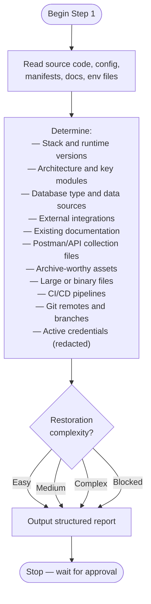

# Step 1 — Explore

Read-only reconnaissance. Scans every corner of the project — stack, data sources, integrations, credentials, Git state — and produces a structured report with a restoration complexity rating. Nothing is modified. The developer decides whether to proceed based on the report.

## Flow

## What it scans

The step reads source code, configuration files, manifests, env files, and any existing documentation. It does not rely only on README files. It separates confirmed facts from guesses and labels guesses explicitly.

**Project profile**
- Purpose and business domain
- Technology stack: framework, language, runtime versions, package manager, database type
- Architecture: key modules, layers, and how the pieces fit together
- Authentication and authorization approach

**Data and database**
- Database type and where credentials live
- Available restoration sources in priority order: dumps, seeders, migrations, or none
- Demo accounts or demo data if found

**External integrations**
- Third-party services the project depends on
- Which are required for basic operation vs optional

**Credentials risk**
- Scans all env files: `.env`, `.env.staging`, `.env.production`, config files, Docker files
- Redacts values — shows only file path, variable name, and a short preview (`API_KEY=abc...xyz`)
- Flags anything that appears still-active

**Git and repository safety**
- All remotes and their URLs
- Branch list
- CI/CD pipelines that could auto-deploy on push

**Archive assets**
- Existing Postman or API collection files
- Screenshots, videos, sample exports, demo files
- Large or binary files that could affect Git storage

## Complexity rating

The report closes with one of four ratings:

| Rating | Meaning |
|---|---|
| Easy | Project is well-documented, dependencies are available, restoration is straightforward |
| Medium | Some gaps or unknowns, but restoration is likely achievable |
| Complex | Significant unknowns or missing dependencies; expect manual work |
| Blocked | A hard blocker exists that prevents restoration without external action |

## Rules

- Read-only only. No files created, modified, deleted, or executed.
- No external service contact.
- Credential values are always redacted.

## Output

A structured report covering all categories above, ending with the complexity rating and recommended next steps for Step 2. The command stops after the report and waits for explicit approval before Step 2 begins.
