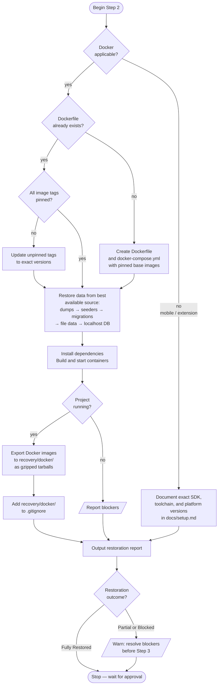

# Step 2 — Restore and Freeze

Gets the project running locally and freezes its environment for long-term recovery. Creates or updates a Docker setup with pinned image versions, restores available data, and exports all images to gzipped tarballs. Recovery years later requires only Docker and the tarballs — no internet, no registry dependency.

## Flow



## Restoration strategy

Docker is the preferred freeze mechanism for most project types. Base image tags and registries can disappear over time, so images are exported as tarballs after a successful build.

| Project type | Approach |
|---|---|
| Web backend / API | Docker Compose: app + database + required services |
| CMS (WordPress, Drupal, etc.) | Docker Compose: web server + database |
| Web frontend (React, Vue, etc.) | Docker: build environment + static server |
| Static site (Jekyll, Hugo, etc.) | Docker: build environment only |
| Full-stack / monorepo | Docker Compose: minimum services for a working demo |
| Data science / ML | Docker: pinned base image with all dependencies |
| CLI tool or script | Docker: pinned runtime image |
| Mobile (React Native, Flutter, iOS, Android) | Document exact SDK and toolchain versions instead |
| Desktop (Electron, Tauri) | Docker for build step if possible; otherwise document versions |
| Browser extension | Document browser version and extension API versions |
| Library / package | Docker for the test environment |

## Data restoration priority

The best available source is used in this order:

1. Repository-contained database dumps or backup files
2. Seed scripts, fixture files, or sample datasets
3. Schema migrations — reconstruct from scratch
4. File-based data (CSV, JSON, XML used by the application)
5. Documented external exports
6. Existing localhost database — only if no repository source exists

If restoration requires a network or cloud database, the step stops for approval.

## Image export

After verification, all Docker images are exported to `recovery/docker/` as gzipped tarballs — one per service. The folder is gitignored and stored locally alongside the repo, never committed.

Recovery commands are documented in `docs/setup.md`:
```
docker load < recovery/docker/web.tar.gz
docker load < recovery/docker/db.tar.gz
docker-compose up
```

## Rules

- Preserve the original project. Prefer compatibility fixes over upgrades.
- Record every file created, modified, or deleted with the reason.
- No production systems, live databases, or external services.
- No emails, SMS, notifications, webhooks, or payment gateways without explicit approval.
- No Git state changes — no commit, push, checkout, or history rewrite.

## Outcome ratings

| Rating | Meaning |
|---|---|
| Fully Restored | Project is running and verified |
| Partially Restored | Running but with known gaps or missing features |
| Buildable But Not Runnable | Builds successfully but cannot start |
| Blocked | A hard blocker prevents restoration |
| Cannot Be Restored Without Missing Dependencies | External dependencies unavailable |

If the outcome is anything other than Fully Restored, the step warns the developer and waits for explicit approval before Step 3 begins.
