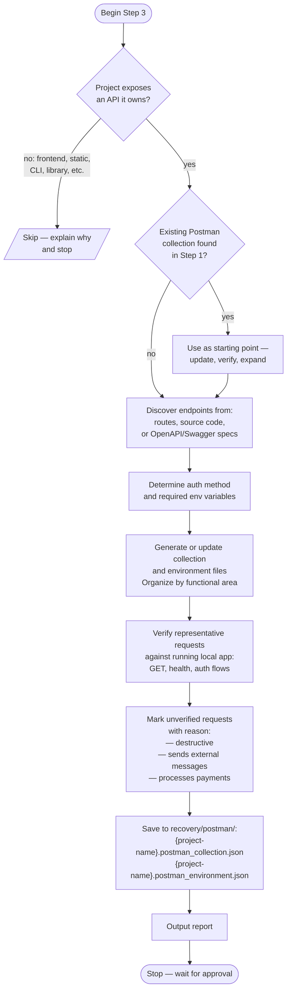

# Step 3 — Postman Collection

Generates a Postman collection for projects that expose an API they own. Discovers endpoints from source code, routes, or OpenAPI specs, verifies safe requests against the running local app, and saves the collection to `recovery/postman/`. Skips silently for projects with no API surface.

## Flow

## Applicability

A collection is generated when the project exposes an API it owns — REST, GraphQL, or similar.

The step skips when:
- The project has no API surface (pure frontend, static site, CLI tool, library)
- The only APIs present belong to third-party services (Stripe, SendGrid, etc.)

If an existing Postman collection was found in Step 1, it is used as the starting point rather than generating from scratch.

## Endpoint discovery

Endpoints are discovered from source code, route definitions, or OpenAPI/Swagger specs. Deprecated, disabled, or commented-out endpoints are excluded.

All requests use demo accounts, local tokens, or placeholder values. No real credentials, production URLs, or secrets.

## Verification

Representative requests are verified against the running local app from Step 2:

- GET requests
- Health endpoints
- Authentication flows
- Local demo workflows

Requests that may cause side effects are not verified automatically and are marked as unverified with a reason:

- Endpoints that delete data
- Endpoints that send emails, SMS, or notifications
- Endpoints that trigger webhooks
- Payment processing endpoints
- Bulk operation endpoints

If the local application is not running (Step 2 did not fully restore), all requests are discovered from source code only and marked as unverified.

## Output files

Saved to `recovery/postman/` using the project name from Step 1:

- `{project-name}.postman_collection.json`
- `{project-name}.postman_environment.json`

Requests are organized by functional area (Authentication, Users, Admin, Products, Orders, etc.) with collection variables, environment variables, request descriptions, and authentication notes.
