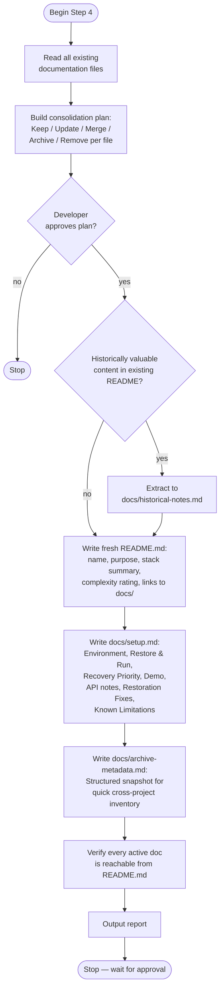

# Step 4 — Documentation

Writes fresh, archive-focused documentation using verified information from all previous steps. Reads every existing doc first and presents a consolidation plan for explicit approval before touching anything. Produces three required files and one optional file.

## Flow

## Consolidation plan

Before making any changes, every existing documentation file is reviewed and assigned one action:

| Existing doc type | Action |
|---|---|
| Accurate, has recovery or demonstration value | Keep — link from README |
| Accurate but duplicates `docs/setup.md` content | Merge into `docs/setup.md`, remove original |
| Outdated instructions that affect restoration | Update |
| Historical context, domain knowledge, business background | Move to `docs/historical-notes.md` |
| Contributor guides, PR templates, code of conduct | Remove — irrelevant for private archive |
| Changelogs and release notes | Move to `docs/historical-notes.md` if useful; otherwise remove |
| CI/CD documentation, deployment runbooks | Remove — no recovery value |
| Auto-generated documentation | Remove — regenerate if needed |
| Outdated and no recovery or historical value | Remove |

The plan is presented and must be explicitly approved before any file is touched.

## Required files

### README.md

Always written fresh, regardless of whether one already exists. Historically valuable content from the old README (business context, domain knowledge, why the project was built) is extracted to `docs/historical-notes.md` first.

The new README contains: project name, one-paragraph purpose, tech stack summary, restoration complexity rating from Step 1, and links to `docs/setup.md` and `docs/archive-metadata.md`. It is a short index for future-you, not a public-facing document.

### docs/setup.md

The single recovery reference. Sections written only when applicable:

- **Environment** — original runtime requirements, verified restoration environment from Step 2
- **Restore & Run** — exact commands to restore and start the project
- **Recovery Priority** — each dependency classified as Required, Optional, or Not Required
- **Demo** — demo accounts, happy path walkthrough, key screens; omitted for CLI tools and libraries
- **API** — authentication method, collection location; included only if Step 3 generated a collection
- **Restoration Fixes** — every fix applied in Step 2, why it was necessary, and whether it may need revisiting
- **Known Limitations** — features that could not be restored or require unavailable services

### docs/archive-metadata.md

Structured snapshot for quick inventory across archived projects:
- Repository name and archive date
- Project purpose (one line)
- Technology stack
- Restoration outcome from Step 2
- Runtime versions used
- Database source used
- Docker images exported and tarball paths
- Postman collection generated: yes / no
- Recovery complexity rating from Step 1
- Known limitations (brief)

## Optional file

**docs/historical-notes.md** — created only when significant historical content exists that has archival value but would clutter current docs. All content is clearly labelled as historical.

## Rules

- Read all existing documentation before making any changes.
- Only document verified information. Label anything unverified explicitly.
- Do not invent setup procedures, demo workflows, runtime requirements, or API behavior.
- No secrets, credentials, API keys, or private/production URLs.
- Every active document must be reachable from README.md.
- No commit or push.
