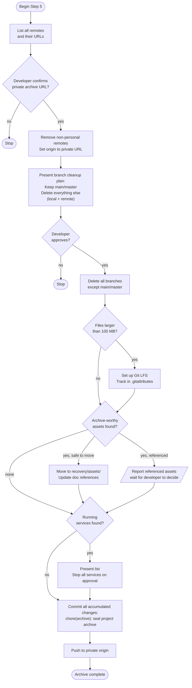

# Step 5 — Finalize

Seals the archive. Verifies and switches the Git remote to the private archive URL, cleans up branches, handles large files with Git LFS, consolidates archive assets, stops running services, and commits everything accumulated across the full workflow with a single commit pushed to the private remote.

## Flow



## Task 1 — Remote verification

All configured remotes are listed and presented. The developer identifies which point to company, client, or external repositories and provides the private archive URL. The remote must already exist before this step runs.

All non-personal remotes are removed. Origin is set to the provided private URL. No other task proceeds until origin is confirmed as the private archive remote.

## Task 2 — Branch cleanup

All local and remote branches are listed. A deletion plan is presented for explicit approval:

```
BRANCH CLEANUP

Keep:     main
Delete:   feature/user-auth   (local + remote)
Delete:   fix/payment-bug     (local + remote)
```

If local and remote main/master have diverged, the step stops for approval before resolving the divergence.

## Task 3 — Git LFS

Scans for files larger than 100 MB (tracked and untracked). If found, Git LFS is set up and large files are tracked with appropriate patterns in `.gitattributes`. Skips silently if no large files exist.

## Task 4 — Asset consolidation

Identifies archive-worthy assets scattered across the project: screenshots, videos, audio files, sample exports, database dumps, and demo files that are not part of the application source.

Each asset is classified:
- **Safe to move** — not referenced anywhere; moved to `recovery/assets/`
- **Referenced** — one or more files reference the current path; reported to the developer, not moved automatically

## Task 5 — Stop services

All running services tied to the project are listed (Docker containers, dev servers, etc.) and stopped after explicit approval. Skips silently if nothing is running.

## Task 6 — Final commit and push

All changes accumulated across the full workflow are committed in a single commit:

```
chore(archive): seal project archive
```

Pushed to origin using the branch confirmed in Task 2. The step confirms the push was successful and closes with the archive date, remote URL, and a quick-start recovery snippet.

## Rules

- Present a plan and wait for explicit approval before any destructive operation.
- No branch deletion without explicit approval.
- No push until origin is confirmed as the private archive remote.
- No commit until all cleanup tasks are complete.
