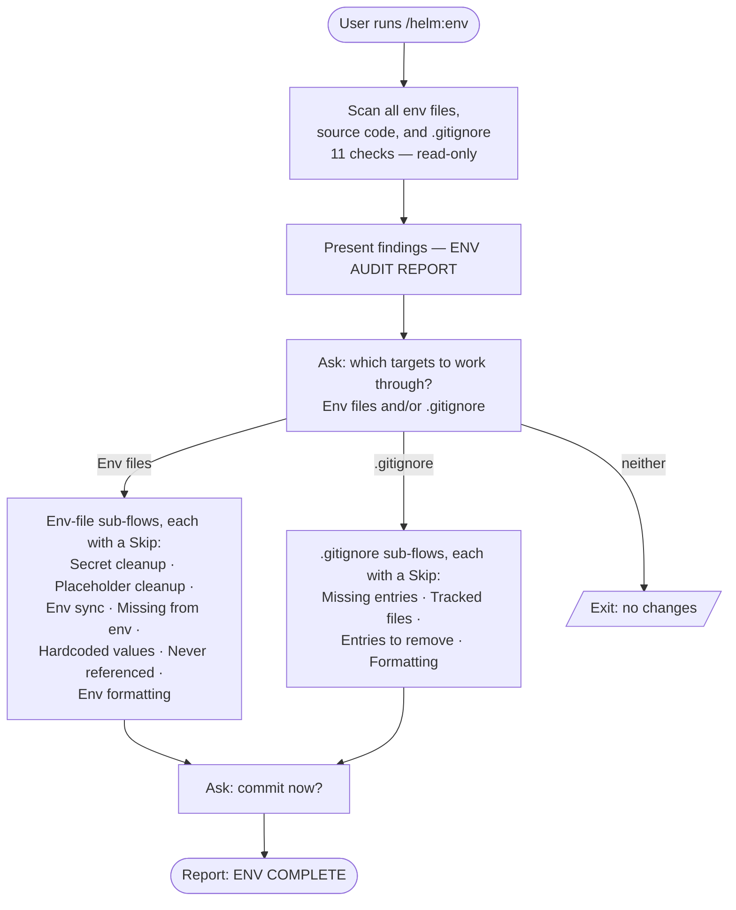

# /helm:env

Audit `.env` files, `.gitignore`, and source code to find and fix environment configuration issues. Covers sync gaps, missing vars, hardcoded values, secret/placeholder correctness, and formatting — all in one pass.

## Flow

## Steps

### Before starting

No branch requirement — runs from any branch. This command audits and fixes `.env`/`.gitignore` configuration in place; it doesn't generate canonical content that needs a stable, merged main to scan from, so it isn't git-strategy-aware the way `/helm:log` or `/helm:manifest` are.

### 1. Scan

Eleven read-only checks across all env files, source code, and `.gitignore`. Never stops early — a partial scan produces missed findings that silently persist.

| Check | What it finds |
|---|---|
| 1.1 Detect env files | All `.env*` files and their inferred purpose |
| 1.2 Env sync | Keys present in some files but missing from others |
| 1.3 Source code refs | Every env var accessed in source, per stack |
| 1.4 Cross-reference | Keys missing from all env files; keys never referenced in code |
| 1.5 Secret/placeholder | Real secrets in `.env.example`; unfilled placeholders in other env files |
| 1.6 Hardcoded values | String literals in source that should be env vars |
| 1.7 Env formatting | Duplicate keys, spacing, missing category groupings |
| 1.8 Gitignore missing entries | Stack-appropriate entries absent from `.gitignore` |
| 1.9 Gitignore tracked files | Tracked files that match a `.gitignore` pattern |
| 1.10 Gitignore entries to remove | Overly broad or harmful `.gitignore` entries |
| 1.11 Gitignore formatting | Duplicate entries, missing category groupings |

### 2. Report

Findings presented as a single `ENV AUDIT REPORT` grouped by category. Includes a total issue count and a multi-select to choose which **targets** to work through — **Env files** and/or **.gitignore**. Selecting a target runs every one of its sub-flows in Step 3 (each with its own Skip); selecting neither exits without changes. The report still lists every finding regardless of what's selected.

### 3. Apply fixes

Run the selected target's sub-flows, one at a time, each completing fully before the next. Each sub-flow runs only if it has findings and offers a Skip.

**Env files sub-flows** (if "Env files" selected):

- **Secret cleanup (.env.example)** — shows each flagged real secret with its planned placeholder replacement. Single-select: Replace all, Skip, or Other (free-text). Does not touch any other env file.
- **Placeholder cleanup (other env files)** — shows unfilled placeholders grouped by file. Dev fills in values manually, then marks done.
- **Env sync** — per file. Shows which keys are missing and where they exist in other files. Dev adds them manually per file, marks done before moving to the next.
- **Missing from env** — all at once. Keys referenced in code but absent from all env files, with file:line locations. Dev adds them manually, marks done.
- **Hardcoded values** — shows all findings with severity, file:line, redacted value, and suggested env var name. Single-select: Replace all, Skip, or Other. If Replace all and more than 10 findings: processes one source file at a time, committing after each.
- **Never referenced** — lists keys with no code reference, with a hint on whether each looks infrastructure-only or stale. Dev responds in free text — delete some, keep some, or wire up to code.
- **Env formatting** — single-select: Proceed or Skip. Fixes formatting, removes duplicate keys (keep last), adds category groupings consistently across all env files. Preserves existing group order.

**.gitignore sub-flows** (if ".gitignore" selected):

- **Missing entries** — shows entries with reason, single-select Add all/Skip. If approved, immediately checks for tracked files matching the new patterns.
- **Tracked files** — per-file confirmation to run `git rm --cached`. Triggered automatically after missing entries are added, and for any pre-existing tracked files found in Step 1.9.
- **Entries to remove** — shows overly broad or harmful entries with reason, single-select Remove all/Skip.
- **Gitignore formatting** — single-select Proceed/Skip. Fixes formatting, removes duplicates, adds category groupings.

### 4. Commit

After all fixes are applied, commits (per [git.md's Auto-Commit rule](../rules/git.md#auto-commit), which governs every commit this plugin makes). Commit message: `chore(env): audit and fix env configuration`.

### 5. Completion report

Summarises the outcome grouped by target (Env files, .gitignore): counts replaced, added, deleted, or fixed for each of the eleven sub-flows — including how many never-referenced keys were deleted vs kept. Lists anything needing manual follow-up: skipped secret cleanup (real secrets still in `.env.example`) and skipped tracked files.

## Stop conditions

- **No findings at all.** Nothing to fix — the report shows a clean audit.
- **User selects neither target, or Skips every sub-flow.** Clean exit, no changes written.

## See also

- [`/helm:ship`](ship.md) — run env before shipping to catch missing vars before they reach production
- [`/helm:refactor`](refactor.md) — broader code quality pass that pairs with env for a full pre-release sweep
