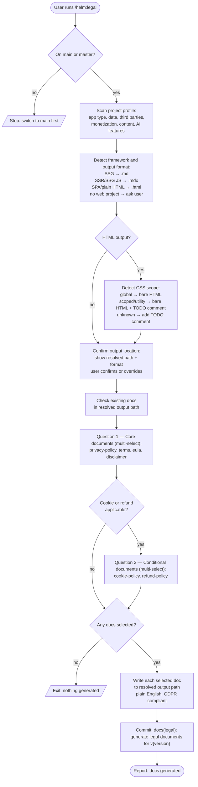

# /helm:legal

Scan the project's legal profile, detect the output format based on the web framework (or ask if none is found), let the user choose which documents to generate, then write GDPR-compliant legal documents in plain English and commit them.

## Flow

## Steps

### 1. Branch check

Only runs from `main` or `master`. Halts on any other branch.

### 2. Project scan

Reads the codebase to build a legal profile:

- **App type**: web app, mobile, Chrome extension, desktop, open source library.
- **Data collection**: forms, auth, accounts, analytics (GA, Mixpanel, Hotjar, GTM), error tracking (Sentry, Bugsnag), any PII.
- **Third parties**: payment processors (Stripe, PayPal, Paddle), social auth, cloud services, marketing tools.
- **Monetization**: paid tiers, subscriptions, pricing pages.
- **Content model**: user-generated content, advice content (financial, health, legal), AI-generated recommendations.
- **AI features**: AI used to generate recommendations presented as facts, BYOK models.

**Framework and output detection** — determines the file format and output path from the project's structure:

| Scenario | Format | Output path |
|---|---|---|
| Static site generator (Jekyll, Hugo, Eleventy, …) | `.md` | Generator's content/docs directory, under `legal/` |
| JS framework with SSR/SSG (Next.js, Astro, Nuxt, SvelteKit, …) | `.mdx` | Framework's pages/content directory, under `legal/` |
| SPA or plain HTML (no SSR, no SSG) | `.html` | Web root (`public/`, `dist/`, or root), clean URL subfolders |
| No web project detected | ask user | User chooses: `legal/` Markdown, `legal/` HTML, or custom path |

**CSS detection (HTML output only)** — if the resolved format is `.html`:
- Global CSS (element/class selectors site-wide) → bare semantic HTML, no comment.
- Scoped or utility-first CSS (Tailwind, CSS Modules, etc.) → bare semantic HTML + a `<!-- TODO: wrap this content … -->` comment inside `<body>`.
- Cannot determine → add the TODO comment as a safe default.

**Output location confirmation** — after detection, the resolved path and format are shown to the user before anything is written. The user can confirm or override with a custom path and format.

**Existing documents** — checks the resolved output path for already-present files. Existing files are labelled `(exists)` in the selection step so the user knows they will be overwritten.

### 3. Select which documents to generate

AskUserQuestion has a 4-option limit, so this step uses two questions.

**Question 1 — core documents** (always asked):

| Option | Recommended when |
|---|---|
| `privacy-policy.md` | always |
| `terms.md` | always |
| `eula.md` | installable software, plugins, desktop apps, Chrome extensions |
| `disclaimer.md` | AI-generated content, financial/health/legal advice |

**Question 2 — conditional documents** (only asked if relevant signals were detected):

| Option | Recommended when |
|---|---|
| `cookie-policy.md` | non-essential cookies or analytics detected |
| `refund-policy.md` | payment processing detected |

Question 2 is skipped entirely if the scan found no analytics and no payment processing.

All documents are opt-in: the user can deselect any recommended document or add ones the scan did not flag. If nothing is selected across both questions, the command exits without writing anything. Selected documents that already exist are overwritten.

### 4. Generate documents

Each selected document is written in plain English, GDPR compliant, to the resolved output path and format.

**Format rules:**
- Markdown/MDX: standard headings, no HTML wrapper, the site's template handles rendering.
- HTML: one subfolder per document (`legal/privacy-policy/index.html`, etc.) for clean URLs; complete standalone page with `<!DOCTYPE html>`, semantic elements, no inline styles or JavaScript.

**Date format:** `YYYY-MM-DD` for all "Last updated" dates.

**Contact section:** every document ends with a `## Contact` section using:
> For questions about this {Document Title}, open an issue at {repo issues URL}.

**Document specs** — summary of titles and key sections. The command specification is the canonical source for full section lists and content rules:

| Document | Title | Key required sections |
|---|---|---|
| `privacy-policy` | `# Privacy Policy` | Who We Are, What Data We Collect, How We Use Your Data (GDPR Art. 6 legal basis), Data Sharing, International Transfers, Retention, Your Rights (Art. 15–21), Cookies (when applicable), Children's Privacy, Supervisory Authority (Art. 77), Changes, Contact |
| `terms` | `# Terms of Service` | Acceptance, Description of Service, Acceptable Use, Prohibited Conduct, Intellectual Property, Disclaimer of Warranties, Limitation of Liability, Indemnification, Termination, Governing Law, Changes, Contact |
| `cookie-policy` | `# Cookie Policy` | What Are Cookies, How We Use Cookies, Categories of Cookies (with legal basis), Third-Party Cookies, Your Consent and How to Withdraw It, Managing Cookies in Your Browser, Contact |
| `refund-policy` | `# Refund Policy` | Overview, Eligibility, Refund Window, How to Request, How Refunds Are Issued, Non-Refundable Items, Contact |
| `eula` | `# End User License Agreement` | Grant of License, License Restrictions, IP Ownership, Updates and Modifications, No Warranty, Limitation of Liability, Termination, Governing Law, Contact |
| `disclaimer` | `# Disclaimer` | No Professional Advice (legal/financial/medical), AI-Generated Content, Accuracy and Completeness, External Links, Limitation of Liability, Changes, Contact |

### 5. Commit

Presents the list of generated files for review and waits for confirmation before committing.

Single commit: `docs(legal): generate legal documents for v{version}`.

If the output path or format differs from the default (`legal/` Markdown), the commit body notes it for future runs.

### 6. Confirm completion

Reports which documents were generated, the output path, format, jurisdiction, and tone. Reminds the user that these are AI-generated starting points: review before publishing and consult a lawyer for high-stakes products.

## Stop conditions

- **Not on `main` or `master`.** Switch back to the trunk first.
- **User selects nothing.** Nothing written.

## See also

- [`/helm:log`](log.md) — reflect legal additions in `CLAUDE.md`
- [`/helm:manifest`](manifest.md) — reference the legal pages from `README.md` if relevant
