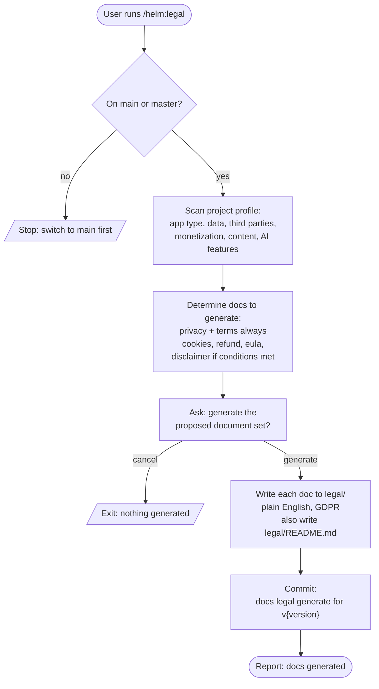

# /helm:legal

Scan the project's legal profile (app type, data collection, third parties, monetization, content model, AI features), generate the legal documents that actually apply, and commit them to `legal/`.

## Flow

## Steps

### 1. Branch check

Only runs from `main` or `master`. Halts on any other branch.

### 2. Project scan

Reads the codebase to build a legal profile:

- **App type**: web app, mobile, Chrome extension, desktop, open source library.
- **Data collection**: forms, auth, accounts, analytics (GA, Mixpanel, Hotjar, GTM), error tracking (Sentry, Bugsnag), any PII.
- **Third parties**: payment processors (Stripe, PayPal, Paddle), social auth, cloud services, marketing tools.
- **Monetization**: paid tiers, subscriptions, pricing pages.
- **Content model**: user-generated content, advice content (financial, health, legal), AI-generated recommendations.
- **AI features**: AI used to generate recommendations presented as facts, BYOK models.

### 3. Determine which documents apply

Always generates `privacy-policy.md` and `terms.md`. Conditionally adds:

- `cookie-policy.md` if non-essential cookies or analytics are detected.
- `refund-policy.md` if payment processing is detected.
- `eula.md` if the project is a Chrome extension, desktop app, or downloadable software.
- `disclaimer.md` if financial, health, legal advice, or AI recommendations are detected.

### 4. Confirm before generating

Lists the proposed document set with the chosen jurisdiction (GDPR) and tone (plain English). User confirms or cancels.

### 5. Generate documents

Each document is written to `legal/` in plain English, GDPR compliant. Each has a defined coverage spec (e.g. privacy must cover what data is collected, why, how stored, third-party sharing, GDPR rights, retention, contact, cookies, last-updated date).

### 6. Generate `legal/README.md`

Index page listing each generated document, its purpose, last-reviewed date, and the jurisdiction.

### 7. Commit

Single commit: `docs(legal): generate legal documents for v{version}`.

### 8. Confirm completion

Reports which documents were generated, where they live, the jurisdiction, the tone, and a reminder: these are AI-generated starting points. Review before publishing, and consult a lawyer for high-stakes products.

## Stop conditions

- **Not on `main` or `master`.** Switch back to the trunk first.
- **User cancels at confirmation.** Nothing written.

## See also

- [`/helm:log`](log.md) - reflect the legal additions in `CLAUDE.md`
- [`/helm:manifest`](manifest.md) - reference the legal pages from `README.md` if relevant
