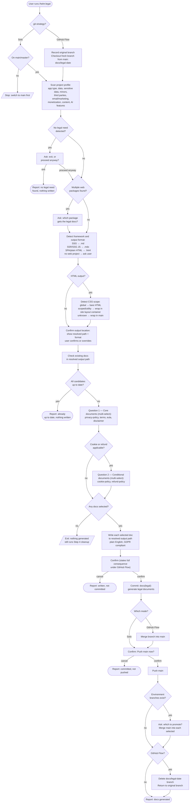

# /helm:legal

Scan the project's legal profile, detect the output format based on the web framework (or ask if none is found), let the user choose which documents to generate, then write GDPR-compliant legal documents in plain English, commit them, and push after a separate confirmation.

## Flow

```mermaid
flowchart TD
  Start([User runs /helm:legal]) --> Strategy{git-strategy?}
  Strategy -->|Solo| SoloCheck{On main/master?}
  SoloCheck -->|no| StopSolo[/Stop: switch to main first/]
  SoloCheck -->|yes| Scan
  Strategy -->|GitHub Flow| Fresh[Record original branch<br/>Checkout fresh branch from main:<br/>docs/legal-date]
  Fresh --> Scan

  Scan[Scan project profile:<br/>app type, data, sensitive data, minors,<br/>third parties, email/marketing,<br/>monetization, content, AI features]

  Scan --> NoNeed{No legal need<br/>detected?}
  NoNeed -->|yes| NoNeedAsk[Ask: exit, or<br/>proceed anyway?]
  NoNeedAsk -->|exit| NoNeedDone([Report: no legal need<br/>found, nothing written])
  NoNeedAsk -->|proceed anyway| Monorepo
  NoNeed -->|no| Monorepo

  Monorepo{Multiple web<br/>packages found?}
  Monorepo -->|yes| MonorepoAsk[Ask: which package<br/>gets the legal docs?] --> Framework
  Monorepo -->|no| Framework

  Framework[Detect framework and output format:<br/>SSG → .md<br/>SSR/SSG JS → .mdx<br/>SPA/plain HTML → .html<br/>no web project → ask user]

  Framework --> CSS{HTML output?}
  CSS -->|yes| CSSDetect[Detect CSS scope:<br/>global → bare HTML<br/>scoped/utility → wrap in site layout container<br/>unknown → wrap in main]
  CSS -->|no| Confirm
  CSSDetect --> Confirm[Confirm output location:<br/>show resolved path + format<br/>user confirms or overrides]

  Confirm --> Existing[Check existing docs<br/>in resolved output path]
  Existing --> UpToDate{All candidates<br/>up to date?}
  UpToDate -->|yes| UpToDateDone([Report: already<br/>up to date, nothing written])
  UpToDate -->|no| Q1

  Q1["Question 1 — Core documents (multi-select):<br/>privacy-policy, terms, eula, disclaimer"]
  Q1 --> Q2{Cookie or refund<br/>applicable?}
  Q2 -->|yes| Q2ask["Question 2 — Conditional documents (multi-select):<br/>cookie-policy, refund-policy"]
  Q2 -->|no| Generate
  Q2ask --> Generate

  Generate{Any docs selected?}
  Generate -->|no| Cancel[/Exit: nothing generated<br/>still runs Step 4 cleanup/]
  Generate -->|yes| Write[Write each selected doc<br/>to resolved output path<br/>plain English, GDPR compliant]
  Write --> CommitAsk["Confirm (states full consequence<br/>under GitHub Flow)"]
  CommitAsk -->|cancel| DoneUncommitted([Report: written, not committed])
  CommitAsk -->|confirm| CommitDocs["Commit: docs(legal):<br/>generate legal documents"]

  CommitDocs --> SoloOrFlow{Which mode?}
  SoloOrFlow -->|Solo| PushAsk["Confirm: Push main now?"]
  SoloOrFlow -->|GitHub Flow| MergeMain[Merge branch into main]
  MergeMain --> PushAsk
  PushAsk -->|cancel| DoneUnpushed([Report: committed, not pushed])
  PushAsk -->|confirm| Push[Push main]
  Push --> Promote

  Promote{Environment<br/>branches exist?}
  Promote -->|yes| PromoteAsk[Ask: which to promote?<br/>Merge main into each selected]
  Promote -->|no| Cleanup
  PromoteAsk --> Cleanup

  Cleanup{GitHub Flow?}
  Cleanup -->|yes| DeleteBranch[Delete docs/legal-date branch<br/>Return to original branch]
  Cleanup -->|no| Done
  DeleteBranch --> Done([Report: docs generated])
```

## Steps

### Before starting

Behavior depends on `git-strategy` in CLAUDE.md's Project Config (absence defaults to GitHub Flow, per git.html):

- **Solo Mode**: runs only on `main`/`master`. Halts on any other branch.
- **GitHub Flow**: records the current branch, then unconditionally checks out a fresh branch from main's current tip (`docs/legal-{date}`) — regardless of what the starting branch was. The generated documents are always scanned from main's own content, never from whatever branch happened to be checked out, so there's nothing to validate about the starting branch itself. The command returns to the original branch at the end (see Step 4).

If the command exits having written nothing at all (Step 1's "No legal need detected" exit, Step 2's "all candidates up to date" exit, or Step 2's "nothing selected" case), this cleanup still runs: delete the temporary branch and return to the original branch. This does **not** apply once documents have actually been written but left uncommitted (Step 4's Cancel option) — that branch is deliberately preserved so the user can review or finish committing later; real drafted work is never auto-deleted.

### 1. Project scan

Reads the codebase to build a legal profile:

- **App type**: web app, mobile, Chrome extension, desktop, open source library.
- **Data collection**: forms, auth, accounts, analytics (GA, Mixpanel, Hotjar, GTM), error tracking (Sentry, Bugsnag), any PII.
- **Sensitive data**: GDPR Art. 9 special-category data (health, biometric, race, religion, sexual orientation, political views) — triggers explicit-consent requirements the policy must state.
- **Children and minors**: whether the service targets or admits children (age gates, 13+/16+ checks, parental consent) — drives the Children's Privacy section (GDPR Art. 8, COPPA).
- **Third parties**: payment processors (Stripe, PayPal, Paddle), social auth, cloud services, marketing tools.
- **Email and marketing**: email service providers (Mailchimp, SendGrid, Postmark, …) and newsletter signups — marketing email needs consent (GDPR/ePrivacy), transactional does not.
- **Monetization**: paid tiers, subscriptions, pricing pages.
- **Content model**: user-generated content, advice content (financial, health, legal), AI-generated recommendations.
- **AI features**: AI used to generate recommendations presented as facts, BYOK models.

**No legal need detected** — if every category above comes back empty (no data collection, no sensitive data, not child-directed, no third-party integrations, no email/marketing, no monetization, no user-generated/advice content, no AI features), the command stops here rather than resolving an output location or contact point for nothing. It asks whether to exit (Recommended — nothing is written, same cleanup as Step 2's "nothing selected" case) or proceed anyway, in case the scan missed something. This runs before output-location and contact-point resolution below, since both are pointless if nothing ends up generated.

**Monorepo detection** — if the scan finds multiple independent web packages (a workspace layout with several `package.json` files each defining their own framework, under `apps/`, `packages/`, or similar), asks which package should receive the legal documents before anything else runs, since a monorepo usually has one public-facing surface. The rest of Framework and output detection then applies scoped to that package only.

**Framework and output detection** — determines the file format and output path from the project's structure:

| Scenario | Format | Output path |
|---|---|---|
| Static site generator (Jekyll, Hugo, Eleventy, …) | `.md` | Generator's content/docs directory, under `legal/` |
| JS framework with SSR/SSG (Next.js, Astro, Nuxt, SvelteKit, …) | `.mdx` | Framework's pages/content directory, under `legal/` |
| SPA or plain HTML (no SSR, no SSG) | `.html` | Web root (`public/`, `dist/`, or root), clean URL subfolders |
| No web project detected | ask user | User chooses: `legal/` Markdown, `legal/` HTML, or custom path |

**CSS detection (HTML output only)** — if the resolved format is `.html`:
- Global CSS (element/class selectors site-wide) → bare semantic HTML; the site's stylesheet renders it.
- Scoped or utility-first CSS (Tailwind, CSS Modules, etc.) → wrap the generated HTML in the same prose/layout container existing pages use, so it inherits the site's design.
- Cannot determine → wrap in `<main>` as a safe default.

**Output location confirmation** — for the auto-detected scenarios (SSG, JS framework, SPA/plain HTML), the resolved path and format are shown to the user to confirm or override before anything is written. The no-web case is not asked twice: its "where and in what format?" question already served as the location choice, so the confirmation is skipped there.

**Existing documents** — checks the resolved output path for already-present files and reads `.claude/helm/legal-manifest.json` (the record of what a previous run generated and at which commit; carries a `schema_version` field — a missing one is treated as `1`, since every manifest written before that field existed is implicitly version 1). Falls back to the legacy flat path `.claude/legal-manifest.json` if the new one isn't found; a legacy file gets migrated to `.claude/helm/` and removed the next time the manifest is written. Each present file is classified: **Helm-generated** (in the manifest — safe to overwrite) or **Foreign** (not in the manifest — likely hand-written or lawyer-reviewed). For a Helm-generated file it also checks `git log {generated-commit}..HEAD` for changes that shift the legal profile (new analytics, payments, auth, integrations) and classifies it **up to date** or **may be outdated** accordingly — a real classification the selection step below acts on, not just a label. Regeneration is always a full rewrite — never a surgical clause edit. The published documents carry **no marker of their own** — the manifest is the sole record, so end-user-facing files stay completely clean.

### 2. Select which documents to generate

**Applicability** (does the document apply at all) is separate from **Recommended** (should the user be nudged to select it right now). privacy-policy.md and terms.md always apply; cookie-policy.md/refund-policy.md/eula.md/disclaimer.md apply per scan findings. A document is Recommended only if it's missing and applies, or it exists but was classified **may be outdated** above — an applicable document that already exists and is up to date is *not* Recommended, regardless of the applicability rule. This means privacy-policy.md/terms.md aren't unconditionally Recommended on every run the way they used to be: once generated and unchanged, they drop out of the nudge.

**All candidates up to date** — if every applicable document already exists, is Helm-generated, and is up to date (nothing missing, nothing Foreign, nothing stale), the command skips this step's questions entirely: "Legal documents are up to date — no meaningful changes since last generation." Proceeds straight to Step 4's cleanup, same as if nothing had been selected.

Otherwise, AskUserQuestion has a 4-option limit, so this step uses two questions.

**Question 1 — core documents** (always asked when this step is reached):

| Option | Recommended when |
|---|---|
| `privacy-policy.md` | missing, or exists and flagged may-be-outdated |
| `terms.md` | missing, or exists and flagged may-be-outdated |
| `eula.md` | same, gated on installable-software applicability |
| `disclaimer.md` | same, gated on AI-content/advice applicability |

**Question 2 — conditional documents** (only asked if relevant signals were detected):

| Option | Recommended when |
|---|---|
| `cookie-policy.md` | same, gated on analytics applicability |
| `refund-policy.md` | same, gated on payment-processing applicability |

Question 2 is skipped entirely if the scan found no analytics and no payment processing. If both apply, it's a multi-select as shown above; if only one applies, a multi-select with a single option isn't valid (AskUserQuestion needs at least 2), so it asks a direct yes/no confirmation for that one document instead.

Each existing document's option also carries a status suffix: `(exists — up to date)`, `(exists — may be outdated)`, or `(exists — not helm-generated)` for a Foreign file — so the user can tell an auto-generated file from a hand-edited one, and a current file from a stale one, independent of whether it's Recommended.

All documents are opt-in: the user can deselect any recommended document or add ones the scan did not flag. If nothing is selected across both questions, the command exits without writing anything — proceeding to Step 4, which writes nothing but still runs GitHub Flow cleanup (delete the temporary branch, return to the original branch) if one was created. Selected documents that already exist are overwritten (Foreign ones confirmed individually first).

### 3. Generate documents

Each selected document is written in plain English, GDPR compliant, to the resolved output path and format.

**Format rules:**
- Markdown/MDX: standard headings, no HTML wrapper, the site's template handles rendering.
- HTML: one subfolder per document (`legal/privacy-policy/index.html`, etc.) for clean URLs; complete standalone page with `<!DOCTYPE html>`, semantic elements, no inline styles or JavaScript.

**Last updated:** every document begins with a `**Last updated:** {current date}` line below the title, in `YYYY-MM-DD` format.

**Contact section:** every document ends with a `## Contact` section using the contact point resolved in Step 1, with wording matched to its type — "contact us at {email}", "visit our contact page at {url}", "open an issue at {url}", or "write to us at {address}". The contact is resolved up front: the command infers candidates (an existing contact/contact-us page, repo issues URL, support email) and asks the developer which to use, with the built-in Other option for a custom one. Because a legal document legally needs a working contact (GDPR Art. 13), it **will not generate anything until a valid contact is provided** — it never falls back to a placeholder.

**Document specs** — summary of titles and key sections. The command specification is the canonical source for full section lists and content rules:

| Document | Title | Key required sections |
|---|---|---|
| `privacy-policy` | `# Privacy Policy` | Who We Are, What Data We Collect, How We Use Your Data (GDPR Art. 6 legal basis), Data Sharing, International Transfers, Retention, Your Rights (Art. 15–21), Cookies (when applicable), Children's Privacy, Supervisory Authority (Art. 77), Changes, Contact |
| `terms` | `# Terms of Service` | Acceptance, Description of Service, Acceptable Use, Prohibited Conduct, Intellectual Property, Disclaimer of Warranties, Limitation of Liability, Indemnification, Termination, Governing Law, Changes, Contact |
| `cookie-policy` | `# Cookie Policy` | What Are Cookies, How We Use Cookies, Categories of Cookies (with legal basis), Third-Party Cookies, Your Consent and How to Withdraw It, Managing Cookies in Your Browser, Contact |
| `refund-policy` | `# Refund Policy` | Overview, Eligibility, Refund Window, How to Request, How Refunds Are Issued, Non-Refundable Items, Contact |
| `eula` | `# End User License Agreement` | Grant of License, License Restrictions, IP Ownership, Updates and Modifications, No Warranty, Limitation of Liability, Termination, Governing Law, Contact |
| `disclaimer` | `# Disclaimer` | No Professional Advice (legal/financial/medical), AI-Generated Content, Accuracy and Completeness, External Links, Limitation of Liability, Changes, Contact |

### 4. Commit and finalize

If Step 2 selected nothing: skips the commit confirmation and environment promotion — nothing to act on. Still runs GitHub Flow cleanup (delete the temporary branch, return to the original branch) if one was created; this step is never skipped wholesale, since the cleanup logic lives here.

Otherwise presents the list of generated files for review and waits for confirmation before committing — always, even under `git-auto-commit: true`. Generated documents are public, legally-binding text, so this is a deliberate exception to the normal auto-commit flow (see [`safety.md`](../rules/safety.html#agent-execution-boundaries)).

Single commit of the generated documents plus the updated `.claude/helm/legal-manifest.json`: `docs(legal): generate legal documents`. If the output path or format differs from the default (`legal/` Markdown), the commit body notes it for future runs. If the user cancels, the documents stay written but uncommitted — under GitHub Flow this also means no merge, no branch deletion, and no return to the original branch; the command still proceeds to the completion report either way.

Push is always its own separate confirmation after the commit — never folded into the commit prompt, and never skipped regardless of `git-auto-commit`, matching every other write-capable command and CLAUDE.md's push rule. Under GitHub Flow this means: commit on the temporary branch, merge into main, *then* a dedicated "Push main now?" gate before anything reaches origin. Cancelling the push gate leaves main committed (Solo Mode) or merged (GitHub Flow) locally but unpushed, skips environment promotion and (under GitHub Flow) branch cleanup, and still proceeds to the completion report.

**Environment promotion** (both modes, after a successful push): if environment branches exist (same detection [`/helm:ship`](ship.html) uses), asks which should also receive the documents — capped at 4 options if more branches qualify (recognized tier names first, then alphabetical; the question notes any remainder needs a follow-up run), or a direct yes/no confirmation instead of a multi-select if exactly one branch qualifies (AskUserQuestion needs at least 2 options) — then merges main into each selected branch and pushes — matching ship.md's promotion mechanics exactly, just with a commit message scoped to legal document updates.

**GitHub Flow only** — after the push gate: runs environment promotion, deletes the temporary branch (locally and remotely if it was pushed), and returns to whichever branch the command was originally run from. **Solo Mode** commits directly to main, so none of this branch dance is needed — it goes straight to environment promotion.

### 5. Confirm completion

If Step 1's "No legal need detected" check exited early, reports just that — no documents generated, no legal need found — since output location and contact point were never resolved. If Step 2's "all candidates up to date" check exited early, reports that instead — output location was resolved, but nothing needed regenerating. Otherwise, before reporting success, reads each generated document back and confirms it exists, opens with the `**Last updated:**` line, and closes with a `## Contact` section containing no unfilled placeholder — a failed check is reported per-file instead of folded into a generic success message, since an incomplete legal document is worse silent than loud. Then reports which documents were generated, the output path, format, jurisdiction, tone, whether the changes were committed, whether they were pushed, and which environments were promoted. Under GitHub Flow, also reports the temporary branch's fate (merged and deleted, merged but left unpushed, or left in place if cancelled at the commit stage) and confirms which branch you were returned to. Reminds the user that these are AI-generated starting points: review before publishing and consult a lawyer for high-stakes products.

## Stop conditions

- **Solo Mode, not on main/master.** Switch to main or master and re-run.
- **No legal need detected.** Scan found no data collection, third-party integrations, monetization, user-generated/advice content, or AI features — asks whether to exit (Recommended) or proceed anyway.
- **All candidates up to date.** Every applicable document already exists, is Helm-generated, and has no legal-relevant changes since it was last generated — informs the user and exits, no picker shown.
- **User selects nothing.** Nothing written — GitHub Flow cleanup still runs (delete the temporary branch, return to the original branch) if one was created.

## See also

- [`/helm:log`](log.html) — reflect legal additions in `CLAUDE.md`
- [`/helm:manifest`](manifest.html) — reference the legal pages from `README.md` if relevant
