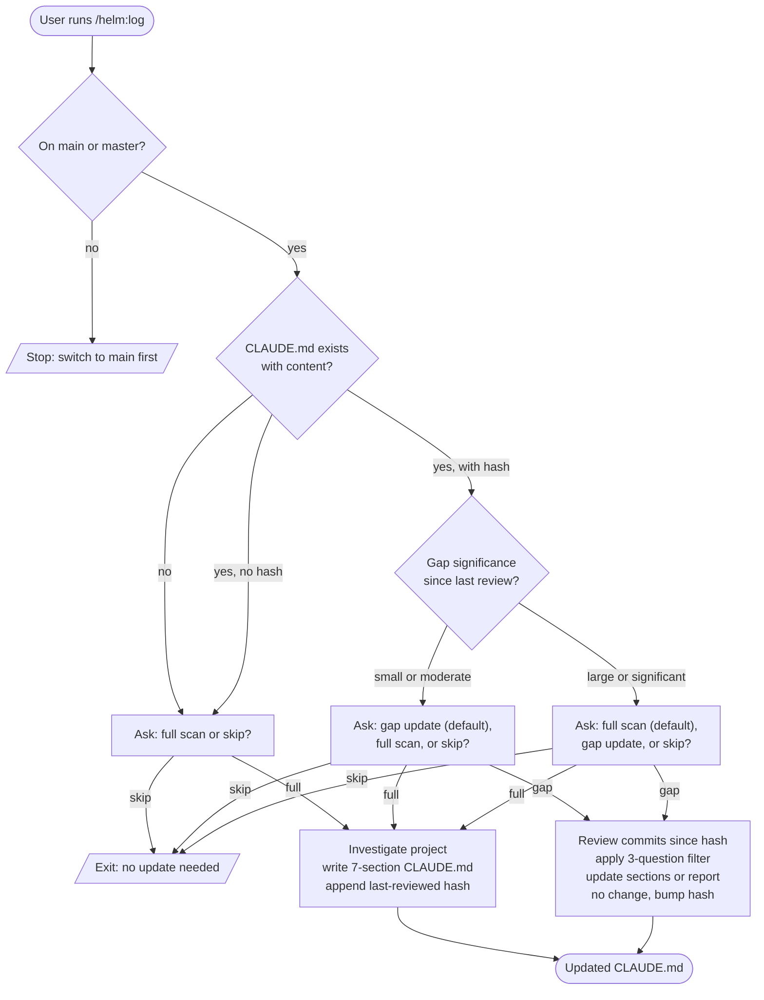

# /helm:log

Keep `CLAUDE.md` in sync with the codebase. Acts as the captain's log of the project: durable, distilled knowledge about architecture, conventions, domain rules, and traps. Full scan on first run, gap update on subsequent runs.

## Flow

## Steps

### 1. Branch check

Only runs from `main` or `master`. Halts on any other branch.

### 2. Assessment

Reads the current `CLAUDE.md`, checks for a saved `<!-- last-reviewed: {hash} -->` marker, and if found, runs `git log {hash}..HEAD --oneline` to measure the gap. Categorizes the gap as small/moderate or large/significant, ignoring noise commits (bug fixes, styling, dependency updates, routine CRUD).

### 3. Pick mode

Three modes, with the default depending on assessment:

- **No file or no hash**: Full scan or skip.
- **Small to moderate gap**: Gap update (recommended), full scan, or skip.
- **Large gap**: Full scan (recommended), gap update, or skip.

### 4. Full scan

Investigates the project from scratch: business purpose, modules and workflows, stack and versions, architectural patterns (from implementation, not folder names), conventions, domain rules, operational context. Reviews any existing docs and `.claude/rules`. Asks once whether the project is GitHub Flow or Solo, then writes `CLAUDE.md` using a seven-section schema:

1. Project Identity
2. Project Config (e.g. `git-solo: true` if solo)
3. Dev Commands
4. Architecture Pointers
5. Behavior Rules
6. Hard Safety Rules
7. Known Traps

Appends the current HEAD hash as `<!-- last-reviewed: ... -->`. Writes directly. Target under 150 lines.

### 5. Gap update

Reads commit messages first to get the shape of what changed. Reads file changes only for significant commits. Focuses on architectural changes, new modules, new conventions, domain rule changes, new operational knowledge, and newly discovered traps.

Applies a three-question filter to each candidate change:

1. Will a future session struggle to find this from the codebase alone?
2. Would knowing it improve future development decisions?
3. Will it stay true for weeks or months?

Only updates if all three answers are yes. Then either reports **Outcome A** (no durable knowledge introduced, just bump the hash) or **Outcome B** (proposes per-section changes and asks for confirmation before writing).

### 6. Confirm completion

Reports what was changed, what the new last-reviewed hash is, and whether any rule files in `.claude/rules` should also be revisited.

## Scope

CLAUDE.md is descriptive project knowledge (orientation layer). `.claude/rules/` are prescriptive (architecture, safety, git, testing). The command may flag rule-file updates but does not write them without explicit request.

## Stop conditions

- **Not on `main` or `master`.** Switch back first.
- **User picks Skip.** Clean exit, no changes.
- **Gap update finds no durable knowledge.** Outcome A: only the hash advances.

## See also

- [`/helm:manifest`](manifest.md) - same lifecycle for `README.md` (the public-facing version)
- [`/helm:ship`](ship.md) - typically run before shipping so the log reflects the release
