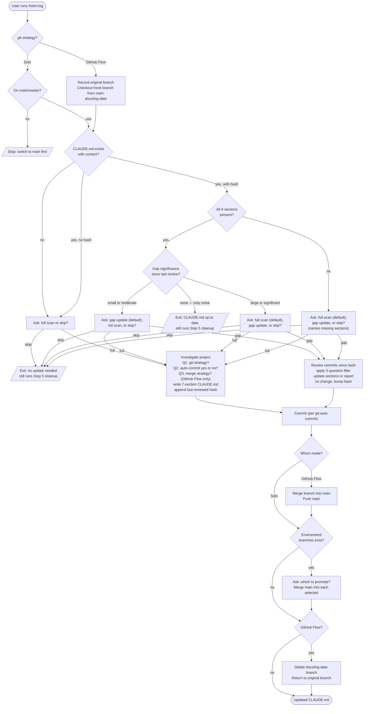

# /helm:log

Keep `CLAUDE.md` in sync with the codebase. Acts as the captain's log of the project: durable, distilled knowledge about architecture, conventions, domain rules, and traps. Full scan on first run, gap update on subsequent runs.

## Flow

```mermaid
flowchart TD
  Start([User runs /helm:log]) --> Strategy{git-strategy?}
  Strategy -->|Solo| SoloCheck{On main/master?}
  SoloCheck -->|no| StopSolo[/Stop: switch to main first/]
  SoloCheck -->|yes| Exists
  Strategy -->|GitHub Flow| Fresh[Record original branch<br/>Checkout fresh branch from main:<br/>docs/log-date]
  Fresh --> Exists

  Exists{CLAUDE.md exists<br/>with content?}

  Exists -->|no| Mode1[Ask: full scan or skip?]
  Exists -->|yes, no hash| Mode1
  Exists -->|yes, with hash| Schema{All 8 sections<br/>present?}

  Schema -->|no| Mode4["Ask: full scan (default),<br/>gap update, or skip?<br/>(names missing sections)"]
  Schema -->|yes| Gap{Gap significance<br/>since last review?}

  Gap -->|none — only noise| UpToDate[/Exit: CLAUDE.md up to date<br/>still runs Step 5 cleanup/]
  Gap -->|small or moderate| Mode2["Ask: gap update (default),<br/>full scan, or skip?"]
  Gap -->|large or significant| Mode3["Ask: full scan (default),<br/>gap update, or skip?"]

  Mode1 -->|skip| Skip[/Exit: no update needed<br/>still runs Step 5 cleanup/]
  Mode1 -->|full| Full
  Mode2 -->|skip| Skip
  Mode2 -->|full| Full
  Mode2 -->|gap| GapPath
  Mode3 -->|skip| Skip
  Mode3 -->|full| Full
  Mode3 -->|gap| GapPath
  Mode4 -->|skip| Skip
  Mode4 -->|full| Full
  Mode4 -->|gap| GapPath

  Full["Investigate project<br/>Q1: git-strategy?<br/>Q2: auto-commit yes or no?<br/>Q3: merge strategy? (GitHub Flow only)<br/>write 7-section CLAUDE.md<br/>append last-reviewed hash"] --> Commit
  GapPath[Review commits since hash<br/>apply 3-question filter<br/>update sections or report<br/>no change, bump hash] --> Commit

  Commit["Commit (per git-auto-commit)"] --> SoloOrFlow{Which mode?}
  SoloOrFlow -->|Solo| Promote
  SoloOrFlow -->|GitHub Flow| MergeMain[Merge branch into main<br/>Push main]
  MergeMain --> Promote

  Promote{Environment<br/>branches exist?}
  Promote -->|yes| PromoteAsk[Ask: which to promote?<br/>Merge main into each selected]
  Promote -->|no| Cleanup
  PromoteAsk --> Cleanup

  Cleanup{GitHub Flow?}
  Cleanup -->|yes| DeleteBranch[Delete docs/log-date branch<br/>Return to original branch]
  Cleanup -->|no| Done
  DeleteBranch --> Done

  Done([Updated CLAUDE.md])
```

## Steps

### Before starting

Rewrites `CLAUDE.md` from the project's state, so it needs the full merged, stable state — never an in-progress feature branch. Behavior depends on `git-strategy`:

- **Solo Mode**: runs only on `main`/`master`. Halts on any other branch.
- **GitHub Flow**: records the current branch, then unconditionally checks out a fresh branch from main's current tip (`docs/log-{date}`) — regardless of what the starting branch was. CLAUDE.md is always scanned from main's own state, never from a feature branch's unmerged work; if a feature branch changes something CLAUDE.md should reflect, re-run `/helm:log` after that branch merges to main. Returns to the original branch at the end (see Step 5).

If the command exits at any point without writing anything — Skip selected at any prompt, or CLAUDE.md already up to date — this cleanup still runs: delete the temporary branch and return to the original branch. This applies everywhere in the command, not just the specific case called out below, so the user is never left stranded on an empty temporary branch it created. (Gap Update's Outcome A doesn't count as "nothing written" — it still bumps the last-reviewed hash, so it goes through the normal commit path in Step 5.)

## Scope

`CLAUDE.md` is descriptive project knowledge (orientation layer); `.claude/rules/` is prescriptive (architecture, safety, git, testing). Keep them consistent. Project-specific safety rules live in `CLAUDE.md`'s `## Hard Safety Rules` section (written here, loaded with CLAUDE.md) — proposed, not auto-written. Never auto-edit the adopt-managed `.claude/rules` files (`git.md`, `safety.md`); they're overwritten by `/helm:adopt`, so propose any needed change to those instead. Whenever writing to CLAUDE.md, in any step: use em-dashes sparingly — only when no other punctuation (comma, semicolon, colon, or a new sentence) works as well. When in doubt, restructure the sentence instead.

### 1. Assessment

Reads the current `CLAUDE.md`, checks for a saved `<!-- last-reviewed: {hash} -->` marker, and if found, runs `git log {hash}..HEAD --oneline` to measure the gap. Categorizes the gap as small/moderate or large/significant, ignoring noise commits (bug fixes, styling, dependency updates, routine CRUD).

Also checks whether all eight required sections are present (`## Project Identity`, `## Project Config`, `## Dev Commands`, `## Architecture Pointers`, `## Domain Rules`, `## Behavior Rules`, `## Hard Safety Rules`, `## Known Traps`). A missing section means the schema is broken, regardless of gap size.

### 2. Pick mode

Modes, with the default depending on assessment:

- **No file or no hash**: Full scan or skip.
- **Schema intact, no meaningful commits since the hash**: exits cleanly ("CLAUDE.md is up to date") with no prompt.
- **Schema broken** (any required section missing): Full scan recommended regardless of gap size; names the missing sections.
- **Small to moderate gap, schema intact**: Gap update (recommended), full scan, or skip.
- **Large gap, schema intact**: Full scan (recommended), gap update, or skip.

### 3. Full scan

Investigates the project from scratch: business purpose, modules and workflows, stack and versions, architectural patterns (from implementation, not folder names), conventions, domain rules, operational context. Reviews any existing docs and `.claude/rules`. Before writing, runs the Project Config Check — up to three single-select questions:

1. **Branching strategy** — Solo Mode (`git-strategy: solo`, commit directly to `main`, no PRs) or GitHub Flow (`git-strategy: github-flow`, branch per change, PR to merge).
2. **Auto-commit** — yes (Claude commits after each task without prompting) or no (ask before every commit).
3. **Merge strategy** (GitHub Flow only) — Squash (default), Rebase, or Merge commit. Stored as `git-merge-strategy`.

Then writes `CLAUDE.md` using an eight-section schema:

1. Project Identity
2. Project Config (e.g. `git-strategy: solo`, `git-auto-commit: true`, `git-merge-strategy: squash`)
3. Dev Commands
4. Architecture Pointers
5. Domain Rules (non-obvious business, lifecycle, and permission constraints — "None" if there are none)
6. Behavior Rules
7. Hard Safety Rules
8. Known Traps

Sections 5–7 are **inline** rules. A separate `## Rules` section — the pointer to the adopted rule files (`git.md`, `safety.md`), written by `/helm:adopt` — is not part of this schema; log preserves it untouched and never writes, moves, or removes it.

Appends the current HEAD hash as `<!-- last-reviewed: ... -->`. Writes directly. Target under 150 lines.

### 4. Gap update

Before reviewing commits, runs the Project Config Check for any flags missing from the existing Project Config section — skipped silently if both are already present. Each question is asked independently: branching strategy if `git-strategy` is absent, auto-commit if `git-auto-commit` is absent, merge strategy if `git-merge-strategy` is absent and GitHub Flow is active.

Then reads commit messages to get the shape of what changed. Reads file changes only for significant commits. Focuses on architectural changes, new modules, new conventions, domain rule changes, new operational knowledge, and newly discovered traps.

Applies a three-question filter to each candidate change:

1. Will a future session struggle to find this from the codebase alone?
2. Would knowing it improve future development decisions?
3. Will it stay true for weeks or months?

Only updates if all three answers are yes. Every change is bound to one of the eight schema sections — the schema defines what each holds, so each finding lands in its section and never in a new heading; a finding that fits no section is left out. Then either reports **Outcome A** (no durable knowledge introduced, just bump the hash) or **Outcome B** (proposes per-section changes and asks for confirmation before writing).

### 5. Commit and finalize

If nothing was written (the "CLAUDE.md is already up to date" case, or Skip selected anywhere): skips commit, merge, and environment promotion — nothing to act on. Still runs GitHub Flow cleanup (delete the temporary branch, return to the original branch) if one was created; this step is never skipped wholesale, since the cleanup logic lives here.

Otherwise commits per [git.md's Auto-Commit rule](../rules/git.md#auto-commit) — this also governs whether the rest of this step needs confirmation: silent if `git-auto-commit: true`, otherwise one confirmation covers commit, merge, promotion, and cleanup together, rather than prompting at each stage.

If environment branches exist (same detection [`/helm:ship`](ship.md) uses), asks which should also receive the update, then merges main into each selected branch and pushes.

**Solo Mode** commits directly to main, then runs environment promotion. **GitHub Flow** commits on the temporary branch, merges it into main and pushes, runs environment promotion, deletes the temporary branch (locally and remotely if pushed), and returns to whichever branch the command was originally run from.

### 6. Confirm completion

Reports what was changed, what the new last-reviewed hash is, which environments were promoted, and whether any rule files in `.claude/rules` should also be revisited. Under GitHub Flow, also reports the temporary branch's fate and which branch you were returned to.

## Stop conditions

- **Solo Mode, not on main/master.** Switch to main or master and re-run.
- **CLAUDE.md is up to date.** Schema intact and no meaningful commits since the last-reviewed hash — clean exit, no prompt.
- **User picks Skip.** Clean exit, no changes.
- **Gap update finds no durable knowledge.** Outcome A: only the hash advances.

Every exit above still runs GitHub Flow cleanup (delete the temporary branch, return to the original branch) if one was created — see Before starting.

## See also

- [`/helm:manifest`](manifest.md) - same lifecycle for `README.md` (the public-facing version)
- [`/helm:ship`](ship.md) - typically run before shipping so the log reflects the release
