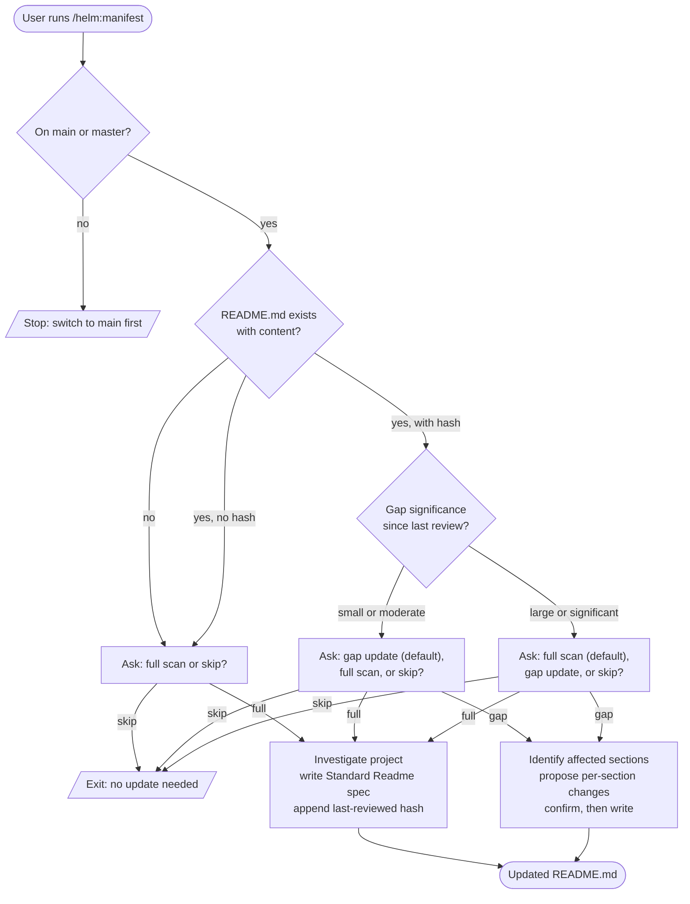

# /helm:manifest

Keep `README.md` in sync with the codebase, following the Standard Readme spec. Acts as the vessel's manifest: the public-facing listing of what is aboard. Full scan on first run, gap update on subsequent runs.

## Flow

## Steps

### 1. Branch check

Only runs from `main` or `master`. Halts on any other branch.

### 2. Assessment

Reads the current `README.md`, checks for a saved `<!-- last-reviewed: {hash} -->` marker, and if found, runs `git log {hash}..HEAD --oneline` to measure the gap. Ignores noise commits.

### 3. Pick mode

Three modes, default depending on assessment:

- **No file or no hash**: Full scan or skip.
- **Small to moderate gap**: Gap update (recommended), full scan, or skip.
- **Large gap**: Full scan (recommended), gap update, or skip.

### 4. Full scan

Investigates: business purpose and target audience, stack and dependencies, installation steps, core usage patterns and CLI commands, public API surface, license, contributing model, maintainers.

Writes `README.md` following the Standard Readme spec section order. Mandatory sections: Title (matches repo name), Short Description (under 120 chars, matches `package.json` description), Table of Contents (if README exceeds 100 lines), Install, Usage, Contributing, License (last section before the comment tag).

Optional sections when relevant: badges, long description, background, API.

Skipped unless specifically needed: banner, security, thanks, maintainers, extra sections.

Appends the current HEAD hash as `<!-- last-reviewed: ... -->`. Writes directly.

### 5. Gap update

Reads commit messages first. Reads file changes only for significant commits. Focuses on new features, API changes, new install steps, changed usage, changed CLI commands, new env vars, and removed functionality.

For each significant change, identifies the affected README section. Updates only those sections. Proposes the changes per section, asks for confirmation, then writes. Bumps the saved hash to HEAD.

### 6. Confirm completion

Reports which sections were touched and the new last-reviewed hash.

## Scope

README.md is human-facing documentation for contributors, GitHub visitors, and new users. It is not a changelog, not a technical spec, and not a deployment manual. Keep it clear and scannable.

## Stop conditions

- **Not on `main` or `master`.** Switch back first.
- **User picks Skip.** Clean exit, no changes.
- **User cancels at the proposed-changes confirmation.** No write.

## See also

- [`/helm:log`](log.md) - same lifecycle for `CLAUDE.md` (the agent-facing version)
- [`/helm:ship`](ship.md) - typically run before shipping so the manifest reflects the release
