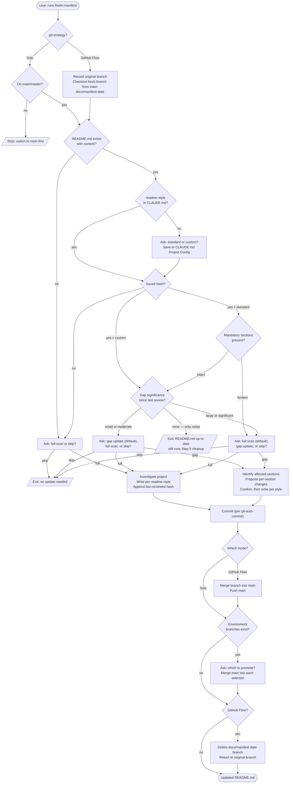

# /helm:manifest

Keep `README.md` in sync with the codebase. Full scan on first run, gap update on subsequent runs. Supports two styles: Standard Readme spec (enforced structure) or custom (preserves the developer's existing structure).

## Flow

```mermaid
flowchart TD
  Start([User runs /helm:manifest]) --> Strategy{git-strategy?}
  Strategy -->|Solo| SoloCheck{On main/master?}
  SoloCheck -->|no| StopSolo[/Stop: switch to main first/]
  SoloCheck -->|yes| Exists
  Strategy -->|GitHub Flow| Fresh[Record original branch<br/>Checkout fresh branch from main:<br/>docs/manifest-date]
  Fresh --> Exists

  Exists{README.md exists<br/>with content?}

  Exists -->|no| Mode1[Ask: full scan or skip?]
  Exists -->|yes| StyleFlag{readme-style<br/>in CLAUDE.md?}

  StyleFlag -->|no| AskStyle["Ask: standard or custom?\nSave to CLAUDE.md Project Config"]
  StyleFlag -->|yes| HashCheck
  AskStyle --> HashCheck

  HashCheck{Saved hash?}
  HashCheck -->|no| Mode1
  HashCheck -->|"yes + standard"| StructCheck{Mandatory sections<br/>present?}
  HashCheck -->|"yes + custom"| Gap

  StructCheck -->|broken| Mode3["Ask: full scan (default),<br/>gap update, or skip?"]
  StructCheck -->|intact| Gap{Gap significance<br/>since last review?}

  Gap -->|none — only noise| UpToDate[/Exit: README.md up to date<br/>still runs Step 5 cleanup/]
  Gap -->|small or moderate| Mode2["Ask: gap update (default),<br/>full scan, or skip?"]
  Gap -->|large or significant| Mode3

  Mode1 -->|skip| Skip[/Exit: no update needed/]
  Mode1 -->|full| Full
  Mode2 -->|skip| Skip
  Mode2 -->|full| Full
  Mode2 -->|gap| GapPath
  Mode3 -->|skip| Skip
  Mode3 -->|full| Full
  Mode3 -->|gap| GapPath

  Full["Investigate project<br/>Write per readme-style<br/>Append last-reviewed hash"] --> Commit
  GapPath["Identify affected sections<br/>Propose per-section changes<br/>Confirm, then write per style"] --> Commit

  Commit["Commit (per git-auto-commit)"] --> SoloOrFlow{Which mode?}
  SoloOrFlow -->|Solo| Promote
  SoloOrFlow -->|GitHub Flow| MergeMain[Merge branch into main<br/>Push main]
  MergeMain --> Promote

  Promote{Environment<br/>branches exist?}
  Promote -->|yes| PromoteAsk[Ask: which to promote?<br/>Merge main into each selected]
  Promote -->|no| Cleanup
  PromoteAsk --> Cleanup

  Cleanup{GitHub Flow?}
  Cleanup -->|yes| DeleteBranch[Delete docs/manifest-date branch<br/>Return to original branch]
  Cleanup -->|no| Done
  DeleteBranch --> Done

  Done([Updated README.md])
```

## Steps

### Before starting

Rewrites `README.md` from the project's state, so it needs the full merged, stable state — never an in-progress feature branch. Behavior depends on `git-strategy`:

- **Solo Mode**: runs only on `main`/`master`. Halts on any other branch.
- **GitHub Flow**: records the current branch, then unconditionally checks out a fresh branch from main's current tip (`docs/manifest-{date}`) — regardless of what the starting branch was. README.md is always scanned from main's own state, never from a feature branch's unmerged work; if a feature branch changes something README.md should reflect, re-run `/helm:manifest` after that branch merges to main. Returns to the original branch at the end (see Step 5).

If the command exits at any point without writing anything — Skip selected at any prompt, README.md already up to date, or custom mode finding nothing to preserve — this cleanup still runs: delete the temporary branch and return to the original branch. This applies everywhere in the command, not just the specific cases called out below, so the user is never left stranded on an empty temporary branch it created.

## Scope

README.md is human-facing documentation for contributors, GitHub visitors, and new users — not a changelog, not a technical spec, not a deployment manual. Audience is humans, not future Claude sessions, so keep it clear and scannable. Whenever writing to README.md, in any step: use em-dashes sparingly — only when no other punctuation (comma, semicolon, colon, or a new sentence) works as well. When in doubt, restructure the sentence instead.

### 1. Assessment

First determines the README style by reading `readme-style` from CLAUDE.md Project Config. If the flag is absent, checks whether README.md already exists with content and asks accordingly — the question and the Custom option's description differ depending on whether there's an existing README to be "custom" relative to, since a brand-new project has nothing yet. Saves the choice (`readme-style: standard` or `readme-style: custom`) to CLAUDE.md before continuing.

Then reads the current `README.md`, checks for a saved `<!-- last-reviewed: {hash} -->` marker, and if found, runs `git log {hash}..HEAD --oneline` to measure the gap. Ignores noise commits.

When `readme-style: standard` and a hash exists, also checks whether all mandatory sections are present. If any are missing, recommends a full scan regardless of gap size and states which sections are missing.

### 2. Pick mode

Four outcomes, default depending on assessment:

- **No file or no hash**: Full scan or skip.
- **Standard style, structure broken**: Full scan (recommended), gap update, or skip.
- **Structure intact (or custom) and no meaningful commits since the last review**: exits cleanly — "README.md is up to date" — no prompt shown.
- **Structure intact (or custom) and meaningful commits since the last review**: Gap update or Full scan, recommended option first based on gap size, or skip.

### 3. Full scan

**Custom mode with no existing README exits immediately, before investigation runs.** Custom mode preserves structure, it doesn't author it — if there's nothing to preserve, there's nothing worth investigating the project for either. Reports that there's no README.md yet and asks the developer to write one in whatever structure they prefer; a future run then preserves it. No project scan, no write, no proceeding to Step 5.

Otherwise, investigates: business purpose and target audience, stack and dependencies, installation steps, core usage patterns and CLI commands, public API surface, license, contributing model, maintainers, and project motivation/limitations worth surfacing.

If `readme-style: standard`: writes `README.md` following the Standard Readme spec section order.

Mandatory sections: Title (matches repo name), Short Description (under 120 chars, matches `package.json` description), Table of Contents (if README exceeds 100 lines), Install, Usage, Contributing, License (last section before the comment tag).

Optional sections when relevant: badges, long description, background, API, limitations (only if the project has meaningful limitations worth surfacing to users evaluating adoption).

Skipped unless specifically needed: banner, security, thanks, maintainers, extra sections.

If `readme-style: custom` (the only way to reach this point is with an existing README, per the early exit above): reads the existing structure first, rewrites content within each section based on the project scan, and does not add, remove, or rename sections without explicit approval.

Appends the current HEAD hash as `<!-- last-reviewed: ... -->`. Writes directly.

### 4. Gap update

Reads commit messages first. Reads file changes only for significant commits. Focuses on new features, API changes, new install steps, changed usage, changed CLI commands, new env vars, and removed functionality.

For each significant change, identifies the affected README section. Updates only those sections. Does not rewrite unaffected sections.

If no significant changes are found despite the initial gap estimate: reports that no update is needed — the equivalent of [`/helm:log`](log.md)'s Outcome A — and skips the proposal and confirmation below; only the hash advances.

If `readme-style: standard`: sections remain in spec order after updates. A significant change can also add a newly-relevant optional section (e.g. a first public API) in its spec position, or remove one whose justification went away (e.g. the API was removed) — never inventing a section outside the spec.
If `readme-style: custom`: preserves existing section order and naming, and — matching Step 2 — does not add, remove, or rename sections without explicit approval. If a significant change doesn't fit any existing section, asks whether to add a new one or fold it into the closest existing section rather than deciding silently.

Proposes the changes per section, asks for confirmation, then writes. Bumps the saved hash to HEAD.

### 5. Commit and finalize

If Full scan wrote nothing (the custom-mode, absent-README case): skips commit, merge, and environment promotion — nothing to act on. Still runs GitHub Flow cleanup (delete the temporary branch, return to the original branch) if one was created; this step is never skipped wholesale, since the cleanup logic lives here.

Otherwise commits per [git.md's Auto-Commit rule](../rules/git.md#auto-commit) — this also governs whether the rest of this step needs confirmation: silent if `git-auto-commit: true`, otherwise one confirmation covers commit, merge, promotion, and cleanup together, rather than prompting at each stage.

If environment branches exist (same detection [`/helm:ship`](ship.md) uses), asks which should also receive the update, then merges main into each selected branch and pushes.

**Solo Mode** commits directly to main, then runs environment promotion. **GitHub Flow** commits on the temporary branch, merges it into main and pushes, runs environment promotion, deletes the temporary branch (locally and remotely if pushed), and returns to whichever branch the command was originally run from.

### 6. Confirm completion

Reports the outcome (up to date / full scan written / gap update written / skipped), the style used (standard or custom), which sections were updated, and which environments were promoted. Under GitHub Flow, also reports the temporary branch's fate and which branch you were returned to. Runs even when nothing was written, since that's still an outcome worth reporting.

## Stop conditions

- **Solo Mode, not on main/master.** Switch to main or master and re-run.
- **README.md is up to date.** Structure intact and no meaningful commits since the last review — clean exit, no prompt.
- **User picks Skip.** Clean exit, no changes.
- **User cancels at the proposed-changes confirmation.** No write.
- **No significant changes found during Gap Update.** Only the hash advances.

Every exit above still runs GitHub Flow cleanup (delete the temporary branch, return to the original branch) if one was created — see Before starting.

## See also

- [`/helm:log`](log.md) - same lifecycle for `CLAUDE.md` (the agent-facing version)
- [`/helm:ship`](ship.md) - typically run before shipping so the manifest reflects the release
