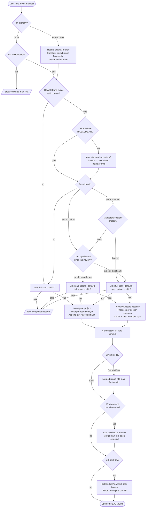

# /helm:manifest

Keep `README.md` in sync with the codebase. Full scan on first run, gap update on subsequent runs. Supports two styles: Standard Readme spec (enforced structure) or custom (preserves the developer's existing structure).

## Flow

```mermaid
flowchart TD
  Start([User runs /helm:manifest]) --> Strategy{git-strategy?}
  Strategy -->|Solo| SoloCheck{On main/master?}
  SoloCheck -->|no| StopSolo[/Stop: switch to main first/]
  SoloCheck -->|yes| Exists
  Strategy -->|GitHub Flow| Fresh[Record original branch<br/>Checkout fresh branch from main:<br/>docs/manifest-date]
  Fresh --> Exists

  Exists{README.md exists<br/>with content?}

  Exists -->|no| Mode1[Ask: full scan or skip?]
  Exists -->|yes| StyleFlag{readme-style<br/>in CLAUDE.md?}

  StyleFlag -->|no| AskStyle["Ask: standard or custom?\nSave to CLAUDE.md Project Config"]
  StyleFlag -->|yes| HashCheck
  AskStyle --> HashCheck

  HashCheck{Saved hash?}
  HashCheck -->|no| Mode1
  HashCheck -->|"yes + standard"| StructCheck{Mandatory sections<br/>present?}
  HashCheck -->|"yes + custom"| Gap

  StructCheck -->|broken| Mode3["Ask: full scan (default),<br/>gap update, or skip?"]
  StructCheck -->|intact| Gap{Gap significance<br/>since last review?}

  Gap -->|small or moderate| Mode2["Ask: gap update (default),<br/>full scan, or skip?"]
  Gap -->|large or significant| Mode3

  Mode1 -->|skip| Skip[/Exit: no update needed/]
  Mode1 -->|full| Full
  Mode2 -->|skip| Skip
  Mode2 -->|full| Full
  Mode2 -->|gap| GapPath
  Mode3 -->|skip| Skip
  Mode3 -->|full| Full
  Mode3 -->|gap| GapPath

  Full["Investigate project<br/>Write per readme-style<br/>Append last-reviewed hash"] --> Commit
  GapPath["Identify affected sections<br/>Propose per-section changes<br/>Confirm, then write per style"] --> Commit

  Commit["Commit (per git-auto-commit)"] --> SoloOrFlow{Which mode?}
  SoloOrFlow -->|Solo| Promote
  SoloOrFlow -->|GitHub Flow| MergeMain[Merge branch into main<br/>Push main]
  MergeMain --> Promote

  Promote{Environment<br/>branches exist?}
  Promote -->|yes| PromoteAsk[Ask: which to promote?<br/>Merge main into each selected]
  Promote -->|no| Cleanup
  PromoteAsk --> Cleanup

  Cleanup{GitHub Flow?}
  Cleanup -->|yes| DeleteBranch[Delete docs/manifest-date branch<br/>Return to original branch]
  Cleanup -->|no| Done
  DeleteBranch --> Done

  Done([Updated README.md])
```

## Steps

### Before starting

Rewrites `README.md` from the project's state, so it needs the full merged, stable state — never an in-progress feature branch. Behavior depends on `git-strategy`:

- **Solo Mode**: runs only on `main`/`master`. Halts on any other branch.
- **GitHub Flow**: records the current branch, then unconditionally checks out a fresh branch from main's current tip (`docs/manifest-{date}`) — regardless of what the starting branch was. README.md is always scanned from main's own state, never from a feature branch's unmerged work; if a feature branch changes something README.md should reflect, re-run `/helm:manifest` after that branch merges to main. Returns to the original branch at the end (see Step 5).

### 1. Assessment

First determines the README style by reading `readme-style` from CLAUDE.md Project Config. If the flag is absent, asks the user once and saves the choice (`readme-style: standard` or `readme-style: custom`) to CLAUDE.md before continuing.

Then reads the current `README.md`, checks for a saved `<!-- last-reviewed: {hash} -->` marker, and if found, runs `git log {hash}..HEAD --oneline` to measure the gap. Ignores noise commits.

When `readme-style: standard` and a hash exists, also checks whether all mandatory sections are present. If any are missing, recommends a full scan regardless of gap size and states which sections are missing.

### 2. Pick mode

Three modes, default depending on assessment:

- **No file or no hash**: Full scan or skip.
- **Standard style, structure broken**: Full scan (recommended), gap update, or skip.
- **Small to moderate gap**: Gap update (recommended), full scan, or skip.
- **Large gap**: Full scan (recommended), gap update, or skip.

### 3. Full scan

Investigates: business purpose and target audience, stack and dependencies, installation steps, core usage patterns and CLI commands, public API surface, license, contributing model, maintainers, and project motivation/limitations worth surfacing.

If `readme-style: standard`: writes `README.md` following the Standard Readme spec section order.

Mandatory sections: Title (matches repo name), Short Description (under 120 chars, matches `package.json` description), Table of Contents (if README exceeds 100 lines), Install, Usage, Contributing, License (last section before the comment tag).

Optional sections when relevant: badges, long description, background, API, limitations (only if the project has meaningful limitations worth surfacing to users evaluating adoption).

Skipped unless specifically needed: banner, security, thanks, maintainers, extra sections.

If `readme-style: custom`: reads the existing README structure first. Rewrites content within each section based on the project scan. Does not add, remove, or rename sections without explicit approval.

Appends the current HEAD hash as `<!-- last-reviewed: ... -->`. Writes directly.

### 4. Gap update

Reads commit messages first. Reads file changes only for significant commits. Focuses on new features, API changes, new install steps, changed usage, changed CLI commands, new env vars, and removed functionality.

For each significant change, identifies the affected README section. Updates only those sections. Does not rewrite unaffected sections.

If `readme-style: standard`: sections remain in spec order after updates.
If `readme-style: custom`: preserves existing section order and naming.

Proposes the changes per section, asks for confirmation, then writes. Bumps the saved hash to HEAD.

### 5. Commit and finalize

Commits per [git.md's Auto-Commit rule](../rules/git.md#auto-commit) — this also governs whether the rest of this step needs confirmation: silent if `git-auto-commit: true`, otherwise one confirmation covers commit, merge, promotion, and cleanup together, rather than prompting at each stage.

If environment branches exist (same detection [`/helm:ship`](ship.md) uses), asks which should also receive the update, then merges main into each selected branch and pushes.

**Solo Mode** commits directly to main, then runs environment promotion. **GitHub Flow** commits on the temporary branch, merges it into main and pushes, runs environment promotion, deletes the temporary branch (locally and remotely if pushed), and returns to whichever branch the command was originally run from.

## Scope

README.md is human-facing documentation for contributors, GitHub visitors, and new users. It is not a changelog, not a technical spec, and not a deployment manual. Keep it clear and scannable.

## Stop conditions

- **Solo Mode, not on main/master.** Switch to main or master and re-run.
- **User picks Skip.** Clean exit, no changes.
- **User cancels at the proposed-changes confirmation.** No write.

## See also

- [`/helm:log`](log.md) - same lifecycle for `CLAUDE.md` (the agent-facing version)
- [`/helm:ship`](ship.md) - typically run before shipping so the manifest reflects the release
