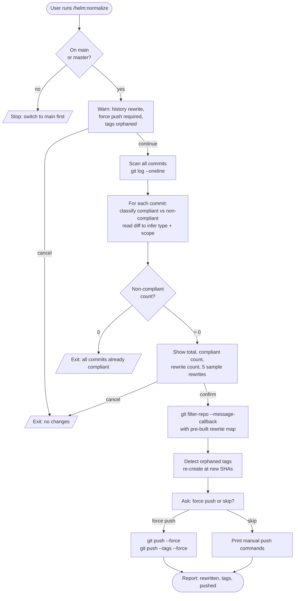

# /helm:normalize

Rewrites every non-conventional commit message in the repository's history to follow [Conventional Commits](https://www.conventionalcommits.org/) format. Three confirmation gates stand between the user and any destructive action: a plain-language risk warning, a full scan showing exactly how many commits will change and a sample of the rewrites before anything is touched, and a final force-push confirmation before the remote is touched.

## Flow



## Steps

### 1. Branch check

Only runs from `main` or `master`. Refuses to rewrite history from a feature branch — the rebase would diverge from `main` and create a worse mess.

### 2. Risk warning

Unconditional first gate. Presents a plain-language summary of what history rewriting means:

- Every rewritten commit gets a new SHA — history is permanently altered
- Remote copies require a force push to sync
- Tags pointing at rewritten commits become orphaned (handled in Step 4)
- Anyone else who has cloned the repo will have a broken history

Cancel is equally prominent. The command exits cleanly if the user declines.

### 3. Scan and classify

Runs `git log --oneline --no-decorate` to collect every commit from the beginning of the repo. For each commit, checks whether the message already matches the `type(scope): description` format.

For non-compliant commits, reads the diff via `git show {sha} --stat` to infer the correct type and scope:

- **Type** is inferred from what changed: new files → `feat`, broken behavior fixed → `fix`, restructuring with no behavior change → `refactor`, test files only → `test`, docs only → `docs`, dependencies or tooling → `chore`, CI config → `ci`, build config → `build`.
- **Scope** is inferred from the primary module, folder, or domain area affected. Cross-cutting changes use `project` or `core`.
- **Breaking changes** are detected from keywords (`breaking`, `BREAKING`, `!`) in the original message and preserved with a `!` suffix and `BREAKING CHANGE:` footer.

### 4. Show plan and confirm

Second gate, informed by real data. Presents:

- Total commits scanned
- Already-compliant count
- Commits to be rewritten
- Up to 5 sample rewrites showing `'original'` → `'proposed'`

The user sees exactly what will change before confirming. Cancel exits cleanly with no changes made.

If the non-compliant count is zero, the command exits here with a "nothing to do" message.

### 5. Rewrite

Uses `git filter-repo --message-callback` (preferred) with a pre-built JSON rewrite map, falling back to `git filter-branch --msg-filter` if `git filter-repo` is not installed. Claude builds the full `{original: proposed}` map during the scan phase and applies it in a single pass — no interactive prompts per commit, no partial rewrites. Messages not in the map pass through unchanged.

Verifies the result by sampling the first 20, last 20, and total count of commits before continuing.

### 6. Re-create orphaned tags

Collects all tags via `git tag`. For each tag, checks whether the original commit SHA still exists in the rewritten history. Orphaned tags (pointing at rewritten SHAs) are deleted and re-created at the corresponding new SHA with the same name and message.

### 7. Force push

Separate third confirmation before touching the remote. Presents the branch and remote clearly. If the user skips, prints the exact manual commands to run later:

```
git push origin {branch} --force
git push origin --tags --force
```

### 8. Report

Closes with a structured summary: total commits scanned, rewritten count, tags re-created, force push status. Any commits Claude could not classify with high confidence are listed separately as uncertain rewrites so the user can review them manually.

## Stop conditions

- **Not on `main` or `master`.** Switch branches and re-run.
- **Risk warning declined.** No changes made.
- **Plan confirmation declined.** No changes made.
- **All commits already compliant.** Nothing to do — exits after the scan.

## Notes

- `git filter-branch` rewrites the full history including merge commits. `git rebase -i` is not used because it requires interactive input per commit and does not handle merge commits cleanly.
- The rewrite map is built from Claude's diff analysis before any git commands run. If the scan is interrupted, nothing has been modified.
- After a successful normalize + force push, `git pull` on any other clone of the repo will fail. Each clone needs a `git fetch --all` followed by `git reset --hard origin/main`.

## See also

- [`git.md`](../rules/git.md) — the rule file that enforces Conventional Commits on all future commits
- [`/helm:ship`](ship.md) — the release command that reads commit history to calculate the next version; normalize ensures its version calculation works on repos with messy pre-convention history
- [`/helm:adopt`](adopt.md) — installs the git rules into a project so future commits follow the convention automatically
