# /helm:refactor

Branch off `main`, scan the project for refactoring opportunities, apply selected categories one at a time with tests passing after each, then merge, open a PR, or leave the branch for review. A persistent ledger (`.claude/refactor-log.json`) tracks findings across runs so the same issue never surfaces twice and progress is visible over time.

## Flow

```mermaid
flowchart TD
  Start([User runs /helm:refactor]) --> Branch{On main or master?}
  Branch -->|no| Stop[/Stop: switch to main first/]
  Branch -->|yes| ExistingCheck{Existing refactor/* branch?}

  ExistingCheck -->|yes| Pick[Ask: continue on existing<br/>or create fresh?]
  ExistingCheck -->|no| Create["Create refactor/{timestamp}"]
  Pick --> Create

  Create --> Ledger{.claude/refactor-log.json<br/>exists?}

  Ledger -->|no — first run| DeepAuto["Inform: running Deep Mode<br/>to build baseline"]
  Ledger -->|yes| ModeAsk[Ask: Deep Mode or Quick Mode?<br/>recommendation based on commits<br/>days elapsed and consecutive quick count]

  DeepAuto --> Deep
  ModeAsk -->|Deep| Deep[Spawn sub-agents per folder chunk<br/>each reads full chunk, all categories]
  ModeAsk -->|Quick| QuickCheck{Changed files > 50?}

  QuickCheck -->|yes| BigAsk[Ask: switch to Deep or continue?]
  QuickCheck -->|no| Quick[Single-thread scan of<br/>changed files only]
  BigAsk -->|Deep| Deep
  BigAsk -->|continue| Quick

  Deep --> Consolidate[Consolidate findings<br/>cross-chunk issues<br/>auto-resolve stale entries]
  Quick --> Revalidate[Re-validate open ledger entries<br/>auto-resolve deleted or rewritten files]

  Consolidate --> CommitLedger["Commit ledger<br/>chore(refactor): update ledger after deep scan"]
  Revalidate --> CommitLedger2["Commit ledger<br/>chore(refactor): update ledger after quick scan"]

  CommitLedger --> Report
  CommitLedger2 --> Report

  Report[Build report:<br/>New · Still Open · Auto-Resolved<br/>tagged with risk and cluster]
  Report --> Cats[Ask: which categories to apply?<br/>only categories with new or still-open findings]

  Cats -->|none selected| SkipExit[/Exit: no changes applied/]
  Cats -->|categories selected| Safe[Apply safe findings automatically<br/>in dependency order per cluster]

  Safe --> NeedsReview{Needs-review<br/>findings?}
  NeedsReview -->|yes| Ask1[Ask per finding:<br/>apply or skip?]
  NeedsReview -->|no| Tests
  Ask1 -->|skip| SkipMark[Mark skipped-by-user in ledger]
  Ask1 -->|apply| Tests
  SkipMark --> Tests

  Tests[Run tests + lint + commit<br/>refactor category summary]
  Tests -->|fail| TestStop[/Stop: fix tests before continuing/]
  Tests -->|pass| MoreCats{More selected<br/>categories?}
  MoreCats -->|yes| Safe
  MoreCats -->|no| Verify

  Verify[Scoped verification pass<br/>re-check touched files only<br/>catch newly introduced issues]
  Verify --> Next[Ask: merge, PR, or leave?]

  Next -->|merge| Merge[Switch to main · merge --no-ff<br/>delete refactor branch · push]
  Next -->|PR| PR[Push branch<br/>prompt user to open PR]
  Next -->|leave| Leave[Leave branch intact locally]

  Merge --> Done([Report: ledger summary · verification result])
  PR --> Done
  Leave --> Done
```

## Steps

### 1. Branch check

Only runs from `main` or `master`. Halts on any other branch.

### 2. Create or continue refactor branch

Creates a timestamped branch `refactor/{YYYYMMDD-HHMMSS}`. If a previous `refactor/*` branch already exists, asks whether to continue on it or start fresh.

### 3. Scan boundaries

Reads the project but skips `vendor/`, `node_modules/`, `public/`, `storage/`, migration files, `.env` files, generated or compiled files, and `.claude/refactor-log.json` itself. Tests are included on purpose because test quality degrades fastest.

### 4. Load history and choose mode

Looks for `.claude/refactor-log.json` — the command's persistent memory.

**First run (no ledger):** skips the mode question and runs Deep Mode automatically to build a baseline.

**Later runs:** computes commits and days elapsed since the last scan, then recommends a mode:
- **Deep Mode** if 40+ commits, 60+ days, or two Quick Mode scans in a row (`consecutive_quick_count >= 2`)
- **Quick Mode** otherwise

The user picks via a prompt with the reason for the recommendation shown inline.

### 5. Scan

**Deep Mode** — splits the project into folder/module chunks (keeping related files together), spawns one sub-agent per chunk, and has each agent read its full chunk in a single pass across all five categories. The main agent then consolidates: merges reports, spots cross-chunk patterns, checks new findings against the ledger to avoid duplicates, auto-resolves stale entries, assigns `risk` (`safe` / `needs-review`), groups related findings into `cluster_id`s, and records `depends_on` order where one fix must precede another.

**Quick Mode** — runs `git diff --name-only` since the last scan commit. If the diff exceeds 50 files, asks whether to switch to Deep Mode instead. Otherwise re-validates all open ledger entries against changed files (auto-resolving deleted or rewritten ones), then scans just the changed files in a single pass.

Both modes commit the updated ledger before moving on:
`chore(refactor): update ledger after {deep/quick} scan`

### 6. Present findings

Builds a structured report split into three sections:

- **New** — found for the first time this run
- **Still Open** — carried over from a previous run, still valid
- **Auto-Resolved** — previously open, file since deleted or rewritten

Each finding is tagged `[New]`/`[Still Open]`, priority (`High`/`Medium`/`Low`), and risk (`Safe`/`Needs Review`). Total count at the bottom shows new vs still-open separately.

### 7. Select categories

Multi-select prompt with only categories that have at least one `new` or `still open` finding (max 4 options — smallest two merge if more than four qualify). Categories with only auto-resolved findings are excluded. Selecting nothing is a clean skip with no harm done.

### 8. Apply category by category

For each selected category in turn:

1. **Order by dependency** — findings with `depends_on` entries are applied after their prerequisites. Findings sharing a `cluster_id` (touching the same or related files) are handled together in one pass, never split across parallel agents.
2. **Safe findings** — applied automatically, no prompt needed.
3. **Needs-review findings** — presented one at a time (or batched if closely related) for the user to approve or skip. Skipped findings are marked `skipped-by-user` in the ledger and stop resurfacing unless the surrounding code changes significantly enough to warrant a second look.
4. **Test, lint, commit** — run tests after each category; if they fail, halt and wait for resolution. Then lint, format, and commit: `refactor({category}): {summary}`. Update ledger statuses: `fixed` with `resolved_commit` and `resolved_date`, or `skipped-by-user`.

### 8.5 Scoped verification pass

After all selected categories are applied, re-checks only the files touched this session — not a fresh full scan. Confirms each `fixed` finding is actually gone, and catches anything new the fixes themselves introduced. Updates the ledger accordingly. Results surface in the final report.

### 9. Merge, PR, or leave

Asks how to land the work:
- **Auto-merge** into `main` with `refactor(project): apply refactoring {timestamp}`, delete the refactor branch, push
- **Open PR** — push the branch (with updated ledger) and prompt the user to open a PR
- **Leave as-is** — branch stays locally for manual review

### 10. Confirm completion

Closes with a structured summary: branch, mode, changes per category, ledger state (still open / auto-resolved / newly fixed / skipped by user), verification result (confirmed resolved / newly introduced), commits made, tests passing, outcome.

## Stop conditions

- **Not on `main` or `master`.** Switch back to the trunk first.
- **Tests fail mid-apply.** Resolve before the next category continues.
- **No categories selected.** Clean exit, ledger unchanged.
- **Quick Mode diff exceeds 50 files.** Prompted to switch to Deep Mode or continue.

## The ledger

`.claude/refactor-log.json` is committed alongside code changes on the refactor branch and travels with the branch to `main` on merge. It tracks every finding ever surfaced: when it was first found, when it was resolved (and in which commit), whether the user skipped it, and whether it auto-resolved because the code was rewritten. This is what makes progress visible across runs instead of repeating the same flat list every time.

## See also

- [`/helm:test`](test.md) — the test framework setup that this command relies on between categories
- [`/helm:ship`](ship.md) — ship the merged refactor as a release
