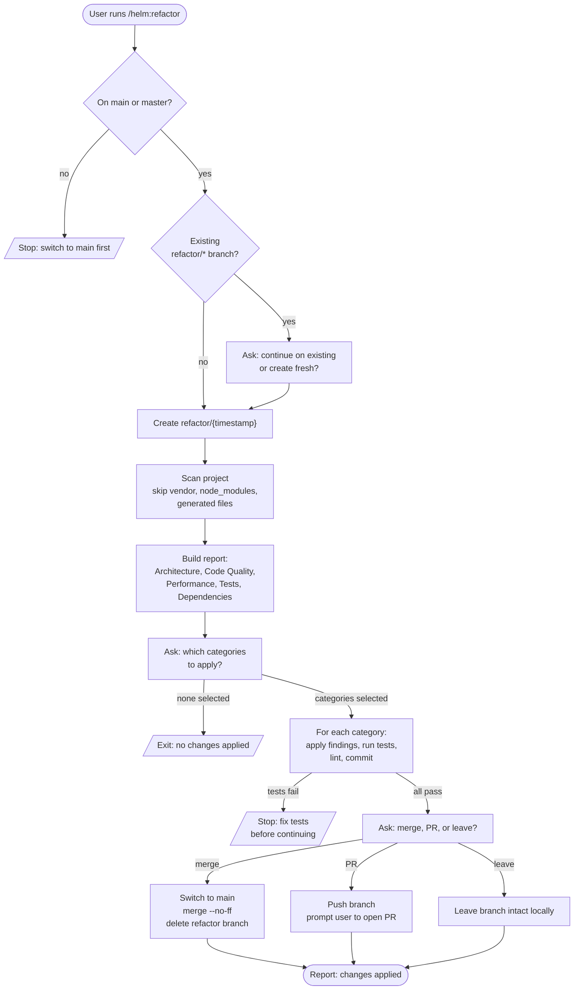

# /helm:refactor

Branch off `main`, run a full project scan to identify refactoring opportunities by category, apply selected categories one at a time with tests passing after each, then merge, open a PR, or leave the branch for review.

## Flow

## Steps

### 1. Branch check

Only runs from `main` or `master`. Halts on any other branch.

### 2. Create or continue refactor branch

Creates a timestamped branch `refactor/{YYYYMMDD-HHMMSS}`. If a previous `refactor/*` branch already exists, asks whether to continue on it or start fresh.

### 3. Scan boundaries

Reads the project but skips `vendor/`, `node_modules/`, `public/`, `storage/`, migration files, `.env` files, and anything generated or compiled. Tests are included on purpose because test quality degrades fastest.

### 4. Full project scan

Looks for issues across five categories: **Architecture** (logic in the wrong layer, missing abstractions, inconsistent patterns), **Code Quality** (duplication, dead code, magic numbers, complex methods), **Performance** (N+1 queries, inefficient loops, eager-loading mistakes), **Tests** (missing coverage on critical paths, outdated assertions, implementation-coupled tests), **Dependencies** (deprecated methods, outdated patterns, unnecessary packages).

### 5. Present findings

Builds a structured report grouping issues by category and prioritizing by High, Medium, Low within each. Each issue shows the file, a brief description, and a one-sentence reason. Total issue count at the bottom.

### 6. Select categories

Multi-select prompt with only categories that have issues (max 4 options). If more than four categories have issues, the two smallest merge. Selecting nothing is a clean skip with no harm done.

### 7. Apply category by category

For each selected category in turn: apply all findings, run tests, run the linter and formatter, commit with `refactor({category}): {summary}`. If tests fail at any point, the command stops and waits for resolution before continuing to the next category.

### 8. Merge, PR, or leave

After all selected categories are applied, asks how to land the work. Auto-merge into `main` with a single `refactor(project): apply refactoring {timestamp}` commit, push the branch and prompt the user to open a PR, or leave the branch as-is for manual review.

### 9. Confirm completion

Closes with a structured summary: branch name, changes per category, commits made, tests passing, and the chosen outcome.

## Stop conditions

- **Not on `main` or `master`.** Switch back to the trunk first.
- **Tests fail mid-apply.** Resolve before the next category.
- **No categories selected.** Clean exit.

## See also

- [`/helm:test`](test.md) - the test framework setup that this command relies on between categories
- [`/helm:ship`](ship.md) - ship the merged refactor as a release
