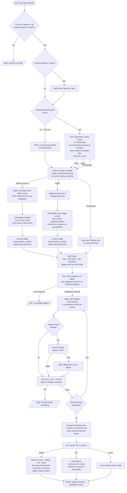

# /helm:refactor

Branch off `main`, scan the project for refactoring opportunities, apply selected categories one at a time with tests passing after each, then merge, open a PR, or leave the branch for review. A persistent ledger (`.claude/refactor-log.json`) tracks findings across runs so the same issue never surfaces twice and progress is visible over time.

## Flow

```mermaid
flowchart TD
  Start([User runs /helm:refactor]) --> Branch{On main, master, or an<br/>existing refactor/* branch?}
  Branch -->|no| Stop[/Stop: switch to one first/]
  Branch -->|yes| ExistingCheck{Existing refactor/* branch?}

  ExistingCheck -->|yes| NoteExisting[Note branch name for later]
  ExistingCheck -->|no| Ledger
  NoteExisting --> Ledger

  Ledger{.claude/refactor-log.json<br/>exists?}
  Ledger -->|no — first run| DeepAuto["Inform: running Deep Mode<br/>to build baseline"]
  Ledger -->|yes| ModeAsk["Ask: Deep Mode, Quick Mode,<br/>or Fix Backlog?\nrecommendation based on commits,<br/>days elapsed, changed files,<br/>and open_count"]

  DeepAuto --> CreateBranch["Switch to main if needed<br/>create refactor/{timestamp}<br/>(or ask to continue existing)"]
  ModeAsk -->|Deep| CreateBranch
  ModeAsk -->|Quick| CreateBranch
  ModeAsk -->|Fix Backlog| CreateBranch

  CreateBranch -->|Deep or first run| Deep[Spawn sub-agents per folder chunk<br/>each reads full chunk, all categories]
  CreateBranch -->|Quick| Quick[Single-thread scan of<br/>changed files only]
  CreateBranch -->|Fix Backlog| FixBacklog[Load open findings only<br/>no scan performed]

  Deep --> Consolidate[Consolidate findings<br/>cross-chunk issues<br/>auto-resolve stale entries]
  Quick --> Revalidate[Re-validate open ledger entries<br/>auto-resolve deleted/rewritten<br/>refresh line numbers for touched files]

  Consolidate --> CommitLedger["Commit ledger<br/>chore(refactor): update ledger after deep scan"]
  Revalidate --> CommitLedger2["Commit ledger<br/>chore(refactor): update ledger after quick scan"]

  CommitLedger --> Report
  CommitLedger2 --> Report
  FixBacklog --> Report

  Report[Build report:<br/>New · Still Open · Auto-Resolved<br/>tagged with risk and cluster]
  Report --> Cats[Ask: which categories to apply?<br/>only categories with new or still-open findings]

  Cats -->|none selected| SkipExit[/Exit: no changes applied/]
  Cats -->|categories selected| Safe[Apply safe findings automatically<br/>in dependency order per cluster]

  Safe --> NeedsReview{Needs-review<br/>findings?}
  NeedsReview -->|yes| Ask1[Ask per finding:<br/>apply or skip?]
  NeedsReview -->|no| Tests
  Ask1 -->|skip| SkipMark[Mark skipped-by-user in ledger]
  Ask1 -->|apply| Tests
  SkipMark --> Tests

  Tests[Run tests + lint + commit<br/>refactor category summary]
  Tests -->|fail| TestStop[/Stop: fix tests before continuing/]
  Tests -->|pass| MoreCats{More selected<br/>categories?}
  MoreCats -->|yes| Safe
  MoreCats -->|no| Verify

  Verify[Scoped verification pass<br/>re-check touched files only<br/>catch newly introduced issues]
  Verify --> Next[Ask: merge, PR, or leave?]

  Next -->|merge| Merge[Switch to main · merge --no-ff · push<br/>ask which environment branches to promote<br/>delete refactor branch]
  Next -->|PR| PR[Push branch<br/>attempt gh pr create<br/>fall back to manual if unavailable]
  Next -->|leave| Leave[Leave branch intact locally]

  Merge --> Done([Report: ledger summary · verification result])
  PR --> Done
  Leave --> Done
```

## Steps

### Before starting

Runs from `main`, `master`, or an existing `refactor/*` branch — resuming a session left via Step 7's "Leave as-is" option happens directly from that branch, not via a manual switch back to main first. Halts on any other branch.

### 1. Check for existing refactor branch

Runs `git branch --list 'refactor/*'` and records any existing branch name. No branch is created here.

### 2. Scan boundaries

Reads the project but skips `vendor/`, `node_modules/`, `public/`, `storage/`, migration files, `.env` files, generated or compiled files, and `.claude/refactor-log.json` itself. Tests are included on purpose because test quality degrades fastest.

### 3. Load history and choose mode

Looks for `.claude/refactor-log.json` — the command's persistent memory.

**First run (no ledger):** skips the mode question and runs Deep Mode automatically to build a baseline.

**Later runs:** computes commits, days elapsed, and the real changed-file count (`git diff --name-only`) since the last scan, plus the number of open findings, then recommends a mode:
- **Fix Backlog** if there are open findings and zero commits since last scan — nothing new to scan for
- **Deep Mode** if 40+ commits, 60+ days, two Quick Mode scans in a row (`consecutive_quick_count >= 2`), or more than 50 files changed — commit count alone is a weak proxy for diff size, so the real file count is checked upfront rather than discovered as a surprise after Quick Mode is already chosen
- **Quick Mode** otherwise

The Fix Backlog option only appears when there are open findings. The user picks via a prompt with the reason for the recommendation shown inline — the recommendation is a suggestion, not a restriction, and nothing later re-checks or overrides the choice.

**After mode is confirmed**, the refactor branch is created: `refactor/{YYYYMMDD-HHMMSS}`. If an existing `refactor/*` branch was found in Step 1, the user is asked whether to continue on it or start fresh.

### 4. Scan

**Deep Mode** — splits the project into folder/module chunks (keeping related files together), spawns one sub-agent per chunk, and has each agent read its full chunk in a single pass across all five categories: **Architecture**, **Code Quality**, **Performance**, **Tests**, and **Dependencies**. The main agent then consolidates: merges reports, spots cross-chunk patterns, checks new findings against the ledger to avoid duplicates, auto-resolves stale entries, assigns `risk` (`safe` / `needs-review`), groups related findings into `cluster_id`s, and records `depends_on` order where one fix must precede another.

**Quick Mode** — reuses the changed-file list already computed in Step 3 (size already accounted for in the mode recommendation, so no second size check here). Re-validates all open ledger entries: a deleted or heavily rewritten file auto-resolves its findings; an untouched file carries its findings forward unchanged; a file touched but not heavily rewritten — the common case — gets each finding's `line` re-verified and refreshed before carrying it forward, since line numbers drift with any unrelated edit above them and `risk: safe` findings apply with no human review to catch a stale one. Then scans just the changed files in a single pass for new issues.

**Fix Backlog** — skips scanning entirely. Loads every finding with `status: open` from the ledger and proceeds directly to presenting findings. Scan metadata (`last_scanned_commit`, `last_mode`, `consecutive_quick_count`) is left untouched since no scan was performed.

Deep and Quick Mode commit the updated ledger before moving on: `chore(refactor): update ledger after {deep/quick} scan`, per [git.md's Auto-Commit rule](../rules/git.html#auto-commit) like every commit this command makes.

### 5. Present findings

Builds a structured report. For Deep and Quick Mode, findings are split into three sections:

- **New** — found for the first time this run
- **Still Open** — carried over from a previous run, still valid
- **Auto-Resolved** — previously open, file since deleted or rewritten

For Fix Backlog mode, only **Still Open** is shown — no New or Auto-Resolved sections, since no scan was performed.

Each finding is tagged `[New]`/`[Still Open]`, priority (`High`/`Medium`/`Low`), and risk (`Safe`/`Needs Review`). Total count at the bottom shows new vs still-open separately.

Then presents a multi-select prompt with only categories that have at least one `new` or `still open` finding (max 4 options — smallest two merge if more than four qualify). Categories with only auto-resolved findings are excluded. Performance findings are reported but folded into whichever category it merges with if all five categories have issues. Selecting nothing is a clean skip with no harm done.

### 6. Apply category by category

For each selected category in turn:

1. **Order by dependency** — findings with `depends_on` entries are applied after their prerequisites. Findings sharing a `cluster_id` (touching the same or related files) are handled together in one pass, never split across parallel agents.
2. **Safe findings** — applied automatically, no prompt needed.
3. **Needs-review findings** — presented one at a time (or batched if closely related) for the user to approve or skip. Skipped findings are marked `skipped-by-user` in the ledger and stop resurfacing unless the surrounding code changes significantly enough to warrant a second look.
4. **Test, lint, commit** — run tests after each category; if they fail, halt and wait for resolution. Then lint, format, and commit: `refactor({scope}): {summary}`, where scope is the primary module/feature/domain touched by the cluster (e.g. `orders`, `auth`) per git.md's Conventional Commits convention — not the category name itself, which is a report/selection grouping, not a commit scope. Update ledger statuses: `fixed` with `resolved_commit` and `resolved_date`, or `skipped-by-user`.

**Scoped verification pass (Step 6.4)** — after all selected categories are applied, re-checks only the files touched this session, not a fresh full scan. Confirms each `fixed` finding is actually gone, and catches anything new the fixes themselves introduced. Updates the ledger accordingly. Results surface in the final report.

### 7. Merge, PR, or leave

Asks how to land the work:
- **Auto-merge** into `main` with `refactor(project): apply refactoring {timestamp}`, push, then — if environment branches exist (same detection [`/helm:ship`](ship.html) uses) — ask which should also receive the refactor and merge main into each selected one, before deleting the refactor branch
- **Open PR** — push the branch (with updated ledger), then, if the repo is hosted on GitHub, attempt `gh pr create` directly (same pattern as [`/helm:ship`](ship.html)'s GitHub Release step). Falls back to a manual "open a PR yourself" instruction if the repo isn't on GitHub, `gh` isn't installed, or it isn't authenticated
- **Leave as-is** — branch stays locally for manual review

### 8. Confirm completion

Closes with a structured summary: branch, mode, scan scope (new / carried-over / auto-resolved findings this run — omitted for Fix Backlog, since no scan occurred), changes per category, ledger state (still open / auto-resolved / newly fixed / skipped by user), verification result (confirmed resolved / newly introduced), commits made, tests passing, outcome. Ends with a sample of up to 5 applied fixes (description and file) so the closing report shows what was actually done, not just how many.

## Stop conditions

- **Not on `main`, `master`, or an existing `refactor/*` branch.** Switch to one first.
- **Tests fail mid-apply.** Resolve before the next category continues.
- **No categories selected.** Clean exit, ledger unchanged.

## The ledger

`.claude/refactor-log.json` is committed alongside code changes on the refactor branch and travels with the branch to `main` on merge. It tracks every finding ever surfaced: when it was first found, when it was resolved (and in which commit), whether the user skipped it, and whether it auto-resolved because the code was rewritten. This is what makes progress visible across runs instead of repeating the same flat list every time.

It also carries a `schema_version` field, bumped only if this structure changes in a future release, so a future version of the command can detect and handle an older-shaped file explicitly rather than misreading it. A missing `schema_version` means `1`.

## See also

- [`/helm:test`](test.html) — the test framework setup that this command relies on between categories
- [`/helm:ship`](ship.html) — ship the merged refactor as a release
