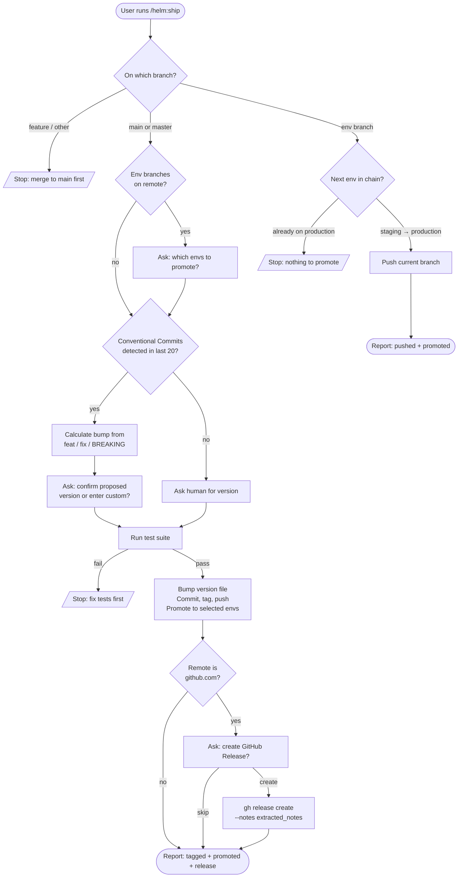

# /helm:ship

The release command. Reads the commits since the last tag, calculates the next version using Conventional Commits, runs the test suite, tags the release, and optionally promotes `main` to one or more environment branches.

## Flow

## Steps

### 1. Branch check

Refuses to release from a feature branch. On `main` or `master`, runs the full release flow. On an environment branch (`staging`, `production`, or similar), skips version tagging and runs the promotion path instead.

### 2. Select deployment targets

Only on `main`. Discovers remote environment branches via `git branch -r`, filters for known environment names, and presents a multi-select so the user can pick which environments to promote alongside the main release. Selecting none means a main-only release.

### 3. Calculate version

Only on `main`. Versions follow [Semantic Versioning](https://semver.org/) (`MAJOR.MINOR.PATCH`). Scans the last 20 commits for Conventional Commits patterns. If detected, walks commits since the last tag and proposes the next version: `BREAKING CHANGE` or `feat!` bumps major, `feat` bumps minor, `fix` bumps patch, `chore` and `docs` are ignored. The user confirms or enters a custom version. If Conventional Commits are not in use, the command asks the human for the version directly.

### 4. Run tests

Runs the full test suite using the project's detected test framework. Halts on failure with a clear stop message. Skips silently if no test framework is configured.

### 5. Execute release

Only on `main`. Bumps the version in the detected version file (`package.json`, `composer.json`, or `VERSION`), updates any inline version references in the README, commits as `chore(release): bump version to {version}`, creates an annotated tag `v{version}`, and pushes both the commit and tag. For each selected environment branch, merges `main` in with a `--no-ff` deploy commit and pushes.

After pushing, checks whether the remote origin URL contains `github.com`. If not, this sub-step is skipped silently. If yes, asks whether to create a GitHub Release. On confirmation, extracts `feat` and `fix` commits from `git log v{last_tag}..HEAD` and runs `gh release create v{version} --title "v{version}" --notes "{extracted_notes}"`, which publishes a release on GitHub with the curated commit list.

**Prerequisite:** `gh release create` requires the GitHub CLI to be authenticated. Run `gh auth login` once before using this feature. If `gh` is not authenticated, the command will fail with an auth error and the ship command will surface the manual fix rather than silently failing.

### 6. Promotion path

Only on an environment branch. Pushes the current branch so CI/CD can deploy. Determines the next environment in the chain (`staging → production`) and stops if already on the final environment.

### 7. Report

Closes with a summary: version tagged, README updated yes or no, environments promoted, GitHub Release created or skipped or not applicable, deployment triggered.

## Stop conditions

The command refuses to proceed in three cases:

- **On a feature branch.** Merge to `main` first via PR, then re-run.
- **Tests fail.** Fix the failing tests before releasing.
- **Already on the final environment.** No further promotion is available.

## See also

- [`/helm:test`](test.md) — the test framework setup and coverage flow that pairs with this command
- [`/helm:log`](log.md) — sync `CLAUDE.md` to reflect the release
- [`/helm:manifest`](manifest.md) — sync `README.md` to reflect the release
