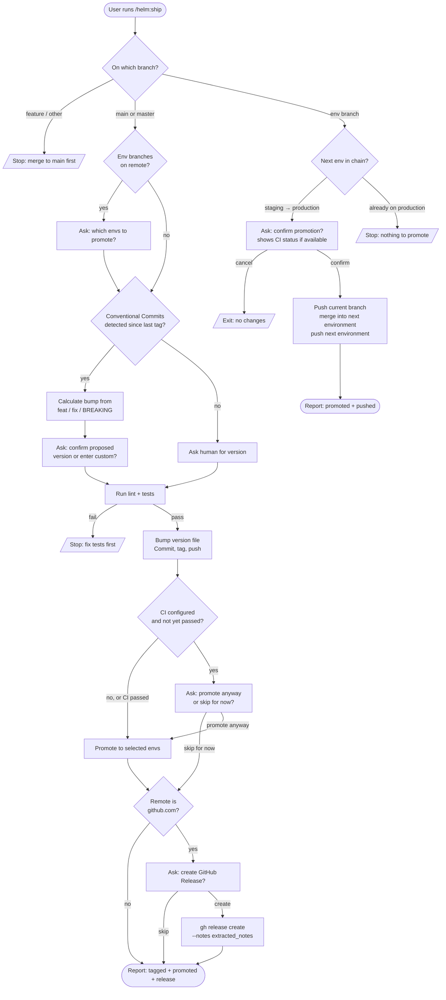

# /helm:ship

The release command. Reads the commits since the last tag, calculates the next version using Conventional Commits, runs the test suite, tags the release, and optionally promotes `main` to one or more environment branches.

## Flow

```mermaid
flowchart TD
  Start([User runs /helm:ship]) --> Branch{On which branch?}
  Branch -->|feature / other| FeatStop[/Stop: merge to main first/]
  Branch -->|main or master| Targets{Env branches<br/>on remote?}
  Branch -->|env branch| EnvNext{Next env in chain?}

  Targets -->|yes| Pick[Ask: which envs to promote?]
  Targets -->|no| CC
  Pick --> CC{Conventional Commits<br/>detected since last tag?}

  CC -->|yes| Calc[Calculate bump from<br/>feat / fix / BREAKING]
  CC -->|no| AskVersion[Ask human for version]
  Calc --> Confirm[Ask: confirm proposed<br/>version or enter custom?]
  Confirm --> Tests
  AskVersion --> Tests

  Tests[Run lint + tests] -->|fail| TestStop[/Stop: fix tests first/]
  Tests -->|pass| Release[Bump version file<br/>Commit, tag, push]
  Release --> CICheck{CI configured<br/>and not yet passed?}
  CICheck -->|no, or CI passed| Promote[Promote to selected envs]
  CICheck -->|yes| CIAsk[Ask: promote anyway<br/>or skip for now?]
  CIAsk -->|skip for now| GHCheck
  CIAsk -->|promote anyway| Promote
  Promote --> GHCheck{Remote is<br/>github.com?}
  GHCheck -->|no| MainDone
  GHCheck -->|yes| GHConfirm[Ask: create GitHub Release?]
  GHConfirm -->|skip| MainDone
  GHConfirm -->|create| GHRelease[gh release create<br/>--notes extracted_notes]
  GHRelease --> MainDone([Report: tagged + promoted + release])

  EnvNext -->|staging → production| EnvConfirm[Ask: confirm promotion?<br/>shows CI status if available]
  EnvNext -->|already on production| EnvStop[/Stop: nothing to promote/]
  EnvConfirm -->|cancel| EnvCancelExit[/Exit: no changes/]
  EnvConfirm -->|confirm| EnvMerge[Push current branch<br/>merge into next environment<br/>push next environment]
  EnvMerge --> EnvDone([Report: promoted + pushed])
```

## Steps

### Before starting

Refuses to release from a feature branch. On `main` or `master`, runs the full release flow. On an environment branch (`staging`, `production`, or similar), skips the entire release flow — version bump, commit, tag, code quality checks, and GitHub Release all only run from main — and runs the promotion path (Step 5) instead.

### 1. Select deployment targets

Only on `main`. Discovers remote environment branches via `git branch -r`, filters for known environment names, and presents a multi-select so the user can pick which environments to promote alongside the main release. Selecting none means a main-only release.

### 2. Calculate version

Only on `main`. Versions follow [Semantic Versioning](https://semver.org/) (`MAJOR.MINOR.PATCH`). Scans every commit since the last tag (`git log {last_tag}..HEAD`, unbounded) for Conventional Commits patterns. If detected, the same commit list proposes the next version, covering every type in git.md's Conventional Commits list: `BREAKING CHANGE` or `feat!` bumps major, `feat` (no breaking change) bumps minor, `fix` or `perf` bumps patch (`perf` is a real improvement to shipped behavior, not treated as a no-op). `chore`, `docs`, `style`, `ci`, `build`, `refactor`, `test`, and `revert` are ignored for version calculation — no behavior change from the user's perspective. The user confirms or enters a custom version. If Conventional Commits are not in use, the command asks the human for the version directly.

If no tag exists, the base version is read from the version file (`package.json`, `composer.json`, `VERSION`). If no version is found there either, `0.1.0` is used as the starting point.

When the current version is in the `0.x.x` range, the confirmation prompt includes a dedicated **Bump to v1.0.0** option. This is for releases that complete a usable set of features solving a real problem end-to-end — not about size or stability, just about being genuinely usable. Once the version reaches `1.0.0` or above, this option is no longer shown.

Any manually-entered version — a custom version typed after the auto-calculated proposal, or direct entry when Conventional Commits aren't detected — is validated against Semantic Versioning format before use, and re-asked for if it doesn't match. The auto-calculated proposal itself skips this check, since it's derived from a known-good base version and is always well-formed.

### 3. Run code quality checks

Only reached on the main-branch path — Step 1's redirect sends the environment-branch path straight to Step 5, skipping this entirely. Runs the git.md Code Quality gate — lint and tests — before releasing, rather than restating the procedure. Two release-specific overrides: it runs the full test suite (not just changed-file tests), and if no test framework is detected it asks for confirmation to release untested instead of skipping silently. Does not proceed until lint passes and tests are green.

### 4. Execute release

Only on `main`. Bumps the version in the detected version file (`package.json`, `composer.json`, or `VERSION`), updates any inline version references in the README, then stages the version file, the README (if changed), and any files the linter/formatter touched in Step 3 — folding formatting changes into the release commit per git.md, never `git add -A`. Commits as `chore(release): bump version to {version}`, creates an annotated tag `v{version}`, and pushes both the commit and tag.

Before promoting to any selected environment, checks CI status for the commit just pushed — per git.md's Environment Branches rule ("if CI is configured, it must pass before promoting to next environment"). If the repo isn't on GitHub or no workflow files exist, this check is skipped silently. Otherwise it checks the latest run for `main` via `gh run list`; if it reported success, promotion proceeds silently. If it hasn't (still running, failed, or no run found yet), asks whether to promote anyway or skip promotion for this run — main stays tagged and pushed either way. Once cleared, merges `main` into each selected environment branch with a `--no-ff` deploy commit and pushes.

After pushing, checks whether the remote origin URL contains `github.com`. If not, this sub-step is skipped silently. If yes, asks whether to create a GitHub Release. On confirmation, extracts `feat` and `fix` commits from `git log v{last_tag}..HEAD` and runs `gh release create v{version} --title "v{version}" --notes "{extracted_notes}"`, which publishes a release on GitHub with the curated commit list.

**Prerequisite:** `gh release create` requires the GitHub CLI to be authenticated. Run `gh auth login` once before using this feature. If `gh` is not authenticated, the command will fail with an auth error and the ship command will surface the manual fix rather than silently failing.

### 5. Promotion path

Only on an environment branch. Determines the next environment in the chain (`staging → production`) and stops if already on the final environment. Otherwise checks CI status for the current branch the same way Step 4 does (skipped silently if not on GitHub or no CI configured), folds the result into the confirmation prompt rather than asking twice, and confirms before mutating anything (per safety.md: never push without confirmation). On confirm, pushes the current branch, merges it into the next environment branch with a `--no-ff` deploy commit, pushes that branch too, and returns to the current branch.

### 6. Report

Closes with a summary. On `main`: version tagged, README updated yes or no, environments promoted (including "none — skipped, CI had not passed" if that's why), GitHub Release created or skipped or not applicable, deployment triggered. On an environment branch: which branch was promoted to which, both branches pushed, deployment triggered.

## Stop conditions

The command refuses to proceed in three cases:

- **On a feature branch.** Merge to `main` first via PR, then re-run.
- **Tests fail.** Fix the failing tests before releasing.
- **Already on the final environment.** No further promotion is available.

## See also

- [`/helm:test`](test.md) — the test framework setup and coverage flow that pairs with this command
- [`/helm:log`](log.md) — sync `CLAUDE.md` to reflect the release
- [`/helm:manifest`](manifest.md) — sync `README.md` to reflect the release
