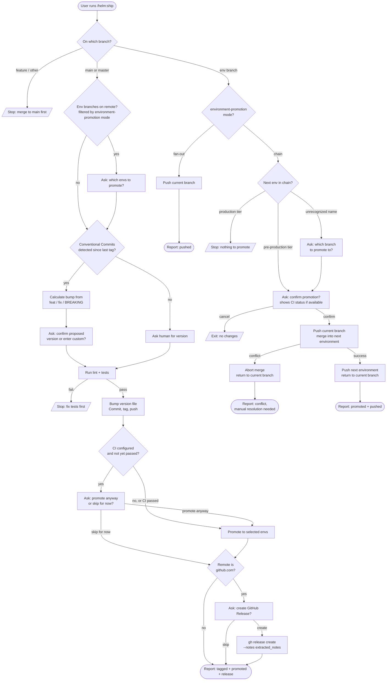

# /helm:ship

The release command. Reads the commits since the last tag, calculates the next version using Conventional Commits, runs the test suite, tags the release, and optionally promotes `main` to one or more environment branches.

## Flow

```mermaid
flowchart TD
  Start([User runs /helm:ship]) --> Branch{On which branch?}
  Branch -->|feature / other| FeatStop[/Stop: merge to main first/]
  Branch -->|main or master| Targets{Env branches on remote?<br/>filtered by environment-promotion mode}
  Branch -->|env branch| EnvMode{environment-promotion<br/>mode?}

  Targets -->|yes| Pick[Ask: which envs to promote?]
  Targets -->|no| CC
  Pick --> CC{Conventional Commits<br/>detected since last tag?}

  CC -->|yes| Calc[Calculate bump from<br/>feat / fix / BREAKING]
  CC -->|no| AskVersion[Ask human for version]
  Calc --> Confirm[Ask: confirm proposed<br/>version or enter custom?]
  Confirm --> Tests
  AskVersion --> Tests

  Tests[Run lint + tests] -->|fail| TestStop[/Stop: fix tests first/]
  Tests -->|pass| Release[Bump version file<br/>Commit, tag, push]
  Release --> CICheck{CI configured<br/>and not yet passed?}
  CICheck -->|no, or CI passed| Promote[Promote to selected envs]
  CICheck -->|yes| CIAsk[Ask: promote anyway<br/>or skip for now?]
  CIAsk -->|skip for now| GHCheck
  CIAsk -->|promote anyway| Promote
  Promote --> GHCheck{Remote is<br/>github.com?}
  GHCheck -->|no| MainDone
  GHCheck -->|yes| GHConfirm[Ask: create GitHub Release?]
  GHConfirm -->|skip| MainDone
  GHConfirm -->|create| GHRelease[gh release create<br/>--notes extracted_notes]
  GHRelease --> MainDone([Report: tagged + promoted + release])

  EnvMode -->|fan-out| EnvPushOnly[Push current branch]
  EnvPushOnly --> EnvFanDone([Report: pushed])

  EnvMode -->|chain| EnvNext{Next env in chain?}
  EnvNext -->|pre-production tier| EnvConfirm[Ask: confirm promotion?<br/>shows CI status if available]
  EnvNext -->|production tier| EnvStop[/Stop: nothing to promote/]
  EnvNext -->|unrecognized name| EnvAsk[Ask: which branch<br/>to promote to?]
  EnvAsk --> EnvConfirm
  EnvConfirm -->|cancel| EnvCancelExit[/Exit: no changes/]
  EnvConfirm -->|confirm| EnvMerge[Push current branch<br/>merge into next environment]
  EnvMerge -->|conflict| EnvAbort[Abort merge<br/>return to current branch]
  EnvAbort --> EnvConflictDone([Report: conflict,<br/>manual resolution needed])
  EnvMerge -->|success| EnvPush2[Push next environment<br/>return to current branch]
  EnvPush2 --> EnvDone([Report: promoted + pushed])
```

## Steps

### Before starting

Refuses to release from a feature branch. On `main` or `master`, first checks for a clean working tree (`git status --porcelain`) before doing anything else: Step 4 stages specific files by path (`git add README.md`, the version file, etc.), and staging a file picks up its entire current state — so unrelated pending edits already sitting in one of those exact files would otherwise ride silently into the release commit and get tagged and pushed along with it. If the tree isn't clean, asks whether to commit the pending changes separately first (Conventional Commits message, scope inferred from the touched files, same convention every other command in this plugin uses) or stop so it can be handled manually — proceeding as-is without committing is never offered, since that's exactly the silent-bundling failure mode this check exists to close. Once clean, runs the full release flow. On an environment branch (`staging`, `production`, or similar), skips the entire release flow — version bump, commit, tag, code quality checks, and GitHub Release all only run from main — and runs the promotion path (Step 5) instead.

### 1. Select deployment targets

Only on `main`. Discovers remote environment branches via `git branch -r`, filters for known environment names, then filters again by `environment-promotion` mode (git.md Environment Branches; default `fan-out`): fan-out offers every discovered branch, chain offers only pre-production-tier branches (`staging`, `stage`, `uat`, `preprod`) — a production-tier branch is never a direct deploy target from main under chain mode, only reachable later via Step 5. Presents a multi-select so the user can pick which of the offered environments to promote alongside the main release, capped at 4 options if more branches qualify (recognized tier names first, then alphabetical; the question notes any remainder needs a follow-up run). If exactly one branch qualifies, asks a direct yes/no confirmation instead of a multi-select, since AskUserQuestion needs at least 2 options. Selecting none (or Skip) means a main-only release.

### 2. Calculate version

Only on `main`. Versions follow [Semantic Versioning](https://semver.org/) (`MAJOR.MINOR.PATCH`). Scans every commit since the last tag (`git log {last_tag}..HEAD`, unbounded) for Conventional Commits patterns. If detected, the same commit list proposes the next version, covering every type in git.md's Conventional Commits list: `BREAKING CHANGE` or `feat!` bumps major, `feat` (no breaking change) bumps minor, `fix` or `perf` bumps patch (`perf` is a real improvement to shipped behavior, not treated as a no-op). `chore`, `docs`, `style`, `ci`, `build`, `refactor`, `test`, and `revert` are ignored for version calculation — no behavior change from the user's perspective. The user confirms or enters a custom version. If Conventional Commits are not in use, the command asks the human for the version directly.

If no tag exists, the base version is read from the version file — `.claude-plugin/plugin.json`, `package.json`, `composer.json`, or `VERSION`, checked in that priority order if more than one exists, since a `.claude-plugin/plugin.json` is a deliberate signal this repo's canonical version lives there. If no version is found there either, `0.1.0` is used as the starting point.

When the current version is in the `0.x.x` range, the confirmation prompt includes a dedicated **Bump to v1.0.0** option. This is for releases that complete a usable set of features solving a real problem end-to-end — not about size or stability, just about being genuinely usable. Once the version reaches `1.0.0` or above, this option is no longer shown.

Any manually-entered version — a custom version typed after the auto-calculated proposal, or direct entry when Conventional Commits aren't detected — is validated against Semantic Versioning format before use, and re-asked for if it doesn't match. The auto-calculated proposal itself skips this check, since it's derived from a known-good base version and is always well-formed.

### 3. Run code quality checks

Only reached on the main-branch path — Step 1's redirect sends the environment-branch path straight to Step 5, skipping this entirely. Runs the git.md Code Quality gate — lint and tests — before releasing, rather than restating the procedure. Two release-specific overrides: it runs the full test suite (not just changed-file tests), and if no test framework is detected it asks for confirmation to release untested instead of skipping silently. Does not proceed until lint passes and tests are green.

### 4. Execute release

Only on `main`. Bumps the version in the detected version file, updates any inline version references in the README, and — if the detected file was `.claude-plugin/plugin.json` — also bumps the matching plugin entry's version in `.claude-plugin/marketplace.json` (matched by `name`), keeping marketplace metadata from drifting from the actual plugin version. Then stages the version file, the README (if changed), marketplace.json (if changed), and any files the linter/formatter touched in Step 3 — folding formatting changes into the release commit per git.md, never `git add -A`. Commits as `chore(release): bump version to {version}`, creates an annotated tag `v{version}`, and pushes both the commit and tag.

Before promoting to any selected environment, checks CI status for the commit just pushed — per git.md's Environment Branches rule ("if CI is configured, it must pass before promoting"). If the repo isn't on GitHub or no workflow files exist, this check is skipped silently. Otherwise it matches `gh run list` results against the pushed commit's exact SHA (`headSha`) rather than just the single most recent run — a push can trigger several workflow runs, and checking only the latest one risks missing a still-failing run, or catching a stale run from before this commit was even registered. If every matching run succeeded, promotion proceeds silently; otherwise (still running, failed, or none found yet) it asks whether to promote anyway or skip promotion for this run — main stays tagged and pushed either way. Once cleared, merges `main` into each selected environment branch with a `--no-ff` deploy commit and pushes.

After pushing, checks whether the remote origin URL contains `github.com`. If not, this sub-step is skipped silently. If yes, checks whether `gh` is installed at all (`gh --version`) before asking anything — if it's missing, skips the release offer and prints the manual `gh release create` command instead of asking a question the environment can't fulfill. If `gh` is installed, asks whether to create a GitHub Release. On confirmation, extracts `feat` and `fix` commits from `git log v{last_tag}..HEAD` and runs `gh release create v{version} --title "v{version}" --notes "{extracted_notes}"`, which publishes a release on GitHub with the curated commit list — the printed release URL is captured for the final report.

**Prerequisite:** `gh release create` requires the GitHub CLI to be installed and authenticated. Run `gh auth login` once before using this feature. If `gh` isn't installed, the release offer is skipped with manual instructions (above); if it's installed but not authenticated, the command fails with an auth error and the ship command surfaces the manual fix rather than silently failing.

### 5. Promotion path

Only on an environment branch. Checks `environment-promotion` mode first (git.md Environment Branches; default `fan-out`):

**Fan-out mode**: there's no chain to advance — environment branches only ever receive code directly from main (Step 1), never from each other. Just pushes the current branch and reports.

**Chain mode**: matches the current branch against two tiers of git.md's recognized environment names — pre-production (`staging`, `stage`, `uat`, `preprod`) and production (`production`, `prod`) — treating names within a tier as equivalent rather than requiring an exact match. From the pre-production tier, the next environment is whichever production-tier branch actually exists on the remote; stops if already on the production tier. If the current branch is a long-lived branch outside both recognized tiers, asks which branch to promote to instead of guessing.

Then checks CI status for the current branch's tip commit the same way Step 4 does — matched by `headSha`, all matching runs must succeed (skipped silently if not on GitHub or no CI configured) — folds the result into the confirmation prompt rather than asking twice, and confirms before mutating anything (per safety.md: never push without confirmation). On confirm, pushes the current branch, merges it into the next environment branch with a `--no-ff` deploy commit. If the merge conflicts, aborts it, returns to the current branch, and reports that manual resolution is needed rather than leaving the repo mid-merge. On a clean merge, pushes the next environment branch and returns to the current branch.

### 6. Report

Closes with a summary. On `main`: the release commit's SHA, version tagged, README updated yes or no, environments promoted (or "none — skipped" if CI hadn't passed), the GitHub Release URL if one was created, deployment triggered. If any environment was promoted via "Promote anyway" despite CI not reporting success, adds a note saying so. If promotion was skipped for that reason, adds a note that re-running `/helm:ship` would cut a new version rather than retry the promotion, with the manual merge steps instead. On an environment branch: fan-out mode reports the branch pushed; chain mode reports which branch was promoted to which, both branches pushed, and the same CI-override note if the promotion went ahead without a passing run. Either way, deployment triggered.

## Stop conditions

The command refuses to proceed in three cases:

- **On a feature branch.** Merge to `main` first via PR, then re-run.
- **Tests fail.** Fix the failing tests before releasing.
- **Already on the final environment (chain mode only).** No further promotion is available.

## See also

- [`/helm:test`](test.html) — the test framework setup and coverage flow that pairs with this command
- [`/helm:log`](log.html) — sync `CLAUDE.md` to reflect the release
- [`/helm:manifest`](manifest.html) — sync `README.md` to reflect the release
