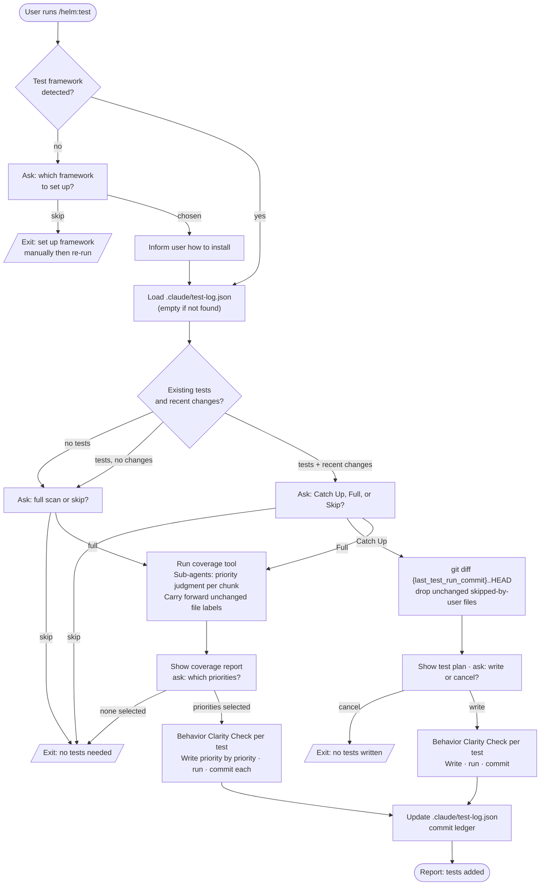

# /helm:test

Detect the test framework, load the run ledger, assess existing coverage and recent activity, then write tests scoped to recent changes or the full project. Commits per scope with `test({scope}):` messages.

## Flow

## Steps

### 1. Detect test framework

Scans for known config files and dependencies (e.g. `vitest.config`, `jest.config`, `phpunit.xml`). Also detects the project's coverage tool (`coverage.py`, `nyc`, `jest --coverage`, etc.) for use in the Full Scan step. If a framework is found, proceeds to the ledger load. If not found, proposes the best-fit framework for the detected stack and lets the user pick or skip.

### 2. Load ledger

Reads `.claude/test-log.json` if it exists. A missing file is not an error — the command proceeds as if the ledger is empty.

The ledger stores:
- **`findings`** — user decisions: `skipped-by-user` (not re-prompted next run unless the file changes) and `ambiguous` (resurfaces in a future run rather than silently guessing).
- **`full_scan_findings`** — sub-agent priority judgments from the last Full Scan, keyed by file with a `last_judged_commit`. Used in Step 6 to skip re-running judgment on unchanged files. Kept separate from `findings` because it is scan data, not a user decision.
- **`last_test_run_commit`** and **`last_full_scan_commit`** — for scoping the next run's diff.

### 3. Assess coverage and recent activity

Uses the same commit-range diff as the Catch Up step to identify recently changed files: `git diff {last_test_run_commit}..HEAD --name-only`, falling back to `HEAD~1..HEAD` or the working tree diff if no ledger commit is stored. Scans for existing test files and estimates gap-in-recent-changes and overall coverage. The branching depends on what it finds.

### 4. Choose scope

Three possible scopes, with the recommendation depending on assessment:

- **No tests yet**: Full scan or skip.
- **Tests exist, no recent changes**: Full scan or skip.
- **Tests exist plus recent changes**: Catch Up, Full, or skip.

For the "tests plus changes" case, the command makes a real recommendation based on gap significance and lists that option first.

### 5. Catch Up path

Identifies changed files using a commit-range diff:

- If `last_test_run_commit` is in the ledger: runs `git diff {last_test_run_commit}..HEAD` to capture all committed changes since the last run — not just uncommitted working-tree changes.
- If the ledger has no stored commit (first run): falls back to `git diff HEAD~1..HEAD`, or the working tree diff if uncommitted changes exist.

Cross-checks the file list against `skipped-by-user` ledger entries and drops those files from the plan, unless they have been modified since they were skipped.

Applies the **Behavior Clarity Check** before writing any test (see below). Presents the test plan and waits for confirmation, then writes tests that reflect proven behavior, runs the suite, and commits with `test({scope}): add tests for {feature}`.

### Behavior Clarity Check

Applied in both Catch Up and Full Scan before writing a test for any piece of code.

If the expected behavior is clear from the code, docs, or existing tests: write the test directly.

If it is ambiguous (undocumented edge case, unclear intended behavior, behavior contradicts docs): stop and ask the user to clarify or skip. If the user clarifies, proceed. If they skip, record the file in the ledger with `status: "ambiguous"` and a short note — never guess and encode a guess as a test.

### 6. Full Scan path

**Coverage check**: runs the project's coverage tool across the full project on every run — never partial, never skipped.

**Priority judgment**: splits the project into folder/module chunks and spawns one sub-agent per chunk (capped at 8), each returning a priority label for untested areas. Before spawning, each file is checked against `full_scan_findings` in the ledger: unchanged since `last_judged_commit` → carry the stored priority forward; changed or not yet recorded → include in the sub-agent run and update the ledger entry; no longer exists in the repo → remove the entry.

Builds a coverage report grouped into High / Medium / Low priority with file-level notes, then asks which priorities to cover via multi-select.

Applies the **Behavior Clarity Check** before writing each test. Writes tests priority by priority, single-agent and sequential — no parallel writing. If a single priority tier is too large for one agent's context, it is batched sequentially (write a chunk, commit, continue) without any planning or dependency system. Runs the suite and commits per priority with `test({scope}): add missing tests for {priority} priority areas`.

### 7. Update ledger

After tests are written, run, and committed:

- **Catch Up run**: sets `last_test_run_commit` to current HEAD.
- **Full Scan run**: sets both `last_full_scan_commit` and `last_test_run_commit` to current HEAD. Persists all `full_scan_findings` changes (new entries, updated priorities, removed stale entries).
- Adds new `skipped-by-user` entries for files the user skipped at the confirmation step.
- Adds new `ambiguous` entries from the Behavior Clarity Check.
- Removes or updates entries for files resolved this run.

Commits the ledger with `test(log): update test ledger after {catch-up / full-scan}`.

## Stop conditions

- **No framework, user skips setup.** Configure a framework and re-run.
- **User cancels at the test plan.** No tests written.
- **No priorities or no scope selected.** Clean exit.
- **Written tests fail.** The command stops before committing and waits for the user to fix the failure.

## See also

- [`/helm:refactor`](refactor.md) — pairs naturally; refactor first, then write tests to lock the new behavior in
- [`/helm:ship`](ship.md) — runs the test suite as part of the release gate
