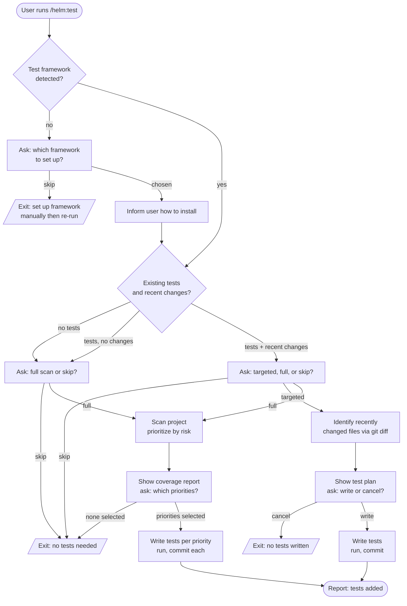

# /helm:test

Detect the test framework, assess existing coverage and recent activity, then write tests scoped to recent changes or the full project. Commits per scope with `test({scope}):` messages.

## Flow

## Steps

### 1. Detect test framework

Scans for known config files and dependencies (e.g. `vitest.config`, `jest.config`, `phpunit.xml`). If found, jumps straight to Assessment. If not found, proposes the best-fit framework for the detected stack and lets the user pick or skip.

### 2. Assess coverage and recent activity

Runs `git diff` to identify recently changed files, scans for existing test files, and estimates both gap-in-recent-changes and overall project coverage. The branching depends on what it finds.

### 3. Choose scope

Three possible scopes, with the recommendation depending on assessment:

- **No tests yet**: Full scan or skip.
- **Tests exist, no recent changes**: Full scan or skip.
- **Tests exist plus recent changes**: Targeted, full, or skip.

For the "tests plus changes" case, the command makes a real recommendation based on gap significance and lists that option first.

### 4. Targeted path

Identifies recently changed files, shows a per-file test plan, confirms with the user, then writes tests that reflect proven behavior (not speculative edge cases). Follows existing test conventions in the project. Runs the suite and commits with `test({scope}): add tests for {feature}`.

### 5. Full scan path

Scans the entire project for untested code, prioritized by risk: payment and billing first, then auth, core business logic, API endpoints, data transformations, and everything else. Builds a coverage report grouped by priority with file-level notes, then asks which priorities to cover. Writes tests priority by priority, running the suite and committing per priority.

### 6. Confirm completion

The command never reports success while tests are failing. Each commit only lands after the suite passes.

## Stop conditions

- **No framework, user skips setup.** Configure a framework and re-run.
- **User cancels at the test plan.** No tests written.
- **No priorities or no scope selected.** Clean exit.
- **Written tests fail.** The command stops before committing and waits for the user to fix the failure.

## See also

- [`/helm:refactor`](refactor.md) — pairs naturally; refactor first, then write tests to lock the new behavior in
- [`/helm:ship`](ship.md) — runs the test suite as part of the release gate
