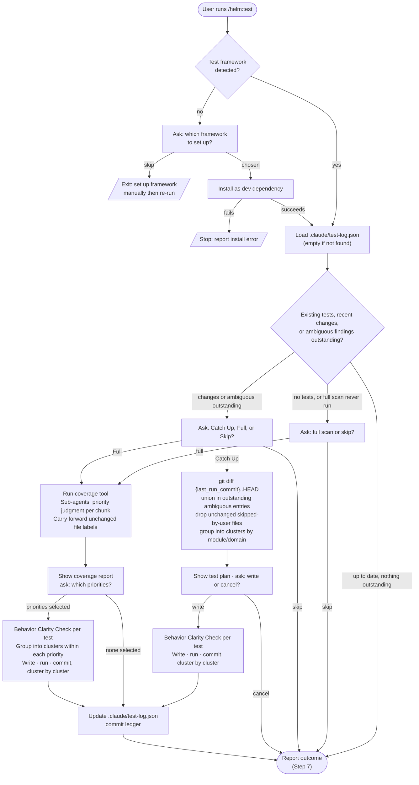

# /helm:test

Detect the test framework, load the run ledger, assess existing coverage and recent activity, then write tests scoped to recent changes or the full project. Commits per scope with `test({scope}):` messages, per [git.md's Auto-Commit rule](../rules/git.html#auto-commit).

## Flow

```mermaid
flowchart TD
  Start([User runs /helm:test]) --> Framework{Test framework<br/>detected?}
  Framework -->|no| AskFW[Ask: which framework<br/>to set up?]
  AskFW -->|skip| FWStop[/Exit: set up framework<br/>manually then re-run/]
  AskFW -->|chosen| FWSetup[Install as dev dependency]
  FWSetup -->|fails| FWFail[/Stop: report install error/]
  Framework -->|yes| Ledger
  FWSetup -->|succeeds| Ledger

  Ledger["Load .claude/test-log.json<br/>(empty if not found)"] --> Assess

  Assess{Existing tests, recent changes,<br/>or ambiguous findings outstanding?}
  Assess -->|no tests, or full scan never run| FullOrSkip["Ask: full scan or skip?"]
  Assess -->|up to date, nothing outstanding| Report(["Report outcome<br/>(Step 7)"])
  Assess -->|changes or ambiguous outstanding| Choice["Ask: Catch Up, Full, or Skip?"]

  FullOrSkip -->|skip| Report
  FullOrSkip -->|full| FullScan
  Choice -->|skip| Report
  Choice -->|Catch Up| CatchUp
  Choice -->|Full| FullScan

  CatchUp["git diff {last_run_commit}..HEAD<br/>union in outstanding ambiguous entries<br/>drop unchanged skipped-by-user files<br/>group into clusters by module/domain"] --> CatchPlan["Show test plan · ask: write or cancel?"]
  CatchPlan -->|cancel| Report
  CatchPlan -->|write| CWrite["Behavior Clarity Check per test<br/>Write · run · commit, cluster by cluster"]
  CWrite --> UpdateLedger

  FullScan["Run coverage tool<br/>Sub-agents: priority judgment per chunk<br/>Carry forward unchanged file labels"] --> FullPlan["Show coverage report<br/>ask: which priorities?"]
  FullPlan -->|none selected| UpdateLedger
  FullPlan -->|priorities selected| FWrite["Behavior Clarity Check per test<br/>Group into clusters within each priority<br/>Write · run · commit, cluster by cluster"]
  FWrite --> UpdateLedger

  UpdateLedger["Update .claude/test-log.json<br/>commit ledger"] --> Report
```

## Steps

### Before starting

No branch requirement — runs from any branch. Writing tests for the code you're currently working on is useful regardless of branch, so this isn't git-strategy-aware the way `/helm:log` or `/helm:manifest` are.

### 1. Detect test framework

Scans for known config files and dependencies (e.g. `vitest.config`, `jest.config`, `phpunit.xml`). Also detects the project's coverage tool (`coverage.py`, `nyc`, `jest --coverage`, etc.) for use in the Full Scan step. If a framework is found, proceeds to the ledger load. If not found, forms a recommendation from what that scan already found — language, package manager, existing build tooling and module system, monorepo structure if any — rather than a generic default, then proposes the best-fit framework for the detected stack and lets the user pick or skip.

If a framework is chosen, installs it directly as a dev dependency — detecting the package manager from the project's lockfile (`package-lock.json` → npm, `yarn.lock` → yarn, `pnpm-lock.yaml` → pnpm, `composer.lock` → composer, `poetry.lock` → poetry, `requirements.txt` → pip, `Gemfile.lock` → bundler) rather than just telling the user how to install it themselves. If the install fails, stops and reports the error instead of proceeding with a framework that isn't actually installed.

### 2. Load ledger

Reads `.claude/test-log.json` if it exists. A missing file is not an error — the command proceeds as if the ledger is empty.

The ledger stores:
- **`schema_version`** — bumped only if this structure changes in a future release. A ledger with `schema_version: 1` or none at all (the shape before this field existed — separate `findings`/`full_scan_findings` arrays and `last_test_run_commit`/`last_full_scan_commit` fields) is converted into the current shape on load rather than misread, and persisted in that shape from then on. `full_scan_ever_run` is derived from whether `last_full_scan_commit` held an actual SHA, not merely whether the key was present — it could legitimately be `null` for a repo where a full scan had never run yet.
- **`files`** — one entry per file, everything currently known about it. `priority` and `last_judged_commit` come from sub-agent scan judgment (Full Scan only); `user_status` (`skipped-by-user` or `ambiguous`), `note`, `recorded_commit`, and `recorded_date` come from an actual human decision (the Behavior Clarity Check, or a skip choice). These two sets of fields are independent — a file can have either, both, or neither, and updating one never clobbers the other.
- **`last_run_commit`** — for scoping the next run's diff.
- **`full_scan_ever_run`** and **`consecutive_catchup_count`** — drive Step 3's scenario decision and Full Scan recommendation (see below).

### 3. Assess coverage and recent activity

Uses the same commit-range diff as the Catch Up step to identify recently changed files: `git diff {last_run_commit}..HEAD --name-only`, falling back to `HEAD~1..HEAD` or the working tree diff if no ledger commit is stored. Also counts `files` entries with `user_status: ambiguous`, regardless of whether they appear in that diff — these are outstanding from a previous run, not just files that happen to have changed again. Scans for existing test files and estimates gap-in-recent-changes and overall coverage.

Four scenarios, with the recommendation depending on what it finds:

- **No tests yet**: Full scan or skip.
- **Tests exist, full scan never run** (`full_scan_ever_run` false or absent): Full scan recommended — coverage gaps may exist that catch-up never touched.
- **Tests exist, full scan done, no changes since last run, no ambiguous findings outstanding**: exits cleanly with "tests are up to date." No prompt shown.
- **Tests exist, and either recent changes are detected or ambiguous findings are outstanding**: Catch Up, Full, or skip. Recommends Full Scan if `consecutive_catchup_count >= 5` (many Catch Ups since the last full look) or the diff touches 50+ files (this batch alone is big enough to warrant one); otherwise recommends Catch Up. Outstanding ambiguous findings alone (no other changes) still route here, since Catch Up picks them up via its ambiguous-entry union and gives the user another pass through the Behavior Clarity Check.

The clean exit in scenario 3 is the key distinction: if nothing has changed, a full scan was already done, and no ambiguous findings are waiting for another look, there is nothing for the developer to act on.

### 4. Catch Up path

Identifies changed files using a commit-range diff:

- If `last_run_commit` is in the ledger: runs `git diff {last_run_commit}..HEAD` to capture all committed changes since the last run — not just uncommitted working-tree changes.
- If the ledger has no stored commit (first run): falls back to `git diff HEAD~1..HEAD`, or the working tree diff if uncommitted changes exist.

Unions in any `files` entries with `user_status: ambiguous`, even if they don't appear in that diff — they're outstanding from a previous run and get another pass through the Behavior Clarity Check, rather than sitting unresolved indefinitely until the file happens to change again.

Cross-checks the file list against `files` entries with `user_status: skipped-by-user` and drops those files from the plan, unless they have been modified since they were skipped. Ambiguous entries are exempt from this drop — they're always re-included regardless of whether they changed.

Groups the remaining files into clusters by module or domain (same folder, or a direct dependency, e.g. a controller and its service) — the same clustering `/helm:refactor` uses. Files in unrelated areas never share a cluster, since git.md requires one commit per logical unit.

Applies the **Behavior Clarity Check** before writing any test (see below). Presents the test plan and waits for confirmation, then writes tests that reflect proven behavior, cluster by cluster — running the suite and committing after each cluster with `test({scope}): add tests for {feature}`, where `{scope}` is the cluster's primary module or domain per git.md's Conventional Commits convention, not a generic label.

### Behavior Clarity Check

Applied in both Catch Up and Full Scan before writing a test for any piece of code.

If the expected behavior is clear from the code, docs, or existing tests: write the test directly.

If it is ambiguous (undocumented edge case, unclear intended behavior, behavior contradicts docs): stop and ask the user to clarify or skip. If the user clarifies, proceed. If they skip, set `user_status: "ambiguous"` and a short note on that file's `files` entry (without touching any `priority` fields already there) — never guess and encode a guess as a test.

### 5. Full Scan path

**Coverage check**: runs the project's coverage tool across the full project on every run — never partial, never skipped.

**Priority judgment**: splits the project into folder/module chunks and spawns one sub-agent per chunk (capped at 8), each returning a priority label for untested areas. Before spawning, each file is checked against `files` in the ledger: a `priority` unchanged since `last_judged_commit` → carry it forward; no `priority` yet or changed since → include in the sub-agent run and update the entry (creating one if needed, without touching any `user_status` fields already on it); the file no longer exists in the repo → remove the entry entirely, priority and user decision alike.

Builds a coverage report grouped into High / Medium / Low priority with file-level notes, then asks which priorities to cover via multi-select.

Applies the **Behavior Clarity Check** before writing each test. Writes tests priority by priority, single-agent and sequential — no parallel writing. Within each priority, groups files into clusters by module/domain the same way Catch Up does — a priority tier commonly spans multiple unrelated areas, and a single commit must never bundle them together just because they share a priority label. If a single cluster is too large for one agent's context, it is batched sequentially (write a chunk, commit, continue) without any planning or dependency system. Runs the suite and commits per cluster with `test({scope}): add missing {priority}-priority tests for {summary}`, `{scope}` again being the cluster's actual module or domain.

### 6. Update ledger

After tests are written, run, and committed:

- Sets `schema_version` to `2` if not already present, including when converting an old-shaped ledger on load.
- **Catch Up run**: sets `last_run_commit` to current HEAD and increments `consecutive_catchup_count` by 1.
- **Full Scan run**: sets `last_run_commit` to current HEAD, sets `full_scan_ever_run` to `true`, resets `consecutive_catchup_count` to `0`. Persists all `priority`/`last_judged_commit` changes into `files` (new entries, updated priorities, entries removed for files that no longer exist).
- For files skipped at the confirmation step: sets `user_status: "skipped-by-user"` on that file's entry, without touching any `priority` fields already there.
- For files flagged during the Behavior Clarity Check: sets `user_status: "ambiguous"` the same way.
- For files resolved this run: clears `user_status`/`note`/`recorded_commit`/`recorded_date` from the entry, but keeps the entry (and its `priority` data) unless nothing is left on it at all.

Commits the ledger with `test(log): update test ledger after {catch-up / full-scan}`.

### 7. Confirm completion

Reports the outcome (up to date / catch up written / full scan written / skipped), the mode used, how many tests were written and where, commits made, whether tests are passing, and the ledger's skipped-by-user/ambiguous/resolved counts. Runs even when nothing was written — Scenario 3's clean exit and any Skip choice both still reach this step to report the outcome, rather than exiting silently. When a Full Scan's scan ran but no priorities were selected for writing, the scan itself is still recorded in the ledger and reported here.

## Stop conditions

- **No framework, user skips setup.** Configure a framework and re-run.
- **No changes since last run, full scan already done, and no ambiguous findings outstanding.** Tests are up to date — reports via Step 7, no tests written.
- **User cancels at the test plan.** No tests written — reports via Step 7.
- **No priorities or no scope selected.** No tests written — reports via Step 7.
- **Written tests fail.** The command stops before committing and waits for the user to fix the failure.

## See also

- [`/helm:refactor`](refactor.html) — pairs naturally; refactor first, then write tests to lock the new behavior in
- [`/helm:ship`](ship.html) — runs the test suite as part of the release gate
