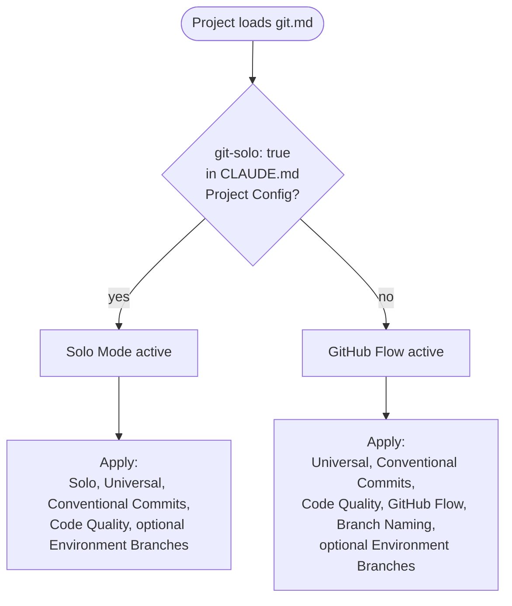

# git.md

The git workflow rules for a project. Defines two modes (Solo and GitHub Flow), the universal rules that apply in both, the Conventional Commits format used for every commit, code-quality gates before pushing, and optional environment-branch promotion.

## Mode selection



The `git-solo: true` flag lives in `CLAUDE.md` under `## Project Config`. Absence means GitHub Flow. The `git-auto-commit: true` flag is independent of mode and controls whether Claude commits without prompting.

## Solo Mode

Activate by declaring `git-solo: true` in `CLAUDE.md`. When active:

- Commit directly to `main`. No feature branches required.
- No PR required.
- Skip Branch Naming and GitHub Flow sections entirely.
- Universal Rules still apply.
- Conventional Commits still apply.
- Code quality checks still run before every push.

Use this mode for solo work where peer review and branch protection have no audience. Switch to GitHub Flow the moment you have collaborators.

## Auto-Commit

Activate by declaring `git-auto-commit: true` in `CLAUDE.md`. Independent of git mode — works with both Solo and GitHub Flow.

When active:

- After completing a task, commit without asking for confirmation.
- Stage only the files changed for the task. Never use `git add -A` blindly.
- Derive the commit message from the work done; follow Conventional Commits.
- If the task spans multiple logical units, commit each unit separately before moving on.
- Push still requires confirmation (cross-references `safety.md`).

When not active (default): ask for confirmation before every commit.

## Universal Rules

Apply in both modes.

**Branches**

- Never commit to `main` or `master` outside Solo Mode.
- Never force-push without explicit confirmation.
- Never delete unmerged branches without explicit confirmation.
- Never delete `main`, `master`, or any environment branch.
- Never delete a published tag from a public repository.
- Delete feature branches immediately after merge.

**Commits**

- Every commit on `main` must leave the codebase in a working state.
- One commit per logical unit. If the subject needs "and" to describe it, split it.
- Use squash merge when merging feature branches into `main`.

**Safety**

- Never push to any branch without confirmation (cross-references `safety.md`).

## Conventional Commits

Every commit follows this format:

```
type(scope): description

[optional body]

[optional footer]
```

**Types**: `feat`, `fix`, `refactor`, `test`, `docs`, `chore`, `style`, `perf`, `ci`, `build`.

**Scope**: required. The module, feature, or domain area touched.

```
feat(auth): add OAuth login
fix(payment): resolve stripe timeout
refactor(orders): extract service layer
```

**Breaking changes**: append `!` to the type and include a `BREAKING CHANGE:` footer.

```
feat(auth)!: replace session with JWT

BREAKING CHANGE: all existing sessions invalidated
```

The `/helm:ship` command reads these types to calculate the next version: `feat!` or `BREAKING CHANGE` triggers a major bump, `feat` minor, `fix` patch, anything else is ignored for versioning.

## Code Quality

Run before pushing, regardless of mode:

**Lint and Formatting**

- Detect lint and formatter config in the project.
- Run lint and formatter; fix all errors before pushing.
- Include formatting changes in the last logical commit.
- Skip the lint step if no linter is configured. If a linter is configured, never push with lint errors.

**Tests**

- Detect test framework from project files.
- Run tests for changed files. Run the full suite if shared or core code is touched.
- Skip silently if not configured. Never push with failing tests.

## GitHub Flow (default)

Active when `git-solo` is not declared.

**Branch structure**

```
main
feature/*
fix/*
chore/*
refactor/*
```

**Rules**

- All branches base from `main`.
- `main` is always deployable.
- Open a PR before merging to `main`.
- Squash merge into `main` with a Conventional Commit message.
- Delete the feature branch immediately after merge.
- If CI is configured, it must pass before merge.

**Deployment**

- Push trigger: CI auto-deploys on merge to `main`.
- Tag trigger: CI deploys on SemVer tag via `/helm:ship`.
- Both can be active simultaneously (e.g. push promotes to staging, tag promotes to production).

## Branch Naming

Only applies under GitHub Flow.

Format: `type/short-description`. Include a ticket number when provided: `type/123-short-description`.

```
feature/user-authentication
feature/123-user-authentication
fix/payment-timeout
fix/456-payment-timeout
chore/bump-dependencies
refactor/extract-payment-service
```

Types mirror Conventional Commits types. Lowercase, hyphens only, no spaces.

## Environment Branches (optional)

Independent of mode. Works alongside Solo and GitHub Flow.

Environment branches are long-lived branches that are not `main`, `master`, or feature branches: `staging`, `stage`, `uat`, `preprod`, `production`, `prod`. The presence of any such branch on the remote activates these rules:

- Environment branches are permanent. Never delete.
- Nothing merges directly to an environment branch.
- All changes flow through `main` first (upstream-first rule).
- Promote by merging upstream branch into downstream branch.
- Hotfixes follow the same rule: `main` first, then promote.
- If CI is configured, it must pass before promoting to the next environment.

**Promotion flow**: `main → {environment branches in order}`.

The `/helm:ship` command detects environment branches automatically and offers a multi-select for which to promote alongside the main release.

## See also

- [`safety.md`](safety.md) - the operational risks file that pairs with this one
- [`/helm:ship`](../commands/ship.md) - reads Conventional Commits and promotes to env branches
