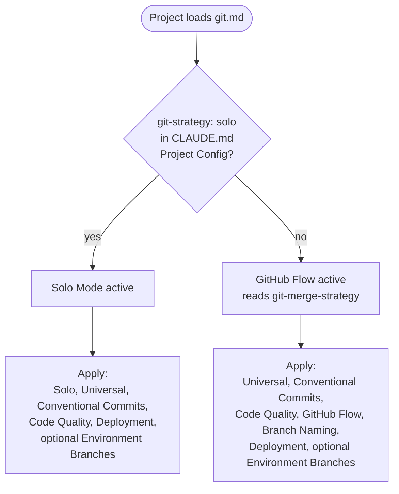

# git.md

The git workflow rules for a project. Defines two strategies (Solo and GitHub Flow), the universal rules that apply in both, the Conventional Commits format used for every commit, code-quality gates before pushing, and optional environment-branch promotion.

## Git Strategy


```mermaid
flowchart TD
  Start([Project loads git.md]) --> Check{git-strategy: solo<br/>in CLAUDE.md<br/>Project Config?}
  Check -->|yes| Solo[Solo Mode active]
  Check -->|no| Flow[GitHub Flow active<br/>reads git-merge-strategy]

  Solo --> Sections1[Apply:<br/>Solo, Universal, Conventional Commits,<br/>Code Quality, Deployment,<br/>optional Environment Branches]
  Flow --> Sections2[Apply:<br/>Universal, Conventional Commits,<br/>Code Quality, GitHub Flow, Branch Naming,<br/>Deployment, optional Environment Branches]
```

The `git-strategy` flag lives in `CLAUDE.md` under `## Project Config`. Set to `solo` for Solo Mode or `github-flow` for GitHub Flow. Absence defaults to GitHub Flow. Exactly one strategy is active at a time. The `git-auto-commit: true` flag is independent of strategy. The `git-merge-strategy` flag applies only under GitHub Flow and sets the PR merge method (`squash`, `rebase`, or `merge`; defaults to `squash`).

After reading `CLAUDE.md`, confirm which mode is active before taking any git action. State it explicitly: "Solo Mode active" or "GitHub Flow active."

### Solo Mode

Activate by declaring `git-strategy: solo` in `CLAUDE.md`. When active:

- Commit directly to `main`. No feature branches required.
- No PR required.
- Skip the GitHub Flow and Branch Naming subsections entirely.
- Environment Branches rules still apply if such branches exist.
- Universal Rules still apply.
- Conventional Commits still apply.
- Code quality checks still run before every push.

Use this mode for solo work where peer review and branch protection have no audience. Switch to GitHub Flow the moment you have collaborators.

### GitHub Flow (default)

Active when `git-strategy: github-flow` is declared, or when `git-strategy` is absent.

**Branch structure**

```
main
feature/*  (or feat/*)
fix/*
chore/*
refactor/*
docs/*
test/*
perf/*
ci/*
build/*
```

**Rules**

- All branches base from `main`.
- `main` is always deployable.
- Open a PR before merging to `main`.
- Merge using the strategy declared as `git-merge-strategy` (default: `squash`):
  - `squash` — squash all commits into one with a Conventional Commit message
  - `rebase` — replay branch commits onto `main` without a merge commit
  - `merge` — create a merge commit preserving full branch topology
- Delete the feature branch immediately after merge.
- If CI is configured, it must pass before merge.

#### Branch Naming

Only applies under GitHub Flow.

Format: `type/short-description`. Include a ticket number when provided: `type/123-short-description`.

```
feature/user-authentication
feature/123-user-authentication
fix/payment-timeout
fix/456-payment-timeout
chore/bump-dependencies
refactor/extract-payment-service
```

Types mirror Conventional Commits types. Lowercase, hyphens only, no spaces.

## Auto-Commit

Governs every commit made by any command in this plugin, by default — individual commands don't restate this, only follow it, unless an explicit exception applies (see below).

Set with `git-auto-commit: true` in `CLAUDE.md`. Independent of git strategy — works with both Solo and GitHub Flow. Absence defaults to off — ask for confirmation before every commit.

When active:

- After completing a task, commit without asking for confirmation.
- Stage only the files changed for the task. Never use `git add -A` blindly.
- Derive the commit message from the work done; follow Conventional Commits.
- Push still requires confirmation — same rule as Universal Rules → Safety below, restated here since it's the exception auto-commit doesn't override.
- If the task spans multiple logical units, commit each unit separately before moving on.

**Exception:** commits covered by [`safety.md`](safety.html#agent-execution-boundaries)'s Agent Execution Boundaries — e.g. committing generated legal documents ([`/helm:legal`](../commands/legal.html)) — always ask for confirmation regardless of this setting. Those are public or otherwise high-stakes content where autonomy level should never skip review.

## Universal Rules

Apply in both strategies.

**Branches**

- Never commit to `main` or `master` outside Solo Mode.
- Never force-push without explicit confirmation.
- Never delete unmerged branches without explicit confirmation.
- Never delete `main`, `master`, or any environment branch.
- Never delete a published tag from a public repository.
- Delete feature branches immediately after merge.

Exception: release commits made by `/helm:ship` (version bump + tag) may land directly on `main` in any mode — the sanctioned release path, not an ad-hoc direct commit.

**Commits**

- Every commit on `main` must leave the codebase in a working state.
- One commit per logical unit. If the subject needs "and" to describe it, split it.

**Safety**

- Never push to any branch without confirmation (cross-references `safety.md`).

## Conventional Commits

Every commit follows this format:

```
type(scope): description

[optional body]

[optional footer]
```

**Types**: `feat`, `fix`, `refactor`, `revert`, `test`, `docs`, `chore`, `style`, `perf`, `ci`, `build`.

**Scope**: required. The module, feature, or domain area touched.

```
feat(auth): add OAuth login
fix(payment): resolve stripe timeout
refactor(orders): extract service layer
```

**Scope inference** — for commands that infer scope from a diff or cluster of changed files (e.g. `/helm:refactor`, `/helm:test`): use the primary module, folder, or domain actually touched, never a command's own internal category/priority taxonomy (e.g. "architecture", "high-priority"), which is a report/selection grouping, not a commit scope. Dominant area wins if a change spans multiple; `project` or `core` if truly cross-cutting.

**Breaking changes**: append `!` to the type and include a `BREAKING CHANGE:` footer.

```
feat(auth)!: replace session with JWT

BREAKING CHANGE: all existing sessions invalidated
```

The `/helm:ship` command reads these types to calculate the next version: `feat!` or `BREAKING CHANGE` triggers a major bump, `feat` minor, `fix` and `perf` patch (perf is a real improvement to shipped behavior, not a no-op), anything else is ignored for versioning.

## Code Quality

Run before pushing, regardless of strategy:

**Lint and Formatting**

- Detect lint and formatter config in the project.
- Run lint and formatter; fix all errors before pushing.
- Include formatting changes in the last logical commit.
- Skip the lint step if no linter is configured. If a linter is configured, never push with lint errors.

**Tests**

- Detect test framework from project files.
- Run tests for changed files. Run the full suite if shared or core code is touched.
- Skip silently if not configured. Never push with failing tests.

## Deployment

Independent of strategy. Applies under both Solo and GitHub Flow.

- Push trigger: CI auto-deploys on merge to `main`.
- Tag trigger: CI deploys on SemVer tag via `/helm:ship`.
- Both can be active simultaneously (e.g. push promotes to staging, tag promotes to production).

## Environment Branches (optional)

Independent of strategy. Works alongside Solo and GitHub Flow.

Environment branches are long-lived branches that are not `main`, `master`, or feature branches — e.g. `staging`, `stage`, `uat`, `preprod`, `production`, `prod`, or similar. The presence of any such branch on the remote activates these rules:

- Environment branches are permanent. Never delete.
- Nothing merges directly to an environment branch.
- All changes flow through `main` first (upstream-first rule).
- Hotfixes follow the same rule: `main` first, then promote.
- If CI is configured, it must pass before promoting.

**Promotion model**: governs `/helm:ship`'s release promotion specifically. Set with `environment-promotion` in CLAUDE.md's Project Config (`fan-out` or `chain`; absence defaults to `fan-out`).

- **Fan-out** (default): `main` promotes directly to any combination of environment branches, independently — no ordering between them. Simple parallel deploy targets.
- **Chain**: environments form an ordered pipeline (e.g. `main → staging → production`). Only the first tier (`staging`, `stage`, `uat`, `preprod`) is ever merged into directly from `main`. A later tier (`production`, `prod`) is never a direct deploy target — it's only reached by merging the previous tier's branch forward into it, one tier at a time.

`/helm:legal`, `/helm:log`, `/helm:manifest`, `/helm:adopt`, `/helm:env`, and `/helm:test` always use fan-out for promoting their own generated content or fixes (legal documents, `CLAUDE.md`, `README.md`, rule files, env/gitignore fixes, tests), regardless of this setting — those are content syncs, not a release pipeline, so there's no tier for the change to pass through.

The [`/helm:ship`](../commands/ship.html) command detects environment branches automatically and offers a multi-select for which to promote alongside the main release (filtered to first-tier branches only under `chain` mode). [`/helm:legal`](../commands/legal.html), [`/helm:log`](../commands/log.html), [`/helm:manifest`](../commands/manifest.html), [`/helm:adopt`](../commands/adopt.html), [`/helm:env`](../commands/env.html), and [`/helm:test`](../commands/test.html) do the same after committing their changes, so environment branches don't fall behind main on legal documents, `CLAUDE.md`, `README.md`, the installed rule files, env/gitignore fixes, or tests.

## See also

- [`safety.md`](safety.html) - the operational risks file that pairs with this one
- [`/helm:ship`](../commands/ship.html) - reads Conventional Commits and promotes to env branches
- [`/helm:legal`](../commands/legal.html) - promotes generated legal documents to env branches the same way
- [`/helm:log`](../commands/log.html) - promotes `CLAUDE.md` updates to env branches the same way
- [`/helm:manifest`](../commands/manifest.html) - promotes `README.md` updates to env branches the same way
- [`/helm:adopt`](../commands/adopt.html) - promotes installed rule files to env branches the same way
